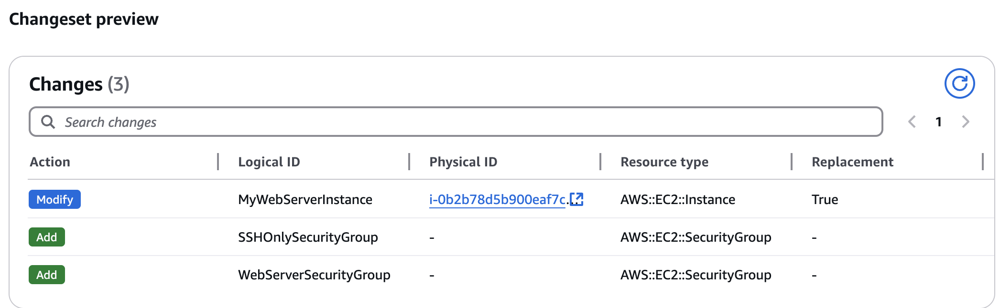

# CF Demo Template

Find Free Tier Eligible ami for EC2 from AMI Catalog

`ImageId: ami-0658158d7ba8fd573`&#x20;

**First Template**

```yaml

Resources:
  MyWebServerInstance:
    Type: AWS::EC2::Instance
    Properties:
      ImageId: ami-0658158d7ba8fd573
      InstanceType: t3.micro

```

**Second Updated Template**

Tags for name will force stack to replace the instance.

<figure><figcaption></figcaption></figure>


**Changes include 2 SGs and Parameters, added manually via Edit in Infrastructure Composer + Validate**

```yaml
Description: EC2 + SG Simple CloudFormation Demo.
Parameters:
  SSHLocation:
    Description: The IP range that can be used to SSH into EC2 instances
    Type: String
    MinLength: '9'
    MaxLength: '18'
    Default: 0.0.0.0/0
    AllowedPattern: (\d{1,3})\.(\d{1,3})\.(\d{1,3})\.(\d{1,3})/(\d{1,2})
    ConstraintDescription: must be a valid IP CIDR range of the form x.x.x.x/x.

Resources:
  MyWebServerInstance:
    Type: AWS::EC2::Instance
    Properties:
      ImageId: ami-0658158d7ba8fd573
      InstanceType: t3.micro
      KeyName: ec2-keys-demo
      Tags:
        - Key: Name
          Value: WebSever

      SecurityGroups:
        - !Ref WebServerSecurityGroup
        - !Ref SSHOnlySecurityGroup

  SSHOnlySecurityGroup:
    Type: AWS::EC2::SecurityGroup
    Properties:
      GroupDescription: Enable SSH access via port 22 from anywhere
      SecurityGroupIngress:
        - IpProtocol: tcp
          FromPort: 22
          ToPort: 22
          CidrIp: !Ref SSHLocation

  WebServerSecurityGroup:
    Type: AWS::EC2::SecurityGroup
    Properties:
      GroupDescription: Enable HTTP access
      SecurityGroupIngress:
        - IpProtocol: tcp
          FromPort: '80'
          ToPort: '80'
          CidrIp: 0.0.0.0/0
```

**Pick up Instance public IPv4 and ssh into it**&#x20;

```bash
ssh -i path/to/AccessKey.pem ec2-user@13.52.125.28
# check SG work
curl http://localhost
```

**It will **<mark style="color:red;">**not work in browser**</mark> :exclamation: **as Application Not Running**

**Install and Start httpd or nginx**

```bash
sudo yum install httpd
sudo systemctl start httpd  
sudo netstat -tuln
```

**Verify it runs -> Look for `0.0.0.0:80` under `Local Address` with the state `LISTEN`.**

```bash
Proto Recv-Q Send-Q Local Address           Foreign Address         State
tcp        0      0 0.0.0.0:80              0.0.0.0:*               LISTEN
tcp        0      0 0.0.0.0:22              0.0.0.0:*               LISTEN
tcp6       0      0 :::22                   :::*                    LISTEN

```

`curl http://localhost` again & output must be \<html> or open from public ip in browser&#x20;

