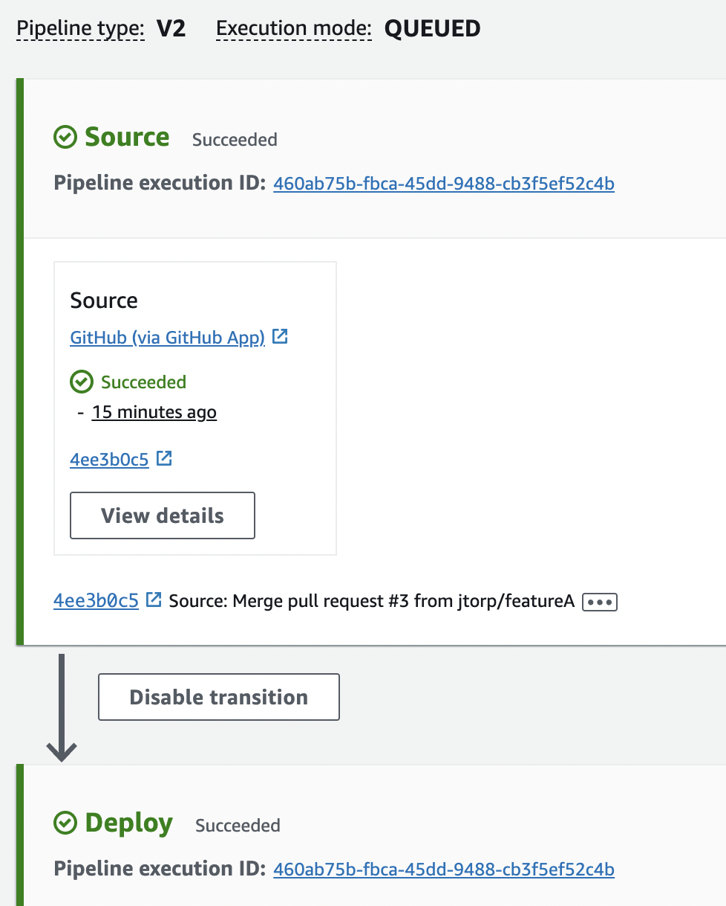
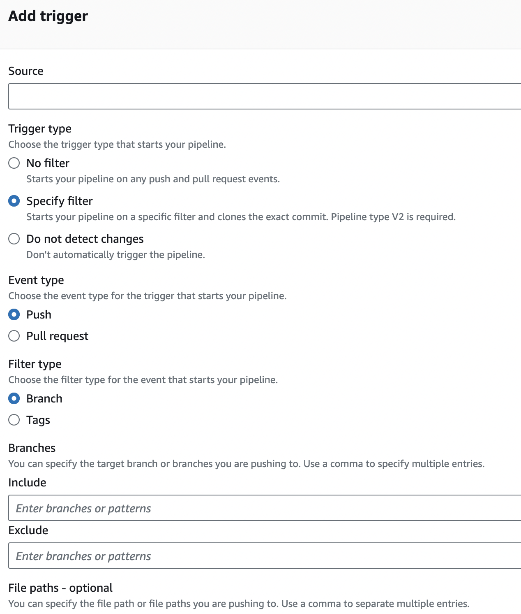
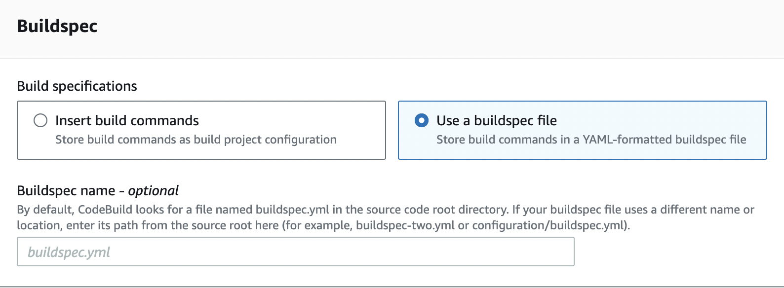
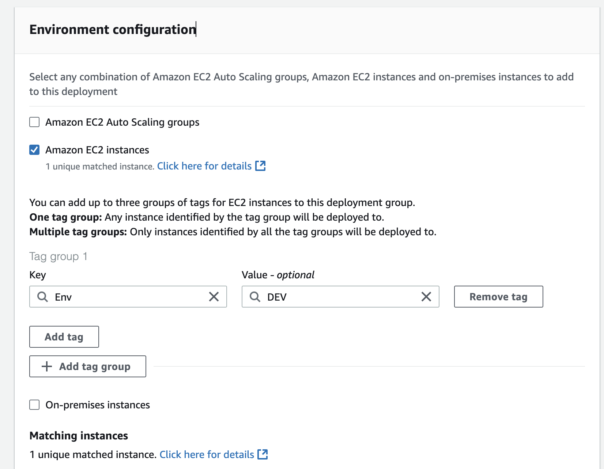
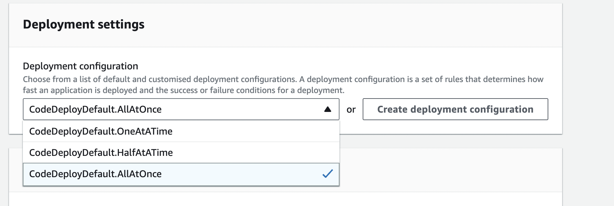
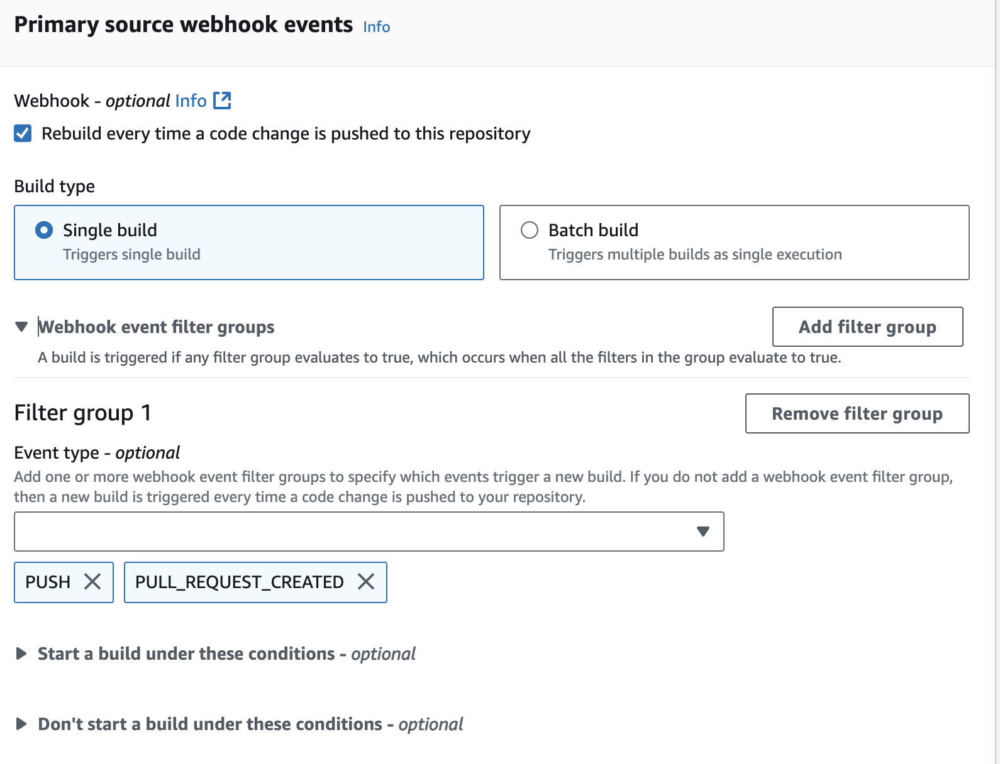

# Developer Tools

## Codepipeline

<div align="left"><figure><figcaption></figcaption></figure></div>

### Pipeline customisation

* Don't automatically trigger the pipeline.
* No filter  = Starts your pipeline on any push and pull request events.
* Add filters = triggers

<div align="left"><figure><figcaption></figcaption></figure></div>

* Add Deploy Stages -> by adding Stages (multiple actions in a stage)

## CodeBuild

**Default Behavior**:

* If no buildspec file is specified, CodeBuild looks for <mark style="color:red;">**`buildspec.yml`**</mark> in the root directory of the repository.

**Specifying the Custom Buildspec**

When you create or update a CodeBuild project, you can specify the **location of the buildspec file** in the configuration.

*   **Console**:

    * Go to  CodeBuild Console -> New  project&#x20;
    * Under **Buildspec**, select **Use a buildspec file**.

    

    * Specify the custom file's path relative to the root of the repository (e.g., `configs/my-custom-buildspec.yaml`).
*   **CLI or API**: Use the `buildspec` parameter when defining the build project:

    ```json
    jsonCopy code{
        "source": {
            "type": "GITHUB",
            "location": "https://github.com/example-repo"
        },
        "buildspec": "configs/my-custom-buildspec.yaml"
    }
    ```

## CodeDeploy

#### Configure Deployment Group

<figure><figcaption></figcaption></figure>

* Tag on the instance itself ( configure with CF tempalte)


<div><figure><figcaption></figcaption></figure> <figure><figcaption></figcaption></figure></div>


