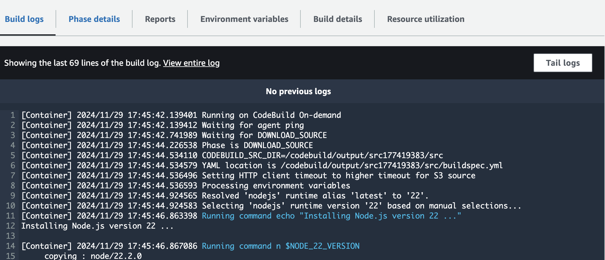

# Developer Tools

## Codepipeline

> AWS CodePipeline is a fully managed continuous delivery (CD) service that helps you automate your release pipeline for fast and reliable application and infrastructure updates. It automates the build, test, and deploy phases of your release process every time there is a code change.


<div align="left"><figure><figcaption></figcaption></figure></div>

### Pipeline customisation

* Don't automatically trigger the pipeline.
* No filter  = Starts your pipeline on any push and pull request events.
* Add filters = triggers

<div align="left"><figure><figcaption></figcaption></figure></div>

* Add Deploy Stages -> by adding Stages (multiple actions in a stage)

## CodeBuild

> CodeBuild is a fully managed continuous integration (CI) service that compiles source code, runs tests, and produces software packages that are ready to deploy. It is an alternative to Jenkins.
>
>

* CodeBuild can run any commands, so you can use it to run commands including build a static website and copy your static web files to an S3 bucket.
* You can configure CodeBuild to run its build containers in a VPC, so they can access private resources in a VPC such as databases, internal load balancers, ..

**Default Behavior**:

* If no **buildspec** file is specified, CodeBuild looks for <mark style="color:red;">**`buildspec.yml`**</mark> in the **root** directory of the repository.

**Specifying the Custom Buildspec**

When you create or update a CodeBuild project, you can specify the **location of the buildspec file** in the configuration.

*   **Console**:

    * Go to  CodeBuild Console -> New  project&#x20;
    * Under **Buildspec**, select **Use a buildspec file**.

    

    * Specify the custom file's path relative to the root of the repository (e.g., `configs/my-custom-buildspec.yaml`).
*   **CLI or API**: Use the `buildspec` parameter when defining the build project:

    ```json
    jsonCopy code{
        "source": {
            "type": "GITHUB",
            "location": "https://github.com/example-repo"
        },
        "buildspec": "configs/my-custom-buildspec.yaml"
    }
    ```
* CodeBuild containers are deleted at the end of their execution (success or failure). You can't SSH into them, even while they're running.

<figure><figcaption></figcaption></figure>

## Buildspec.yml

```yaml
# The version of the buildspec file format.
version: 0.2

# Environment variables can be set here, which are available throughout the build process.
env:
  variables:
    MY_ENV_VAR: "my-value" # Define a custom environment variable

# Phases define the steps of the build lifecycle.
phases:
  # The install phase is for installing any dependencies or setting up the environment.
  install:
    commands:
      - echo "Installing dependencies" # Print message indicating installation phase
      - apt-get update # Update package list (for example, installing system packages)
      - apt-get install -y curl # Install curl tool to download Docker installation script
      - echo "Installing Docker..." # Print message indicating Docker installation
      - curl -fsSL https://get.docker.com -o get-docker.sh # Fetch Docker installation script
      - sh get-docker.sh # Run the script to install Docker
    runtime-versions:
      docker: 18 # Specify a runtime version for Docker (if needed)

  # The pre_build phase runs before the actual build, useful for setup like login or checks.
  pre_build:
    commands:
      - echo "Pre-build phase started" # Indicate that pre-build phase has started
      - echo "Checking Docker version" # Check the version of Docker installed
      - docker --version # Print the Docker version
      - echo "Login to ECR" # Print message about logging into ECR (Elastic Container Registry)
      # Use AWS CLI to log into ECR to push images to a private registry
      - $(aws ecr get-login --no-include-email --region us-west-2)

  # The build phase is where the main application logic happens (e.g., building Docker images, compiling code).
  build:
    commands:
      - echo "Building Docker image" # Indicate build phase for Docker image
      - docker build -t my-image . # Build the Docker image from the current directory
      - echo "Tagging image" # Tagging the Docker image for ECR push
      - docker tag my-image:latest 123456789012.dkr.ecr.us-west-2.amazonaws.com/my-repo:latest

  # The post_build phase is executed after the build phase. Here, you can push artifacts or do other final tasks.
  post_build:
    commands:
      - echo "Pushing Docker image to ECR" # Push the Docker image to ECR
      - docker push 123456789012.dkr.ecr.us-west-2.amazonaws.com/my-repo:latest # Push the image
      - echo "Build completed successfully!" # Indicate successful completion of the build

  # The finally phase is an optional phase that runs after all the other phases, regardless of build success/failure.
  finally:
    commands:
      - echo "Finally phase (always runs)" # Indicate that this phase will always run
      - echo "Sending notification..." # Example of a notification step
      # You could include code here to notify a system or send alerts (e.g., via SNS, Slack, etc.)

# Artifacts section specifies the files to be outputted and stored in Amazon S3.
artifacts:
  files:
    - '**/*' # Include all files in the current directory and subdirectories
  discard-paths: yes # Discard directory structure during artifact upload (store only the files)

# Cache section allows for caching dependencies between builds, reducing build time for repeat dependencies.
cache:
  paths:
    - '/root/.m2/**/*' # Cache Maven dependencies (or other dependencies for your application)

# Reports section defines the locations of test result files that should be uploaded to AWS CodeBuild.
reports:
  my_report:
    files:
      - '**/test-*.xml' # Collect test results with filenames starting with 'test-'
    base-directory: 'test_results' # Specify directory where the test results are stored
    discard-paths: yes # Discard directory structure for the test result files

```

* caching helps to **reduce build times** by storing commonly used build dependencies or intermediate build results - Caching node modules for a Node.js application, or Maven dependencies for a Java application.

```yaml
cache:
  paths:
    - '/root/.m2/**/*'    # Caching Maven dependencies
    - '/root/.npm/**/*'   # Caching Node.js dependencies
    - 'build/output/**/*' # Caching build outputs

```


## CodeDeply

> AWS CodeDeploy is a fully managed deployment service that automates software deployments to a variety of computing services such as EC2, Fargate, Lambda, and your on-premises servers. You can define the strategy you want to execute such as in-place or blue/green deployments.
>
>


#### Configure Deployment Group

<figure><figcaption></figcaption></figure>

* Tag on the instance itself ( configure with CF tempalte)


<div><figure><figcaption></figcaption></figure> <figure><figcaption></figcaption></figure></div>


## Appspec.yml

The **`appspec.yml`** file in AWS CodeDeploy specifies how to deploy, its  components and supports lifecycle hooks are for executing custom scripts at different stages of deployment.

<div align="left"><figure><figcaption></figcaption></figure></div>

**`files`**:

Specifies the source and destination for files to be copied.:

```yaml
files:
  - source: /src
    destination: /var/www/html
```

**`permissions`** (optional): Specifies file permissions for copied files.

```yaml
permissions:
  - object: /var/www/html
    owner: ec2-user
    group: www
    mode: 755
```

**`hooks`**:

Specifies lifecycle event hooks for running custom scripts at different stages

```yaml
hooks:
  AfterInstall:
    - location: scripts/install_dependencies.sh
      timeout: 300
      runas: root
```

| Hook                     | Desc:                                                                            | will throw an error whenever:                                                                                                                                                                                                                                                                                                                                                                                                                                                                   |
| ------------------------ | -------------------------------------------------------------------------------- | ----------------------------------------------------------------------------------------------------------------------------------------------------------------------------------------------------------------------------------------------------------------------------------------------------------------------------------------------------------------------------------------------------------------------------------------------------------------------------------------------- |
| **`BeforeBlockTraffic`** | Runs before traffic is blocked from the instance (only for ECS/ELB deployments). | Misconfigured traffic routing or permissions issues may cause this hook to fail.                                                                                                                                                                                                                                                                                                                                                                                                                |
| **`BlockTraffic`**       | Runs after traffic is blocked (only for ECS/ELB deployments).                    | Issues communicating with the load balancer can trigger errors.                                                                                                                                                                                                                                                                                                                                                                                                                                 |
| **`AfterBlockTraffic`**  | Runs after traffic has been blocked.                                             | Miscommunication between deployment components may lead to failures here.                                                                                                                                                                                                                                                                                                                                                                                                                       |
| **`ApplicationStop`**    | Runs before the existing application is stopped on the instance.                 | Errors in the application shutdown script or locked processes can cause failure.                                                                                                                                                                                                                                                                                                                                                                                                                |
| **`DownloadBundle`**     | Automatically downloads the application revision (cannot be overridden).         | <p></p><ul><li>Missing or incorrect IAM role permissions to access the S3 bucket or application code repository.</li><li>The specified S3 bucket or file key is incorrect or inaccessible.</li><li>Network connectivity issues that prevent downloading the bundle.</li><li>The application revision doesn't exist (e.g., deleted or invalid path).</li><li> <strong>Cross-Region Issues</strong>: The resource is in a different AWS Region, and the service is unable to access it.</li></ul> |
| **`BeforeInstall`**      | Runs before the application revision is installed.                               | Incorrect permissions or missing dependencies can cause this step to fail.                                                                                                                                                                                                                                                                                                                                                                                                                      |
| **`Install`**            | Automatically copies application files to the target location (cannot override). | Disk space issues or file permission errors can disrupt this step.                                                                                                                                                                                                                                                                                                                                                                                                                              |
| **`AfterInstall`**       | Runs after the application revision is installed.                                | File permission issues or post-install script errors may cause failures.                                                                                                                                                                                                                                                                                                                                                                                                                        |
| **`ApplicationStart`**   | Runs after the new application starts.                                           | Failures typically occur due to misconfigured startup scripts or environment issues.                                                                                                                                                                                                                                                                                                                                                                                                            |
| **`BeforeAllowTraffic`** | Runs before traffic is rerouted to the instance (only for ECS/ELB deployments).  | Misconfigured routing rules or load balancer issues can cause this to fail.                                                                                                                                                                                                                                                                                                                                                                                                                     |
| **`AllowTraffic`**       | Runs after traffic is rerouted (only for ECS/ELB deployments).                   | Load balancer health check failures may disrupt this step.                                                                                                                                                                                                                                                                                                                                                                                                                                      |
| **`AfterAllowTraffic`**  | Runs after traffic is allowed.                                                   | Errors can stem from unresolved routing or connectivity issues.                                                                                                                                                                                                                                                                                                                                                                                                                                 |
| **`ValidateService`**    | Runs to validate that the deployment was successful.                             | Health check failures or misconfigured services are common sources of errors here.                                                                                                                                                                                                                                                                                                                                                                                                              |
