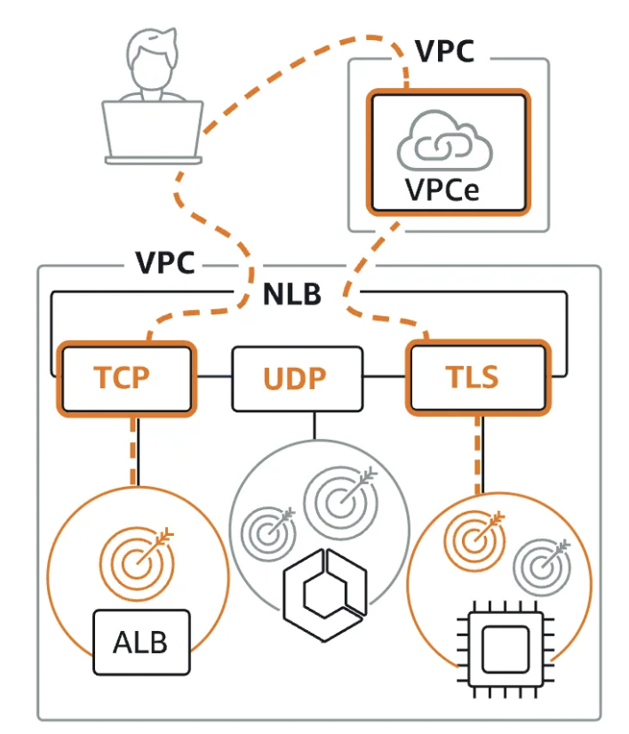
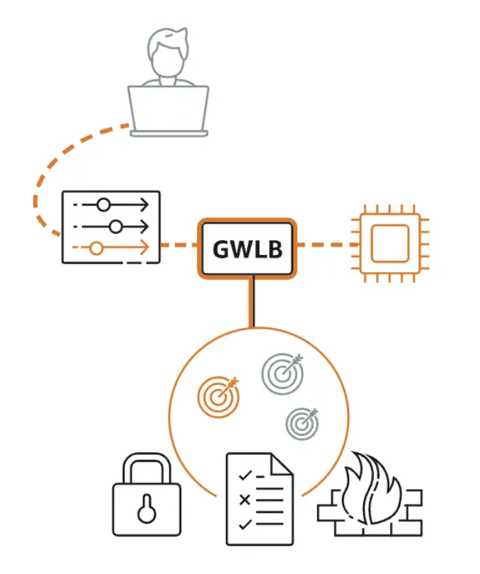

# ELB & ASG

> Everything fails all the time, so plan for failure and nothing fails.

**Elasticity** - refers to the cloud's ability to automatically scale resources up or down in response to varying workloads, dynamic scaling allows  to pay only for the resources used, on-demand. &#x20;

**HA** - resistance to common failures through design and operational mechanism, HA ensures that applications are consistently operational and accessible, with RTO & RPO target downtime, achieved through redundancy, failover strategies, and operational best practices that mitigate the impact of common failures.

**Scalability** - capability of a system to handle increased loads by either upgrading existing resources (vertical scaling) or adding more resources (horizontal scaling) .

* **Vertical Scaling:** Upgrading existing resources (e.g., CPU, RAM) on a single instance.
  * **Use Cases**:&#x20;
    * Legacy applications needing high performance but not designed for distributed environments.
    * Applications like databases where single-instance performance is critical (e.g., PostgreSQL, MySQL).
  * **Advantages**: Elastic vertical scaling,  for applications that benefit from resized instance based on workload demands, like experiencing sudden spikes but can remaining idle during off-peak. Changing instance types is straightforward without needing to re-architectuirng for horizontal scaling (particularly legacy).
  * **Limitations** :
    * Growth is constrained by the maximum capacity of the hardware.
    * Potential downtime during upgrades.
* **Horizontal Scaling**:  more instances to distribute the load
  * **Use Cases**:&#x20;
    * Ideal for distributed systems that require flexibility and fault tolerance.
    * Web applications that can handle many users (e.g., e-commerce sites, content delivery).
  * **Advantages**: Not limited by hardware, allowing for virtually unlimited growth by adding more instances.
  * **Limitations**:
    * More complex architecture and management.
    * Potential consistency issues across instances.

**Reliability** - ability of a workload to perform its required function correctly and consistently, includes  aspects such as uptime, fault tolerance, and adherence to service level agreements (SLAs).

**Resilience** -  workload ability to recover from infrastructure or service disruptions,  including disaster recovery mechanisms and proactive measures to prevent outages.

## ELB - elastic LB

* Managed by AWS
  * AWS takes care of upgrade, maintenance, integration
  * integrated with services like ACM (SSL/TLS certificates), CloudWatch (monitoring), WAF (firewall), and Route 53 (DNS)
* Spread load across multiple downstream EC2s
* Handle failure downstream: Health Checks to monitor instance health and reroutes traffic from unhealthy to healthy instances using configurable checks on ports, routes, and endpoints (e.g., `/health`).
* Expose single point of access, which is ELB DNS name
  * Provides enhanced security because SG inbound rule of EC2 instance will reference ALB SG, which will allow HTTP on port 80, so we can't access instance directly via public IPv4&#x20;
  * application servers / ec2 instances don't see end-client IPs, it in inside X-Forwarded-For header of http request
  * ALB connects to instance on private LB IPs
* DNS host name for your application
* Provide SSL termination (HTTPS) for your websites
* Multi AZ

**ALB** (HTTP, HTTPS, WebSockets, redirects (http -> https)) - Layer 7

<figure><figcaption></figcaption></figure>

1. Best suited for modern application architectures, including containers, micro-services. Routes traffic to targets ( target group) within VPC.
   1. Configurable listener rules to direct traffic&#x20;
2. Routing tables to different targets support, requests based on the path URL like `/login` going to Login micro-service or `/products` going to Products service.
3. Routing based on the hostname in URL
4. Routing based on query strings in URL (blog.com/blogId=dfger)
5. Great for container application, as it has a port mapping feature to redirect to a dynamic port in ECS instance.
6. In front of Lambda function, i.e ALB can  forward the requests to Lambda where HTTP request is translated into a JSON event.  Register Lambda function as targets and configure _Listen Rule_. Request invokes your Lambda function and passes the content of the request to the Lambda function in JSON format.
7. Enhanced security through exposing of ALB DNS name and not ec2 public addresses.&#x20;
   1. The ALB SG allows HTTP/HTTPS traffic from the internet, while EC2 instances' SG only accept traffic from the ALB’s SG, blocking direct public access, i.e. EC2 instance’s security group  inbound rule referencing the ALB's security group as source.
8. DNS Name Only - ALBs are accessed using a DNS name provided by AWS, not an IP address.
   1. AWS assigns a unique DNS name to each ALB, e.g., `my-alb-123456789.us-west-2.elb.amazonaws.com`
   2. ALBs don't support static IPs or Elastic IPs, relying solely on DNS for load balancing.
   3.  Each ALB DNS name is region-specific and does not automatically resolve across multiple AWS regions.

**Network LB** (ultra-high performance,  TCP, UDP, TLS traffic) - Layer 4

<figure><figcaption></figcaption></figure>

1. Suited for load balancing Transmission Control Protocol (TCP), User Datagram Protocol (UDP), and Transport Layer Security (TLS) traffic, has the capability of handling millions of requests per second while maintaining ultra-low latencies.
2. TLS listener to offload the work of encryption and decryption, i.e., TLS offloading at scale ⇒ means handles heavy work of decrypting data from HTTPS, instead of each server doing it, so for all incoming connections)
3. Transmission Control Protocol (TCP), User Datagram Protocol (UDP), and Transport Layer Security (TLS) traffic where extreme performance is required
   * Routes to VPC
   * Financial trading platforms

**Gateway** LB - Layer 3

<figure><figcaption></figcaption></figure>

1. For deep packet inspection, as GWLB first sends the traffic to these EC2 instances that will _analyse_ the traffic to 3rd party virtual appliances, the traffic will be sent back afterwards to the GWLB and then forwarded back to the applications. <mark style="color:red;">When you need inspection and protection before traffic reaches EC2</mark>
2. Designed for deploying and managing 3rd Party virtual fleet of appliances that support GENEVE, like:
   1. firewalls
   2. deep packet inspection systems
   3. intrusion detection systems
   4. URL filtering systems
   5. bump-in-the-wire between the source and destination

**Classic LB** ( Layer 4 +7) / depreciates in 2023

Typical HA architecture is multi-AZ ( minimum 2 ) with cross-region replication for data redundancy,  disaster recovery, safeguarding against region-specific failures.

HA leverages ELB, which is a server that distributes traffic to servers downstream. Typically, it is configured to direct traffic to the back end that has the least outstanding requests. Backend scales, once the new instance is ready ( configure ASG) and tells the ELB that it can take traffic. The frontend doesn't know and doesn't care how many back end instances are running. This is **true decoupled architecture.**

* #### Instances inform LB about their capacity
* Health Check mechanism :green\_heart: , periodically sends metrics
* As ASG backend adds new instance, new instance tells ELB when it can take request

* **What to use to handle hundreds of thousands of connections with low latency?A Network Load Balancer can handle millions** of requests per second with low-latency. It operates at Layer 4, and is best-suited for load-balancing TCP, UDP, and TLS traffic with ultra high-performance.

