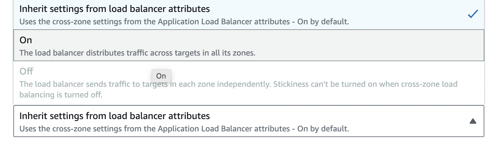
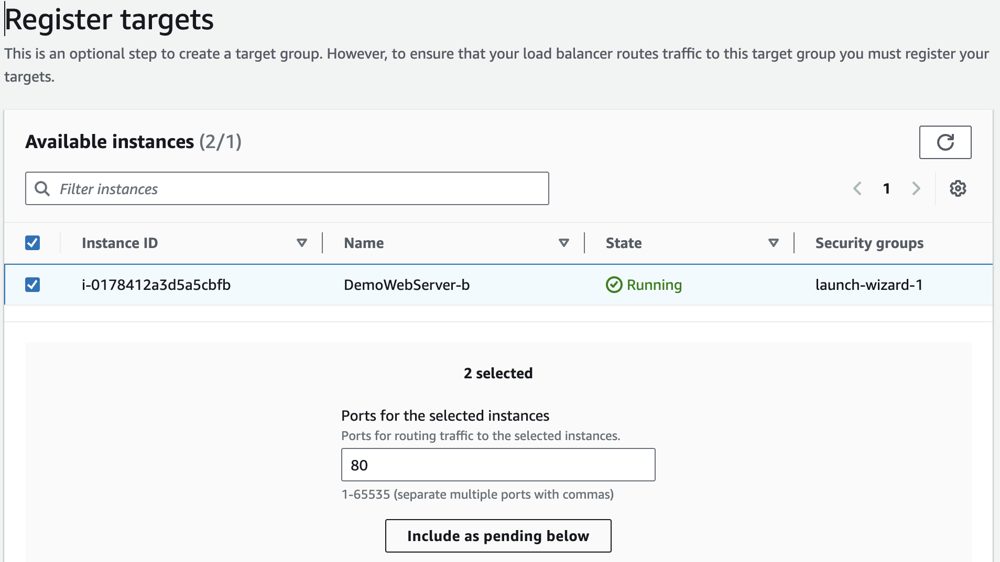
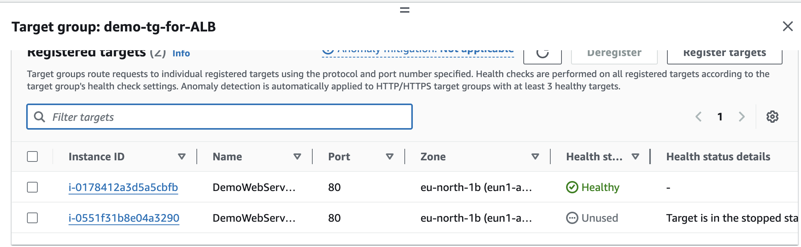
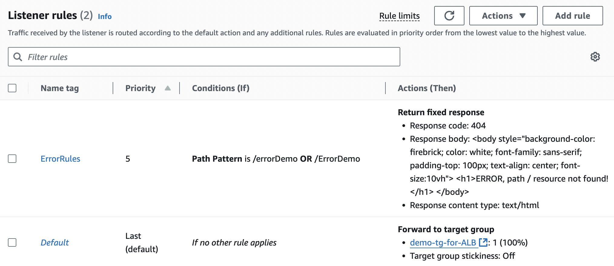
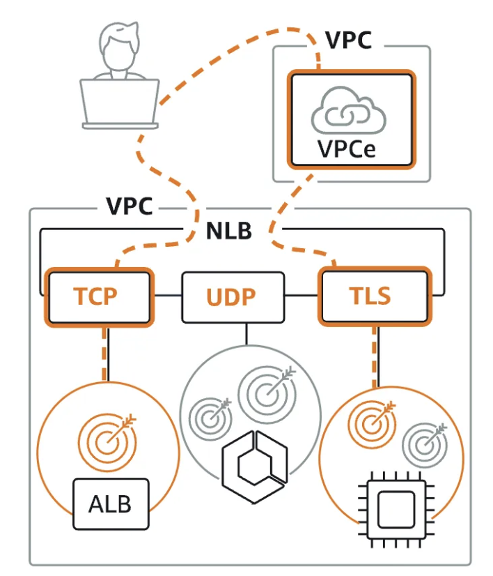
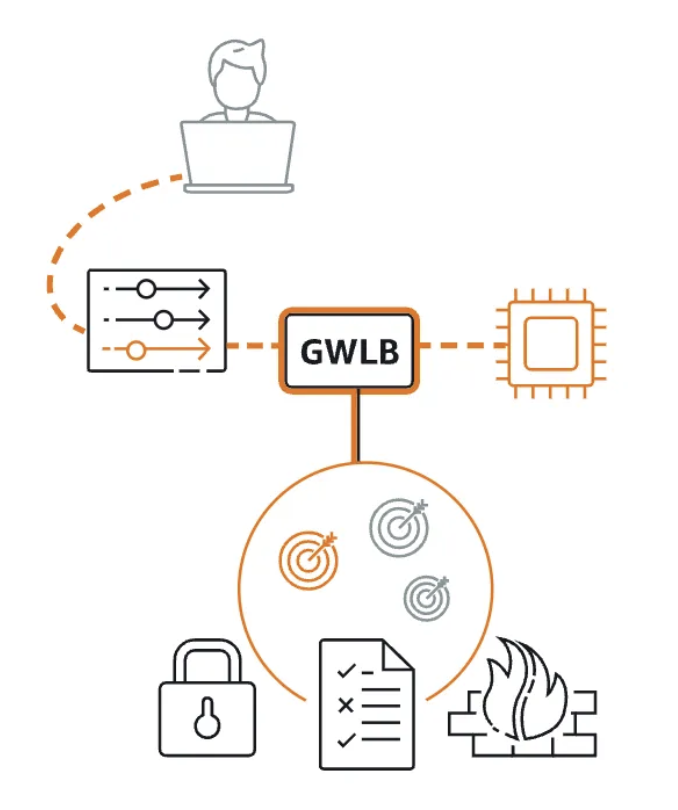
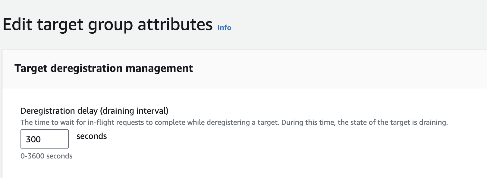
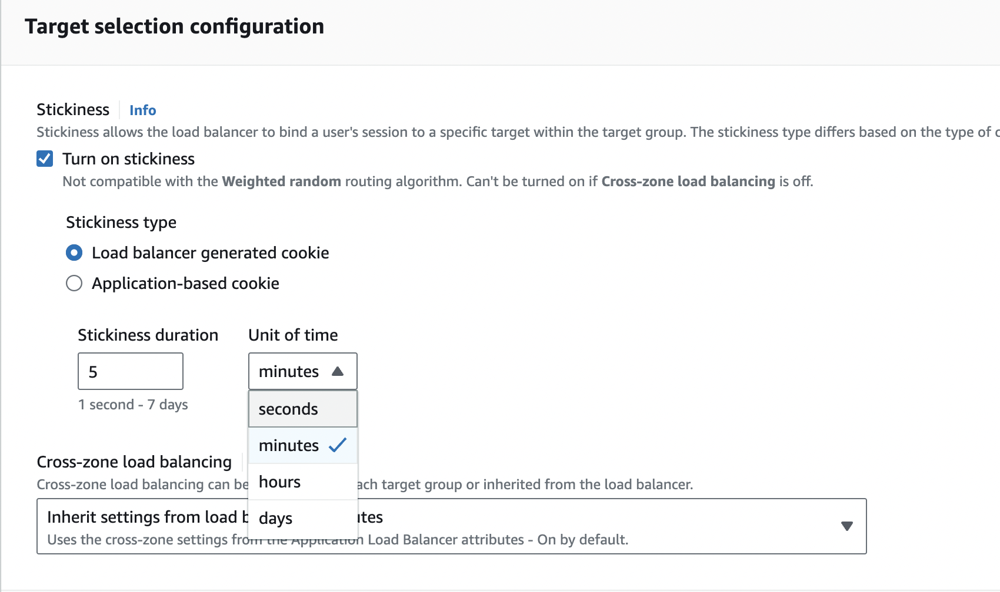

# ELB & ASG

> Everything fails all the time, so plan for failure and nothing fails.

Elasticity - refers to the cloud's ability to automatically scale resources up or down in response to varying workloads, dynamic scaling allows  to pay only for the resources used, on-demand. &#x20;

HA - resistance to common failures through design and operational mechanism, HA ensures that applications are consistently operational and accessible, with RTO & RPO target downtime, achieved through redundancy, failover strategies, and operational best practices that mitigate the impact of common failures.

Scalability - capability of a system to handle increased loads by either upgrading existing resources (vertical scaling) or adding more resources (horizontal scaling) .

* Vertical Scaling: Upgrading existing resources (e.g., CPU, RAM) on a single instance.
  * Use Cases:&#x20;
    * Legacy applications needing high performance but not designed for distributed environments.
    * Applications like databases where single-instance performance is critical (e.g., PostgreSQL, MySQL).
  * Advantages: Elastic vertical scaling,  for applications that benefit from resized instance based on workload demands, like experiencing sudden spikes but can remaining idle during off-peak. Changing instance types is straightforward without needing to re-architectuirng for horizontal scaling (particularly legacy).
  * Limitations :
    * Growth is constrained by the maximum capacity of the hardware.
    * Potential downtime during upgrades.
* Horizontal Scaling:  more instances to distribute the load
  * Use Cases:&#x20;
    * Ideal for distributed systems that require flexibility and fault tolerance.
    * Web applications that can handle many users (e.g., e-commerce sites, content delivery).
  * Advantages: Not limited by hardware, allowing for virtually unlimited growth by adding more instances.
  * Limitations:
    * More complex architecture and management.
    * Potential consistency issues across instances.

Reliability - ability of a workload to perform its required function correctly and consistently, includes  aspects such as uptime, fault tolerance, and adherence to service level agreements (SLAs).

Resilience -  workload ability to recover from infrastructure or service disruptions,  including disaster recovery mechanisms and proactive measures to prevent outages.

## ELB - elastic LB

* Managed by AWS
  * AWS takes care of upgrade, maintenance, integration
  * integrated with services like ACM (SSL/TLS certificates), CloudWatch (monitoring), WAF (firewall), and Route 53 (DNS)
* Spread load across multiple downstream EC2s
* Handle failure downstream: Health Checks to monitor instance health and reroutes traffic from unhealthy to healthy instances using configurable checks on ports, routes, and endpoints (e.g., `/health`).
* Expose single point of access, which is ELB DNS name
  * Provides enhanced security because SG inbound rule of EC2 instance will reference ALB SG, which will allow HTTP on port 80, so we can't access instance directly via public IPv4&#x20;
  * application servers / ec2 instances don't see end-client IPs, it in inside X-Forwarded-For header of http request
  * ALB connects to instance on private LB IPs
* DNS host name for your application
* Provide SSL termination (HTTPS) for your websites
* Multi AZ

## ALB (HTTP, HTTPS, WebSockets, redirects (http -> https)) - Layer 7

<figure><figcaption></figcaption></figure>

1. Best suited for modern application architectures, including containers, micro-services. Routes traffic to targets ( target group) within VPC.
   1. Configurable listener rules to direct traffic&#x20;
2. Routing tables to different targets support, requests based on the path URL like `/login` going to Login micro-service or `/products` going to Products service.
3. Routing based on the hostname in URL
4. Routing based on query strings in URL (blog.com/blogId=dfger)
5. Great for container application, as it has a port mapping feature to redirect to a dynamic port in ECS instance.
6. In front of Lambda function, i.e ALB can  forward the requests to Lambda where HTTP request is translated into a JSON event.  Register Lambda function as targets and configure _Listen Rule_. Request invokes your Lambda function and passes the content of the request to the Lambda function in JSON format.
7. Enhanced security through exposing of ALB DNS name and not ec2 public addresses.&#x20;
   1. The ALB SG allows HTTP/HTTPS traffic from the internet, while EC2 instances' SG only accept traffic from the ALB’s SG, blocking direct public access, i.e. EC2 instance’s not available via public Public IPv4 address
   2. <mark style="color:purple;">EC2 SG inbound rule for HTTP , port 80 references ALB security group</mark>
8. DNS Name Only - ALBs are accessed using a DNS name provided by AWS, not an IP address.
   1. AWS assigns a unique DNS name to each ALB, e.g., `my-alb-123456789.us-west-2.elb.amazonaws.com`
   2. ALBs don't support static IPs or Elastic IPs, relying solely on DNS for load balancing.
   3. Each ALB DNS name is region-specific and does not automatically resolve across multiple AWS regions.
9. Cross-zone balancing by default ( can be disabled at TG level), no cross-AZ data charges

<figure><figcaption></figcaption></figure>

<mark style="color:purple;">Target Group for ALB</mark>

### Click Include targets ( only healthy, running will appear)

### Monitor

### **Listener Rules**

Listeners and rules -> Select default Rule (HTTP : 80) -> Add Rule

## Network LB (ultra-high performance, TCP, UDP, TLS traffic) - Layer 4

<figure><figcaption></figcaption></figure>

1. Suited for load balancing Transmission Control Protocol (TCP), User Datagram Protocol (UDP), and Transport Layer Security (TLS) traffic, has the capability of handling millions of requests per second while maintaining ultra-low latencies.
2. TLS listener to offload the work of encryption and decryption, i.e., TLS offloading at scale ⇒ means handles heavy work of decrypting data from HTTPS, instead of each server doing it, so for all incoming connections)
3.  Target groups:

    1. ec2 tg
    2. private IP addresses
    3. ALB

4. Health :heart\_exclamation: checks for TCP, HTTP/S
5. Cross regional / AZ charges for cross-zoen load balancing enabled
6. Has static a static IPv4 address (or Elastic IP if specified)
   1. ideal for workloads requiring fixed IP addresses -  some legacy systems with strict IP whitelisting requirements
   2. IP whitelisting, :european\_castle: firewalls - many enterprises use firewalls that require specific IPs for access control.
   3. ideal for applications with strict latency (videoconferencing, trade platforms) as they need ensuring a predictable and stable endpoint, TCP traffic and not DNS resolution dependence,  reliance which can be slower and susceptible to caching issues

## Gateway LB - Layer 3

<figure><figcaption></figcaption></figure>

1. For deep packet inspection, as GWLB first sends the traffic to these EC2 instances that will _analyse_ the traffic to 3rd party virtual appliances, the traffic will be sent back afterwards to the GWLB and then forwarded back to the applications. <mark style="color:purple;">When you need inspection and protection before traffic reaches EC2</mark>
2.  Designed for deploying and managing 3rd Party virtual fleet of appliances that support GENEVE (port 6081), like:

    1. firewalls ( GWLB can drop traffic)
    2. deep packet inspection systems
    3. intrusion detection systems
    4. URL filtering systems
    5. bump-in-the-wire between the source and destination

    For that Route tables must be configured in VPC, and traffic goes to GWLB -> virtual applications -> if accepted -> GWLB -> application&#x20;

## TG Attributes

<figure><figcaption></figcaption></figure>

* **Deregistration Delay** is set for a **target group**, not for individual targets (EC2 instances). For example, delay to **60 seconds**, when an instance is deregistered from the load balancer (e.g., during scaling down or when manually removing it), the load balancer will wait for 60 seconds before fully removing it.
* The delay time is between **1 to 3600 seconds** (1 hour).
  * **Short Delays** (30-60 seconds ) :heavy\_plus\_sign: Reduced waiting time for traffic to stop flowing to a deregistered instance :heavy\_minus\_sign: Active connections may be interrupted, leading to error req.
    * For **stateless apps,**  web server serving simple, short-lived HTTP requests (like a REST API).
    * **For highly dynamic environment** where instances are being frequently added and removed (e.g., autoscaling environments), you may want a shorter deregistration delay to ensure quick response times.
    * Low latency / Real-time applications&#x20;
    * Zero downtime recovery systems
  * **Long Delays** (300-600 seconds / 5-10 minutes)
    * For **stateful apps,** to finish in-progress session cleanly ( uploads, transactions)
    * Graceful shutdowns for web applications
* A **longer delay ensures** that the instance has more time to finish processing existing connections before being deregistered from the load balancer.
* Complete removal of an attribute when sessions don't matter or when rapid scaling is essential, like testing to validate ASG behaviour.

### Session Affinity / Sticky cookies&#x20;

Stickiness allows the load balancer to bind a user's session to a specific target within the target group. The stickiness type differs based on the type of cookie used. So user is resolved to the same specfic instance to maintain session data.

ALB will use a cookie (typically the `AWSALB` cookie) to track which EC2 instance the client should be sent to for subsequent requests.

<figure><figcaption></figcaption></figure>

Can be enabled with: _application-bases or duration cookies_

Application-based cookie

* Custom
  * Generated by the target application&#x20;
  * Can include any custom attributes required by the application
  * Cookie name must be specified individually for each target group
  * Don’t use AWSALB, AWSALBAPP, or AWSALBTG (reserved for use by the ELB)
* Application cookie
  * Generated by the load balancer&#x20;
  * Cookie name is AWSALBAPP

Duration-based cookie ( Load balancer generated cookie)

* Generated by LB
* Expiration duration is generated by LB
* Cookie name is AWSALB for ALB, AWSELB for CLB

Typical **HA architecture** is multi-AZ ( minimum 2 ) with cross-region replication for data redundancy,  disaster recovery, safeguarding against region-specific failures.

HA leverages ELB, which is a server that distributes traffic to servers downstream. Typically, it is configured to direct traffic to the back end that has the least outstanding requests. Backend scales, once the new instance is ready (configure ASG) and tells the ELB that it can take traffic. The frontend doesn't know and doesn't care how many back end instances are running. This is true decoupled architecture.

* Instances inform LB on their capacity
* Health Check mechanism :heart\_exclamation:  to periodically send metrics
* ASG created instance tells LB it can take requests

## Cross-Zone :earth\_americas: LB

enables your **ALB** or **NLB** to distribute incoming **traffic equally** across **all instances** in both AZ1 and AZ2, no matter which AZ the traffic came from.

#### Key Benefit:

* **Improved Load Distribution for Imbalanced amount of instances per AZ**: It ensures that the load is balanced across **all** targets, improving reliability and preventing one AZ from becoming overloaded.
*   **Example distribution 3 AZ with** (2 instances in each AZ) ( 1000 requests):

    * **AZ1**: 33.33% of requests (333 requests)
    * **AZ2**: 33.33% of requests (333 requests)
    * **AZ3**: 33.33% of requests (334 requests)

    The 1000 requests are evenly distributed across the 6 EC2 instances. Each instance would handle roughly **166-167 requests**. Here's how the load is shared:

    * **AZ1** instances: 333 requests / 2 instances = 166.5 requests per instance
    * **AZ2** instances: 333 requests / 2 instances = 166.5 requests per instance
    * **AZ3** instances: 334 requests / 2 instances = 167 requests per instance

