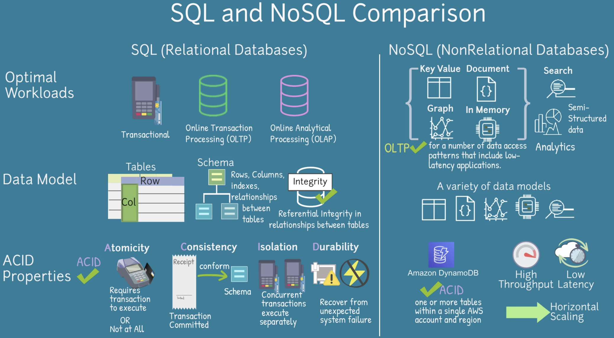
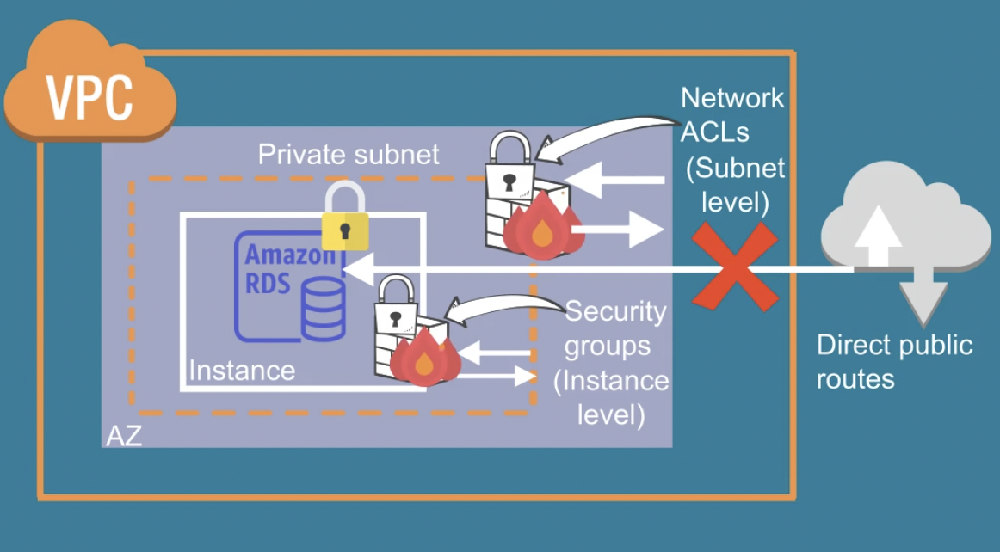
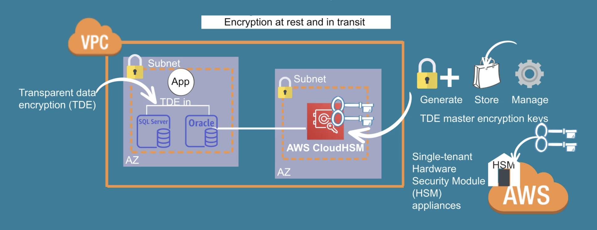
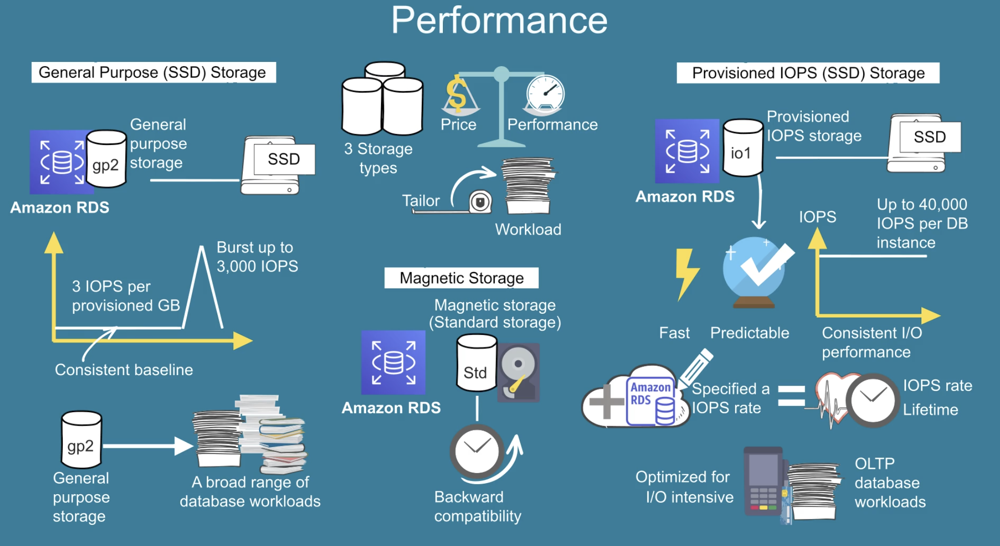
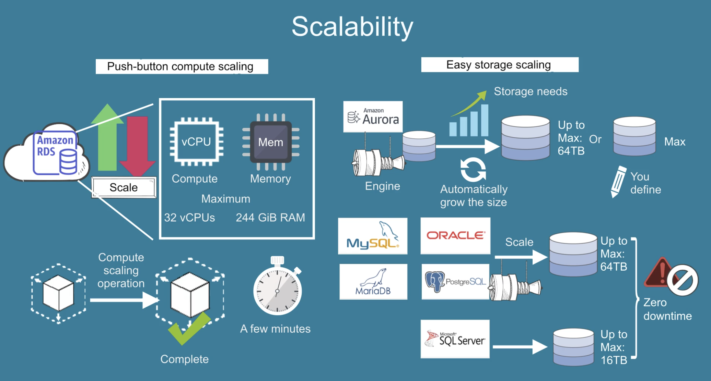
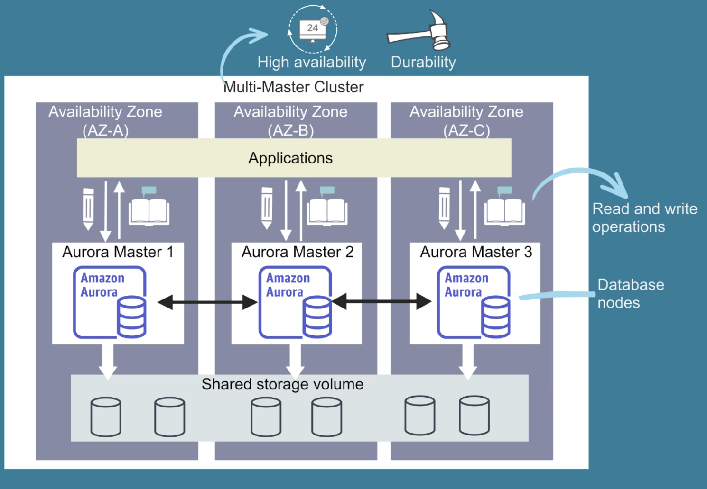
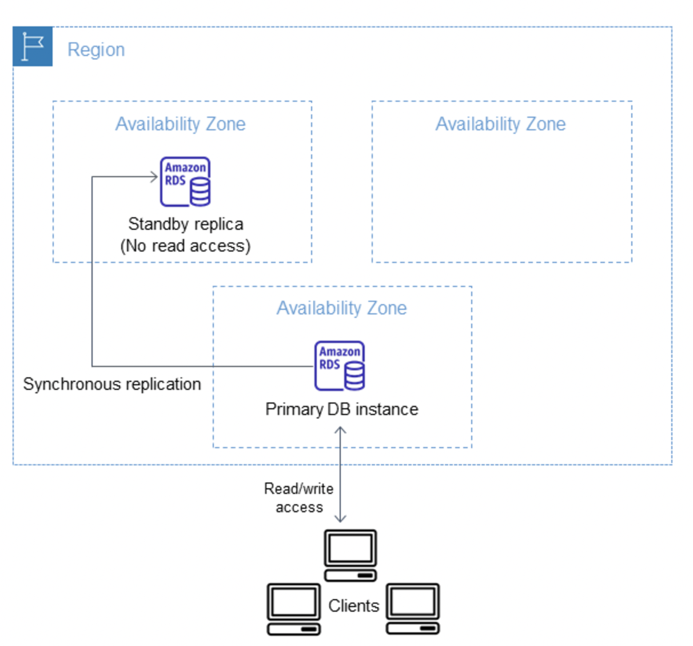
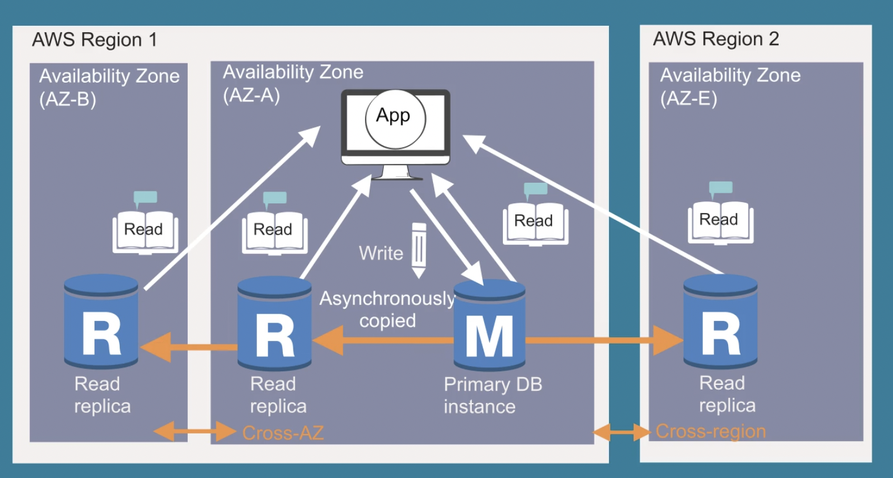

# RDS

<figure><figcaption></figcaption></figure>

<figure><figcaption></figcaption></figure>


* Managed DB service for SQL, automatically scales, but we don't have ssh access, but get patching, provisioning.
* **Aurora** and **RDS primary instances** provide **strong consistency** for all reads and writes.
* **Replicas** for both Aurora and RDS are **eventually consistent**, as replication is asynchronous.\
  For applications requiring **strongly consistent reads** at scale, query the primary instance or Aurora's shared storage layer directly.
* Automatic host replacement
* Automatic backups for PITR -> stored on s3 up to 35 days
  * **PITR** lets you restore your database to a specific point in time within the retention window.
* **Snapshots are manual, user-initiated backups** that you can take at any time. Snapshots do not have an expiration period **->** s3 kept until you delete
* Recommendation for **network isolation** i.e. to run in **private subnet of your VPC to isolate ->** both SG at the instance level and ACL on the subnet level protection :european\_castle::closed\_lock\_with\_key:
  * use IPsec VPN to connect to on premises&#x20;

<figure><figcaption></figcaption></figure>


* Lift-and-shift migration -  to move RDBMS to the cloud :truck:
* Maximum storage Threshold ( not to scale indefinitely) -> configure is Free storage % is less than 10% of Total storage will auto-scale scale ( 6hrs since last modification ,condition persist over 5min)
* CloudWatch integration + :alarm\_clock: **-> SNS to notify** :bell: on over 40 DB events&#x20;
* No upfront :moneybag: pay for usage but **monthly charge for each instance launched** :rocket:
  * Reserved RDS instance for 1 -3 year
* Stop & Start instances for up to 7 days
* Resource-level IAM policies ( granular access for DEV db instances vs prod instances )&#x20;
* If my  **EC2 instance** is in a **private subnet** and my **RDS instance** is in the **same VPC** (typically in a private subnet as well), they can communicate directly through the VPC’s **private IP. I only need Security Groups** to allow traffic between your EC2 instance and the RDS instance. For example, the security group of the EC2 instance allows outbound traffic on the MySQL port (e.g., 3306) and the RDS security group allows inbound traffic on that same port.

## RDS Encryption

* **Encryption Cannot Be Disabled**: Once encryption is enabled for an RDS instance, it cannot be disabled. You can, however, create a new encrypted instance and migrate data.
* **Automatic Encryption for Snapshots and Backups**: When you create an encrypted RDS instance, all snapshots and backups taken from that instance are also encrypted. If you copy a snapshot to another region, it can be encrypted using your CMK
* KMS for encryption at rest ( CMK) + TLS in transit

**You cannot directly enable&#x20;**<mark style="background-color:red;">**encryption**</mark>**&#x20;for an existing unencrypted RDS DB instance? no**\
Work around:

1. Taking an unencrypted snapshot of the DB instance.
2. Copying the snapshot and enabling encryption during the copy.
3. Restoring the encrypted snapshot to create a new encrypted DB instance.
4. **Once a database is encrypted, you cannot disable encryption** for that DB instance.

#### **Can I Create an Encrypted Snapshot of an Unencrypted Volume or DB Instance?**

* **Yes**, you can create an encrypted snapshot of an unencrypted DB instance or EBS volume by **copying the snapshot** and <mark style="background-color:red;">**enabling encryption during the copy operation.**</mark>
  * For RDS: Copy the unencrypted snapshot and select encryption during the copy.
  * For EBS: Same process—copy the unencrypted snapshot and encrypt it during the copy.

#### How to encrypt READ replicas :bookmark\_tabs:?

#### **Read Replicas in the Same AWS Region** :green\_circle: :green\_circle:

* When you create the read replica, ensure that **the encryption option is inherited from the primary instance** (RDS will automatically create encrypted replicas).
  * The Read Replica will **inherit the encryption settings and KMS key** from the source database.
  * or inherit **SSE-RDS** as during the instance creation encryption is **enabled at rest by default**.
* You **cannot use a different KMS key** for the Read Replica in the same region.
  * Make sure that the necessary IAM roles allow replication to use the CMK.
* All read replicas will be encrypted with the same encryption key used by the primary DB instance.

#### **Read Replicas in a Different AWS Region** :green\_circle: :blue\_circle:

For cross-region replication, with **SSE-RDS**, the replica uses default AWS-managed keys, but with **KMS-CMK**, you must copy the CMK to the target region and ensure permissions are set correctly.

1. Enable **RDS Encryption** on the primary DB instance. The primary DB instance must have encryption enabled (SSE-RDS) in the source region.
2.  **Enable Cross-Region Replication**.

    * When creating a **cross-region read replica**, RDS will automatically ensure the replica is encrypted, but you cannot choose encryption keys because it uses the **default AWS-managed keys** (SSE-RDS).


3. **Create Read Replica in the Target Region**. During the creation of the cross-region read replica, RDS will automatically encrypt the replica with the default AWS-managed encryption keys.
4. The read replica in the target region is encrypted with **AWS-managed keys (SSE-RDS)**.

#### For KMS:CMK

1. Enable encryption with **KMS-CMK** on the primary DB instance.
2. Create Read Replicas in target region and specify the KMS CMK that will be used for encryption in there.
3. **Copy the CMK** to the target region before creating the replica, **as KMS keys are region-specific.** You will also need to ensure that both the source and target regions have access to the same CMK.
   1. Billed for storing cmk in both regions
   2. billed for encryption/decryption operations you perform in both regions
   3. **Cannot be single-region CMK** the key is **only usable in the region** where it was created. You **cannot replicate it and single-region keys cannot be changed to multi-region**.&#x20;

<mark style="background-color:green;">**For best practice**</mark><mark style="background-color:green;">: Use</mark> <mark style="background-color:green;"></mark><mark style="background-color:green;">**different CMKs**</mark> <mark style="background-color:green;"></mark><mark style="background-color:green;">in each region to ensure key isolation, security, and compliance.</mark>

1. Make sure that the IAM role used for the replication has sufficient permissions to use the CMK in the target region.
2. The read replica in the target region will use the same **KMS-CMK** as the primary DB instance.

<figure><figcaption></figcaption></figure>

<figure><figcaption></figcaption></figure>


## 6 Engines&#x20;

* PostgreSQL
  * Up to **5 Read replicas**
  * support for complex queries
* MySQL
  * Up to **5 Read replicas**
* MariaDB
  * strong to support MySql application, is a fork of MySQL, used as drop-in replacement
  * Up to **5 Read replicas**
  * General Purpose SSD (gp3) includes 3,000 IOPS at no additional cost independent of volume size.
*   Oracle

    * Up to **5 Read replicas**
    * You can run Amazon RDS for Oracle under two different licensing models – “License Included” and “Bring-Your-Own-License (BYOL)”. The “BYOL” model is designed for customers who prefer to use existing Oracle database licenses or purchase new licenses directly from Oracle.


* Microsof SQL Server
  * **No read replicas, use Availability Groups for high avail**
  * IBM DB2
* Aurora PostgreSQL/MySQL&#x20;

## Storage&#x20;

* supports 3 **types of instance classes** computational and memory instances
  * Standard -> m1 -m6 series
  * Memory optimised  -> **r series** (ideal for large RAM)
  * burstable t2, t3 series -> with ability to burst to full CPU

<figure><figcaption></figcaption></figure>

## Storage Auto-Scaling

<figure><figcaption></figcaption></figure>


### **Aurora** :woman\_office\_worker::star: **AWS-native relational database** compatible with MySQL and PostgreSQL

> proprietary technology from AWS, is designed to improve upon standard MySQL and PostgreSQL

* Fully managed by RDS, which automates time-consuming administration tasks like hardware provisioning, database setup, patching, and backups -> **no administration burden**
* **HA native**
* **Multi-master cluster features** :star: -> ie scale R/W ops -> <mark style="background-color:red;">no need to failover mechanism</mark>
* Aurora allows up to **15** low-latency read **replicas**
  * Has Reader and Writer instance&#x20;
  * You're charged  :dollar: for the replicas used
  * Set up Read Replicas Auto Scaling policy: based on CPU usage or average number of connections
  * Storage is designed to scale across 100s of volumes, providing **automatic failover** and **fault tolerance**. It replicates data across three Availability Zones (AZs), with 6 copies of the data (2 copies in each AZ) :muscle:
  * Only the primary **(master)** instance accepts **writes**, while read replicas handle read traffic. If the primary fails, Aurora promotes a replica to become the new master, **but at any given time, only one instance accepts writes.**
    * <mark style="color:purple;">Aurora provide Writer Endpoint (DNS name) pointing to the master</mark>&#x20;
    * <mark style="color:purple;">Reader Endpoints connect to the Load Balancer</mark>
* Features a distributed, fault-tolerant, **self-healing with peer-to-peer replication** system that auto-scales up to **64TB per database instance.** It delivers high performance and availability with up to 15 low-latency read replicas, point-in-time recovery, continuous backup to Amazon S3, and replication across three Availability Zones (AZs).
* Aurora MySQL automatically replicated across 3 AZs
* Prices 1/10 of the cost of commercial DBs like Oracle or SQL Server
* Cloud optimised and claims **5x faster** performance over standard MySQL on RDS, 3x over Postgres on RDS
* Continuous **backup** to S3, and replication across three AZs.
  * Aurora’s **storage grows automatically** in **10GB increments as needed,** from min 10GB up to a maximum of **128TB**.
  * Costs 20% more than RDS but more efficient
  * **No free tier**

<figure><figcaption></figcaption></figure>


## RDS Deployments :airplane\_departure:

### **RDS Multi-AZ deployments -> high availability, not for scaling**

<div align="left"><figure><figcaption></figcaption></figure></div>

When you provision your database with the Multi-AZ option, Amazon RDS automatically provisions and maintains a **synchronous** standby instance, which doesn't serve read traffic.

_<mark style="color:blue;">It's called a Multi-AZ DB instance deployment -> Reliable? Absolutely. Scalable? Not really.</mark>_

* <mark style="color:blue;">SYNC</mark> replication to standby DB in another AZ ->  primary :crossed\_swords: database synchronously replicates the data to the **standby** instance (this ensures no data loss during failover), and  RDS automatically fails over to the standby instance if the primary instance fails -> good for :sunny: fault isolation :warning::exclamation: and HA **no reads from it** :scream\_cat:
* **RDS applies OS updates by performing maintenance on the standby, then promoting the standby to primary, and finally performing maintenance on the old primary, which becomes the new standby**
  * Run RDS applies operating system updates by as:
    * Perform maintenance on the standby
    * Promote the standby to primary.
    * Perform maintenance on the old primary, which becomes the new standby.
* Writes are only possible on the **primary instance**.
* **Not meant for** read scaling or multi-region deployments.
* No need to stop DB to enable ->  you modify and snapshot is taken and restored in anothe AZ, and synch mechanism is established
* **Automatic failover** works only in **Multi-AZ deployments ->** possible because there's one DNS name for main and standby DB
  * A single static DNS  string like `jdbc:mysql://.rds.amazonaws.com:3306/mydb,`this allows for seamless failover to standby instance in another AZ
  * You don't get a DNS name for the standby instance, and it **won't handle any traffic** unless a failover occurs
  * If a failover happens, your application may briefly lose connectivity while the DNS name updates -> :warning: The failover typically completes within **60-120 seconds**, depending on the database engine&#x20;
* For scaling read traffic, **you can create read replicas** from the primary  instance in the same or cross- region. **Up to 5 read replicas** are supported for a **single primary instance** (this limit applies across all regions).

<details>

<summary>Failover process <span data-gb-custom-inline data-tag="emoji" data-code="1f32a">🌪️</span></summary>

**Event Trigger**: Failover is triggered in scenarios like:

* The primary instance becomes unavailable (e.g., hardware failure, OS crash).
* Loss of network, AZ datacenter&#x20;
* Loss of instance storage (if AZ experiences an outage, the instance storage in that AZ could be affected,  or issues such as file system corruption or metadata inconsistencies)
* Planned maintenance (e.g., patching or updates).
* Manual reboot with failover initiated by you.

**After Failover:**

* \*Old primary in AZ1 is replaced.
* Standby in AZ2 is promoted to primary.
* A new standby instance is created in AZ1 (or another AZ).

</details>

#### Multi-AZ DB cluster deployment

:white\_check\_mark: When the deployment has **2 standby  instances,** it's called a _Multi-AZ DB cluster deployment_. A Multi-AZ DB cluster deployment has standby DB instances that provide failover support and can also serve read traffic.

* One writer DB instance and two reader DB instances in three separate Availability Zones in the same AWS Region.
*   Multi-AZ DB clusters are supported only for the **MySQL** and **PostgreSQL** DB engines.


### **RDS Multi-Region deployments ->** Disaster Recovery (DR) and Improved Global Performance

_<mark style="color:blue;">Good for global reach, but you’ll have to be the one pressing buttons during disasters</mark>_.

&#x20;Multi-Region deployments -  purpose is disaster recovery and local performance.


### **RDS Read Replicas -> for scalability, not HA.**

Purpose to <mark style="color:blue;">offload read-heavy traffic from the primary database</mark> to these replicas, improving the overall read performance and increases the **aggregate read-throughput.**

<figure><figcaption></figcaption></figure>


* Scales out by ASYNC replication with reads being eventually consistent\*
* Replicas can be within AZ, cross-AZ, cross-Region
  * If your master DB is in a single AZ and you create **read replicas in different AZs**, you  <mark style="background-color:red;">don’t get automatic failover in the event of a primary DB failure</mark> -> need to **manually promote a read replica to master**
* Each read replica has its **own DNS endpoint**. You can **connect** directly to a **specific** **read replica** using these endpoints to offload read traffic from the primary instance.

```javascript
//Read Replica 1
jdbc:mysql://<read-replica-1-endpoint>.rds.amazonaws.com:3306/yourdatabase
//Read Replica 2
jdbc:mysql://<read-replica-2-endpoint>.rds.amazonaws.com:3306/yourdatabase
```

* Replicas can be promoted to master DBs -> **manual console, api, cli action.** The promotion process involves downtime during the transition from read replica to primary.
* Ensure it is for SELECT type of queries, ie enable analytics reporting from DB besides main application reads / writes&#x20;
* Exception for cross AZ (same Region) network costs ( as it is a managed RDS service) - no fee

<figure><figcaption></figcaption></figure>

### Blue /Green deployment

Creates staging env. It copies a production database environment to a separate, synchronized staging environment. It stays in sync with the current production environment using logical replication.

<figure><figcaption></figcaption></figure>

## RDS Proxy :sweat\_drops:

> Using an RDS Proxy allows your applications to pool and share database connections to help them scale.&#x20;
>
> When you create an RDS Proxy with your database, RDS uses the database name as part of the proxy identifier.


**Single Proxy Endpoint**: When you set up RDS Proxy, AWS provides you with a single endpoint for the proxy, such as:

```bash
jdbc:mysql://<rds-proxy-endpoint>.rds.amazonaws.com:3306/yourdatabase

```

* **Reduced database load**: By reusing existing connections, it minimizes the strain on RDS, especially during traffic spikes.
* **Enhanced security**: RDS Proxy enforces **IAM authentication**, simplifying credentials management and reducing the risk of exposing database passwords.
* **Lambda connection management:** lambdas often experience high concurrency and can create many database connections quickly. RDS Proxy **pools and reuses connections**, <mark style="color:purple;">which prevents Lambda from overwhelming the database with too many simultaneous connections.</mark>
* No application code change, without a proxy, your application would need to handle failover logic manually
* **Load Balancing for Many READ replicas:** For load balancing across read replicas, you can use a **proxy.**
  * Replica **retains** its **own unique DNS endpoint** in addition to the RDS Proxy endpoint, so we can benefit from connection pooling, load balancing ,auto failover, but still use DNS endpoint for specialised workloads, like some ad-hoc Analytics or Reporting App connects directly to a specific replica
* **VPC-Only Access**: RDS Proxy **never exposes** the database to the public internet; it is **restricted to your VPC**, ensuring private and secure access.

## **Security Details for RDS:**

1. **Encrypting an Existing Unencrypted DB**:
   * To encrypt an unencrypted RDS instance, **create a snapshot**, then **restore it as an encrypted instance**.
   * **Important**: If the master instance was not encrypted at creation, any **read replicas** created from it **cannot be encrypted**. To create encrypted replicas, the master instance must first be encrypted.
2.  **SSH Access**:

    * RDS instances do **not** provide SSH access, except for **RDS Custom** instances (for database engines like PostgreSQL and MySQL, or SQL Server), which are part of the **RDS Custom for SQL Server** offering.


## ElastiCache

Compatible open-source caching solutions: Valkey, Memcached and Redis OSS.

**Use cases:**

* Add caching or in-memory layer to your application architecture instantly.
* To help you build and deploy machine learning models quickly.
* For real-time analytic, used with streaming solutions such as Apache Kafka and Amazon Kinesis as an in-memory data store to ingest, process, and analyse data.

<table data-header-hidden><thead><tr><th width="186"></th><th></th><th></th></tr></thead><tbody><tr><td><em><strong>Feature</strong></em></td><td><em><strong>Redis</strong></em></td><td><em><strong>Memcached</strong></em></td></tr><tr><td><strong>Data Storage</strong></td><td>Supports various DS (strings, lists, sets, sorted sets, hashes, bitmaps), ie to manipulate complex DS</td><td>Supports simple key-value pairs, where value is simple object (int, string)</td></tr><tr><td><strong>Persistence</strong></td><td>Supports RDB snapshots, AOF logs</td><td><mark style="color:blue;">Stateless</mark> => No persistence; data is lost on server restart</td></tr><tr><td><strong>Replication + HA</strong></td><td>Master-slave replication, Redis Sentinel for automatic failover, <mark style="color:blue;">Cluster mode i</mark>s also supported for sharding and scalability.</td><td>No built-in replication or failover, consistency must be handled by the client</td></tr><tr><td><strong>Performance</strong></td><td>High, but slightly slower than Memcached for simple use cases</td><td>Faster for simple key-value storage retrieval</td></tr><tr><td><strong>Scalability</strong></td><td>Horizontal scaling via sharding (using Redis Cluster),</td><td>Horizontal scaling, but sharding is managed by the client</td></tr><tr><td><strong>Eviction Strategy</strong></td><td>Multiple eviction policies (LRU, LFU, etc.)</td><td><mark style="color:blue;">LRU</mark> eviction policy (Least Recently Used)</td></tr><tr><td><strong>Multi-threading</strong></td><td>Single-threaded model, ie process  one cmd at a time</td><td>Multi-threaded model, ie multiple cmd concurrently</td></tr><tr><td><strong>Use Cases</strong></td><td>Session management, real-time analytics, leaderboards, pub/sub messaging, caching with persistence</td><td>Simple caching, <mark style="color:blue;">database query caching</mark> or static content caching where persistence is not required.</td></tr><tr><td><strong>Security</strong></td><td>ACLs (Access Control Lists) for granular security</td><td>Relies on network-level security (e.g., VPC, firewalls)</td></tr></tbody></table>

#### **Summary:**

* **Redis (replication)**: Best for advanced caching scenarios, real-time applications & HA , and use cases requiring <mark style="background-color:red;">persistence, replication, and high availability</mark>.
  * **Durability & AOF (Append-Only File)** is a persistence mechanism used by Redis to ensure data durability.
  * ElastiCache Cluster to otimise  reads
* **Memcached (sharding)**: Best for high-speed, simple caching scenarios <mark style="background-color:red;">where persistence and complex data structures are not needed, as it's not persistent, not HA</mark>.
  * Ideal performance for simple key-value pairs, with high-throughput, low-latency caching scenarios.
  * Provides sub-millisecond latency, it **does not support replication.**

#### Cache Eviction&#x20;

* _Cache Invalidation:_ Generally refers to the manual or programmatic removal of data from the cache, often because the data has become stale or needs updating.
* _Cache Eviction:_ Refers to automatic removal of data to manage cache size and relevancy, based on one of the above policies.





**Mechanism**: Removes the data that has not been accessed for the longest period of time.

**Use case**: Effective for applications where recent data is likely to be reused, and applications with limited cache space and large data sets, like recommendation engines or e-commerce  listings

:green\_circle: Simple and efficient, ensures the most frequently accessed items stay in the cache ie. remove items that haven't been accessed recently

:red\_circle:  Not suitable if all data is equally important or access patterns are unpredictable. We can **evict** data that is expensive to retrieve. Expensive to retrieve like e-commerce website where product recommendations are dynamically generated based on user behavior, buy history, since recommendations are personalised, meaning each user has unique recommendations that aren't necessarily reused by others.

:bulb: **Hybrid TTL + LRU (TTL with LRU Backup)**

Items are removed based on TTL to keep data fresh, with LRU applied to items without a TTL expiration to optimize space. So with e-commerce LRU policy evicts the oldest, least-accessed recommendations, potentially including the recommendations of users who rarely log in.



**Mechanism**: Removes items that have been accessed the least frequently.

**Use case**: Suitable for cases where frequently accessed items are more likely to be needed again.

:green\_circle: Keeps frequently accessed data in the cache, reducing cache misses.

:red\_circle: If data access patterns change, LFU may retain old, outdated data that was once popular.



**Mechanism**: Removes the oldest item added to the cache.

**Use case**: Useful when older data is not as valuable or relevant.

:green\_circle: Simple to implement, no need to track usage frequency or access recency.

:red\_circle: Inefficient if the oldest data may still be needed, as it doesn’t consider access frequency.



**Mechanism**: Evicts data after a set **time-to-live (TTL)** expires.

**Use case**: Ideal for caching data that may become stale or is time-sensitive.

:green\_circle: Ensures data is regularly refreshed, keeping the cache relevant.

:red\_circle: Can cause cache misses after TTL, leading to extra load on the backend. Cache expires and makes item stale, and if user requests that item, it results in a **cache miss**. This forces the system to retrieve the data from the backend => sudden DB load spike, especially if multiple items expire simultaneously (e.g., during peak periods), leading to a **"thundering herd"** effect, where many requests hit the backend at once => potential overload.

:bulb: **TTL (Time-to-Live) with Auto-Refresh for Frequently Updated Data:**

Set a TTL, and when the item expires, re-fetch it on demand. You can also implement a **background refresh** to renew data in the cache before it expires to prevent spikes. It keep at fresh, preventing stale items, still can lead to backend overload if TTLs are too short or poorly aligned with data change frequency.

:bulb: **Custom TTL per Data Type**

For mixed data types, where different data has unique expiration needs (e.g., user profiles vs. session data). We assign _different TTLs to data types_ based on their volatility.

**Longer TTL for High-Cost Data**: Set a longer TTL for personalised user recommendations, ensuring they remain in cache for users who visit less frequently.

**Priority-based Eviction**: Prioritise retention of recommendations for specific users (e.g., those who shop frequently), while allowing less costly data to be evicted first.



**Mechanism**: Removes a random item from the cache.

**Use case**: Rarely used as the primary policy but can be useful as a secondary **fallback in high-load situations.**

:green\_circle: Simple and can balance load.

:red\_circle: Risk of evicting frequently used or still-relevant data.




## ElastiCache Strategies

### Cache Aside / Lazy Loading - read optimisation :sleeping:

**How it works:** The application is responsible for loading data into the cache when it is required.&#x20;

:thumbsup: So only requested dat is cached. Fine-grained control over cache population, any failures are not critical.

:thumbsdown: Cache **misses** may lead to extra database calls, as we making 3 API calls and requests are slower, outdated 'stale' data.

1. Check cache for req. data
2. if none -> DB run
3. populate cache with req. data. + return response (data)

### **Write-Through - write optimisation** :writing\_hand:

* **How it works**: Cache is added or updated when database is updated. Used when the application frequently writes data and you want both the cache and database to stay in sync. So we write to DB + push to Cache

:thumbsup: Cache is never stale.

:thumbsdown: Slow, if application frequently writes data and you want both the cache and database to stay in sync. We have write penalty: 2 API calls for writing data, write takes longer than reads.&#x20;

:thumbsup: Cache chun - a lot of never read data&#x20;

### **Write-Behind (Write-Back)**:

* **How it works**: Data is written to the cache and **not** immediately to the DB. The cache writes the data to the database **asynchronously** in the background. Suitable when you want to avoid slow database writes, such as for high-throughput systems.

:thumbsdown: Risk of data loss if the cache is not synchronised properly.


### **Time-Based Expiration (TTL)**:

* **How it works**: Cached data has a **TTL** after which it is automatically evicted. deal for data that may become stale after a period, such as session data, authentication tokens, or frequently changing data.

:thumbsdown: Expensive cache misses


