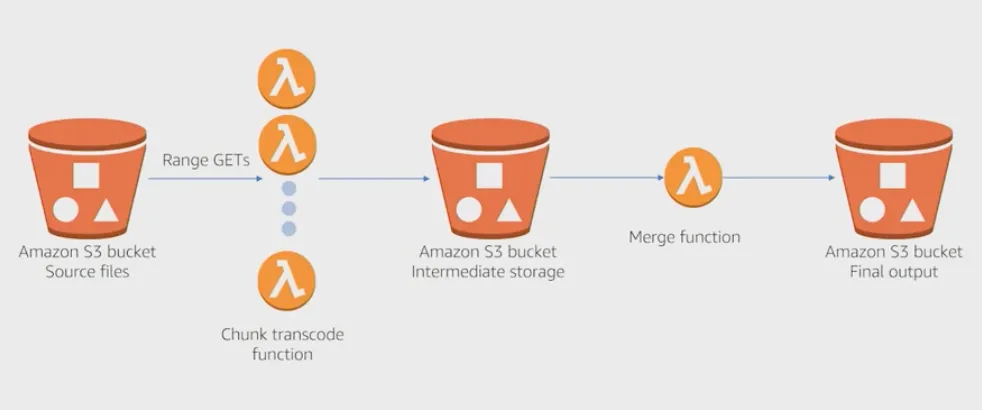

# RDS

Managed DB service for SQL, automatically scales, but we don't have ssh access, but get patching, provisioning.

Lift-and-shift migration -  to move RDBMS to the cloud :truck:

Maximum storage Threshold ( not to scale indefinitely) -> configure is Free storage % is less than 10% of Total storage will auto-scale scale ( 6hrs since last modification ,condition persist over 5min)

## Engines

* PostgreSQL
  * Up to **5 Read replicas**
  * support for complex queries
* MySQL
  * Up to **5 Read replicas**
* MariaDB
  * strong to support MySql application, is a fork of MySQL, used as drop-in replacement
  * Up to **5 Read replicas**
  * General Purpose SSD (gp3) includes 3,000 IOPS at no additional cost independent of volume size.
*   Oracle

    * Up to **5 Read replicas**
    * You can run Amazon RDS for Oracle under two different licensing models – “License Included” and “Bring-Your-Own-License (BYOL)”. The “BYOL” model is designed for customers who prefer to use existing Oracle database licenses or purchase new licenses directly from Oracle.

* Microsof SQL Server
  * **No read replicas, use Availability Groups for high avail**
  * IBM DB2
* Aurora PostgreSQL/MySQL&#x20;

### **Aurora** :woman\_office\_worker:**- AWS-native relational database** compatible with MySQL and PostgreSQL

a proprietary technology from AWS, and is designed to improve upon standard MySQL and PostgreSQL

* Fully managed by RDS, which automates time-consuming administration tasks like hardware provisioning, database setup, patching, and backups.
* HA native
* Aurora allows up to **15** low-latency read **replicas**
  * Has Reader and Writer instance&#x20;
  * You're charged  :dollar: for the replicas used
  * Set up Read Replicas Auto Scaling policy: based on CPU usage or average number of connections
  * Storage is designed to scale across 100s of volumes, providing **automatic failover** and **fault tolerance**. It replicates data across three Availability Zones (AZs), with 6 copies of the data (2 copies in each AZ) :muscle:
  * Only the primary **(master)** instance accepts **writes**, while read replicas handle read traffic. If the primary fails, Aurora promotes a replica to become the new master, **but at any given time, only one instance accepts writes.**
    * <mark style="color:purple;">Aurora provide Writer Endpoint (DNS name) pointing to the master</mark>&#x20;
    * <mark style="color:purple;">Reader Endpoints connect to the Load Balancer</mark>
* Features a distributed, fault-tolerant, **self-healing with peer-to-peer replication** system that auto-scales up to **64TB per database instance.** It delivers high performance and availability with up to 15 low-latency read replicas, point-in-time recovery, continuous backup to Amazon S3, and replication across three Availability Zones (AZs).
* Aurora MySQL automatically replicated across 3 AZs
* Prices 1/10 of the cost of commercial DBs like Oracle or SQL Server
* Cloud optimised and claims **5x faster** performance over standard MySQL on RDS, 3x over Postgres on RDS
* Continuous **backup** to S3, and replication across three AZs.
  * Aurora’s **storage grows automatically** in **10GB increments as needed,** from min 10GB up to a maximum of **128TB**.
  * Costs 20% more than RDS but more efficient
  * **No free tier**

## RDS Deployments

RDS Multi-AZ deployments’ - high availability, not for scaling.

* Typically SYNC replication to standby DB in another AZ&#x20;
* Failover to cross AZ failover replica if main DB crashes, it ensures HA,  possible because there's one DNS name for main and standby DB
  * loss of instance stoarge
  * loss of AZ
  * loss of network
* Data in Failover AZ is passive until RDS will trigger a failover, fully automatic
* DR strategies

&#x20;Multi-Region deployments -  purpose is disaster recovery and local performance.

* Cross region replication costs
* Good performance because they read from local DB

**RDS Read replicas - purpose is scalability for reads.**&#x20;

Purpose to offload read-heavy traffic from the primary database to these replicas, improving the overall read performance.

* replicas for reads, with ASYNC replication => reads are eventually consistent\*
* can be Cross AZ or Cross Region or within AZ
* replicas can be promoted to own DBs
* Ensure it is for SELECT type of queries, ie enable analytics reporting from DB besides main application reads / writes&#x20;
* Exception for cross AZ (same Region) network costs ( as it is a managed RDS service) - no fee

<figure><figcaption></figcaption></figure>

### Blue /Green deployment

Creates staging env. It copies a production database environment to a separate, synchronized staging environment. It stays in sync with the current production environment using logical replication.

<figure><figcaption></figcaption></figure>

## RDS Proxy&#x20;

allows for apps to pool & share connections to RDS instead of establishing new

* **Reduced database load**: By reusing existing connections, it minimizes the strain on RDS, especially during traffic spikes.
* **Enhanced security**: RDS Proxy enforces **IAM authentication**, simplifying credentials management and reducing the risk of exposing database passwords.
* **Lambda connection management:** lambdas often experience high concurrency and can create many database connections quickly. RDS Proxy **pools and reuses connections**, <mark style="color:purple;">which prevents Lambda from overwhelming the database with too many simultaneous connections.</mark>
* No application code change, without a proxy, your application would need to handle failover logic manually,
* **VPC-Only Access**: RDS Proxy **never exposes** the database to the public internet; it is **restricted to your VPC**, ensuring private and secure access.

## **Security Details for RDS:**

1. **Encrypting an Existing Unencrypted DB**:
   * To encrypt an unencrypted RDS instance, **create a snapshot**, then **restore it as an encrypted instance**.
   * **Important**: If the master instance was not encrypted at creation, any **read replicas** created from it **cannot be encrypted**. To create encrypted replicas, the master instance must first be encrypted.
2.  **SSH Access**:

    * RDS instances do **not** provide SSH access, except for **RDS Custom** instances (for database engines like PostgreSQL and MySQL, or SQL Server), which are part of the **RDS Custom for SQL Server** offering.

## ElastiCache

Compatible open-source caching solutions: Valkey, Memcached and Redis OSS.

**Use cases:**

* Add caching or in-memory layer to your application architecture instantly.
* To help you build and deploy machine learning models quickly.
* For real-time analytic, used with streaming solutions such as Apache Kafka and Amazon Kinesis as an in-memory data store to ingest, process, and analyse data.

<table data-header-hidden><thead><tr><th width="186"></th><th></th><th></th></tr></thead><tbody><tr><td><em><strong>Feature</strong></em></td><td><em><strong>Redis</strong></em></td><td><em><strong>Memcached</strong></em></td></tr><tr><td><strong>Data Storage</strong></td><td>Supports various DS (strings, lists, sets, sorted sets, hashes, bitmaps), ie to manipulate complex DS</td><td>Supports simple key-value pairs, where value is simple object (int, string)</td></tr><tr><td><strong>Persistence</strong></td><td>Supports RDB snapshots, AOF logs</td><td><mark style="color:blue;">Stateless</mark> => No persistence; data is lost on server restart</td></tr><tr><td><strong>Replication + HA</strong></td><td>Master-slave replication, Redis Sentinel for automatic failover, <mark style="color:blue;">Cluster mode i</mark>s also supported for sharding and scalability.</td><td>No built-in replication or failover, consistency must be handled by the client</td></tr><tr><td><strong>Performance</strong></td><td>High, but slightly slower than Memcached for simple use cases</td><td>Faster for simple key-value storage retrieval</td></tr><tr><td><strong>Scalability</strong></td><td>Horizontal scaling via sharding (using Redis Cluster),</td><td>Horizontal scaling, but sharding is managed by the client</td></tr><tr><td><strong>Eviction Strategy</strong></td><td>Multiple eviction policies (LRU, LFU, etc.)</td><td><mark style="color:blue;">LRU</mark> eviction policy (Least Recently Used)</td></tr><tr><td><strong>Multi-threading</strong></td><td>Single-threaded model, ie process  one cmd at a time</td><td>Multi-threaded model, ie multiple cmd concurrently</td></tr><tr><td><strong>Use Cases</strong></td><td>Session management, real-time analytics, leaderboards, pub/sub messaging, caching with persistence</td><td>Simple caching, <mark style="color:blue;">database query caching</mark> or static content caching where persistence is not required.</td></tr><tr><td><strong>Security</strong></td><td>ACLs (Access Control Lists) for granular security</td><td>Relies on network-level security (e.g., VPC, firewalls)</td></tr></tbody></table>

#### **Summary:**

* **Redis (replication)**: Best for advanced caching scenarios, real-time applications & HA , and use cases requiring persistence, replication, and high availability.
  * **Durability & AOF (Append-Only File)** is a persistence mechanism used by Redis to ensure data durability.
  * Backup & restore
* **Memcached (sharding)**: Best for high-speed, simple caching scenarios where persistence and complex data structures are not needed, as it's not persistent, not HA.
  * Ideal performance for simple key-value pairs, with high-throughput, low-latency caching scenarios.

#### Cache Eviction&#x20;

* _Cache Invalidation:_ Generally refers to the manual or programmatic removal of data from the cache, often because the data has become stale or needs updating.
* _Cache Eviction:_ Refers to automatic removal of data to manage cache size and relevancy, based on one of the above policies.




**Mechanism**: Removes the data that has not been accessed for the longest period of time.

**Use case**: Effective for applications where recent data is likely to be reused, and applications with limited cache space and large data sets, like recommendation engines or e-commerce  listings

:green\_circle: Simple and efficient, ensures the most frequently accessed items stay in the cache ie. remove items that haven't been accessed recently

:red\_circle:  Not suitable if all data is equally important or access patterns are unpredictable. We can **evict** data that is expensive to retrieve. Expensive to retrieve like e-commerce website where product recommendations are dynamically generated based on user behavior, buy history, since recommendations are personalised, meaning each user has unique recommendations that aren't necessarily reused by others.

:bulb: **Hybrid TTL + LRU (TTL with LRU Backup)**

Items are removed based on TTL to keep data fresh, with LRU applied to items without a TTL expiration to optimize space. So with e-commerce LRU policy evicts the oldest, least-accessed recommendations, potentially including the recommendations of users who rarely log in.



**Mechanism**: Removes items that have been accessed the least frequently.

**Use case**: Suitable for cases where frequently accessed items are more likely to be needed again.

:green\_circle: Keeps frequently accessed data in the cache, reducing cache misses.

:red\_circle: If data access patterns change, LFU may retain old, outdated data that was once popular.



**Mechanism**: Removes the oldest item added to the cache.

**Use case**: Useful when older data is not as valuable or relevant.

:green\_circle: Simple to implement, no need to track usage frequency or access recency.

:red\_circle: Inefficient if the oldest data may still be needed, as it doesn’t consider access frequency.



**Mechanism**: Evicts data after a set **time-to-live (TTL)** expires.

**Use case**: Ideal for caching data that may become stale or is time-sensitive.

:green\_circle: Ensures data is regularly refreshed, keeping the cache relevant.

:red\_circle: Can cause cache misses after TTL, leading to extra load on the backend. Cache expires and makes item stale, and if user requests that item, it results in a **cache miss**. This forces the system to retrieve the data from the backend => sudden DB load spike, especially if multiple items expire simultaneously (e.g., during peak periods), leading to a **"thundering herd"** effect, where many requests hit the backend at once => potential overload.

:bulb: **TTL (Time-to-Live) with Auto-Refresh for Frequently Updated Data:**

Set a TTL, and when the item expires, re-fetch it on demand. You can also implement a **background refresh** to renew data in the cache before it expires to prevent spikes. It keep at fresh, preventing stale items, still can lead to backend overload if TTLs are too short or poorly aligned with data change frequency.

:bulb: **Custom TTL per Data Type**

For mixed data types, where different data has unique expiration needs (e.g., user profiles vs. session data). We assign _different TTLs to data types_ based on their volatility.

**Longer TTL for High-Cost Data**: Set a longer TTL for personalised user recommendations, ensuring they remain in cache for users who visit less frequently.

**Priority-based Eviction**: Prioritise retention of recommendations for specific users (e.g., those who shop frequently), while allowing less costly data to be evicted first.



**Mechanism**: Removes a random item from the cache.

**Use case**: Rarely used as the primary policy but can be useful as a secondary **fallback in high-load situations.**

:green\_circle: Simple and can balance load.

:red\_circle: Risk of evicting frequently used or still-relevant data.



## ElastiCache Strategies

