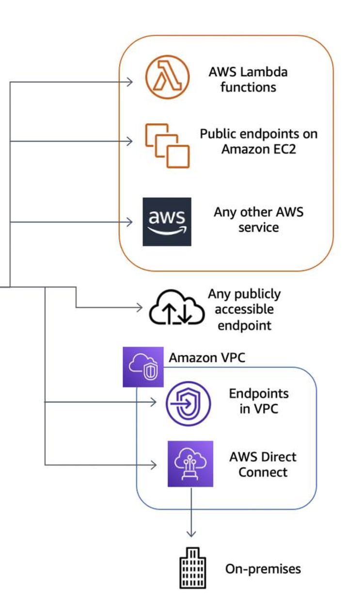
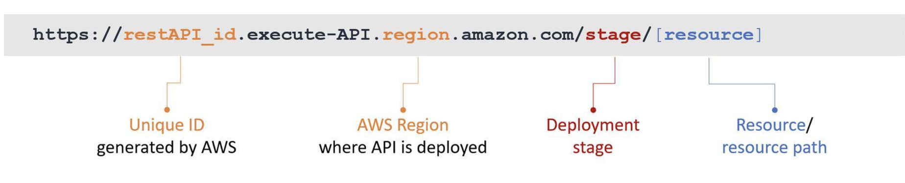

# API Gateway

> API Gateway is a service that facilitates the creation, publishing, maintenance, monitoring, and security of your APIs at any scale. &#x20;
>
> * You only pay when your APIs are in use
>   * flat charge per million API Gateway requests
>   * hourly rate for each stage's provisioned cache&#x20;
> * &#x20;traffic management
> * api Versioning
> * Stages are similar to tags. They define the path through which the deployment is accessible.
> * api keys + usage plans
> * handles authentication + authorisation&#x20;
> * rate limiting +  throttling, monitoring
> * generates SDK -> API Gateway can generate client SDKs for Java, JavaScript, Java for Android, Objective-C or Swift for iOS, and Ruby. You can use AWS Command Line Interface (AWS CLI) to generate and download an SDK of an API for a supported platform by calling the **get-sdk** command
> * WAF integration
> * **Cache** frequently accessed responses (only GET )  so that subsequent requests don't go to backend, can be configured per stage,  has 5min TTL, can be **invalidated with proper IAM + Cache-Control header max-size=0**
>   * **charged at an hourly rate**
>   * can use parameters in the method to form cache keys so that API Gateway caches the method's responses depending on the parameter values used
>   * Two ways to verify caching:
>     1. CloudWatch Metrics: **CacheHitCount** and **CacheMissCount**.
>        1. **CacheHitCount:** Number of requests served from the API cache in a given period
>        2. **CacheMissCount:** Number of requests served from the backend in a given period, when API caching is turned on
>     2. Create a timestamp and include it in your API response.
> * import a REST API from an external definition file -  OpenAPI (Swagger™ is a project used to describe and document RESTful APIs.)
> * **transform and validate request response**&#x20;

## User Authorisation + management

* You can authorize access to your APIs with **IAM** :man\_office\_worker: and Amazon **Cognito or custom**
* :key: API keys for developers -> You can create API keys on API Gateway, set fine-grained access permissions on each API key ( its not a primary authorization mechnisam it **tracks usage**)

## Backend integrations -> endpoitns

#### The API integration has an integration request and an integration response option.

#### API endpoint

A hostname for an API in API Gateway that is deployed to a specific Region. The hostname is of the form `{api-id}.execute-api.{region}.amazonaws.com`. **The following types of API endpoints are supported:**

#### **Edge optimised** ( ACM from us-east-1, api service still in one regions)

1. designed to help you <mark style="background-color:yellow;">reduce client latency from anywhere on the internet</mark>
2. API Gateway **will automatically configure a fully managed CloudFront** distribution to provide lower latency, :star: you don’t have to pay for or manage a CDN separately

<figure><figcaption></figcaption></figure>

#### **Regional** (requests are targeted directly to the Region-specific API Gateway API without going through any CloudFront distribution)

1. designed to reduce latency when calls are made from the same AWS Region as the API, for example, an API that is going to be accessed from EC2 instances within the same Region
2. does not deploy its own CloudFront distribution in front of your API, you have flexibility to **deploy your own CloudFront** distribution or content delivery network (CDN) in front of API Gateway and control that distribution using your own settings for customized scenarios

<figure><figcaption></figcaption></figure>

#### **Private** (access only via VPC ENI)

1. designed to expose APIs only inside your selected VPC
2. designed for applications that have very secure workloads, such as healthcare or financial data that cannot be exposed publicly on the internet
3. PrivateLink charges apply&#x20;
4. <mark style="background-color:red;">change from private to edge-optimized is not a supported endpoint change.</mark>

<figure><figcaption></figcaption></figure>

### **5 API Gateway integration types**

-> determines **how method request data is passed to the backend.** As part of creating the method, you must choose an integration type&#x20;

1. Lambda
2. HTTP&#x20;
   1. if proxy is not configured, you’ll need to configure both the integration request and the integration response&#x20;
   2. &#x20;just proxy
3. AWS service, like drop a message directly into an Amazon Simple Queue Service (Amazon SQS) queue.
4. Mock - return a response without sending the request further to the backend, This is a good idea for a health check endpoint to test your API. Anytime you want a hardcoded response to your API call, use a Mock integration.
5. VPC  Link - endpoint on your EC2 instance that’s not public. API Gateway can’t access it unless you use the VPC link and you have to have a Network Load Balancer on your backend.

<figure><figcaption></figcaption></figure>

## **Data transformations with mapping templates VTL**

:superhero: Mapping templates can be added to the integration request to transform the incoming request to the format required by the backend of the application or to transform the backend payload to the format required by the method response.

* REST JSON to SOAP XML  :apple: -> :tangerine:

**Key variables for transformations**

<figure><figcaption></figcaption></figure>

### **Offloading request validation**&#x20;

* API GW handleS some of your basic validations, rather than making the call or building that validation into the backend.
* API Gateway verifies :thumbsup:
  * required request parameters in the URL, query string, and headers of an incoming request are included and **non-blank**
  * applicable request payload adheres to the configured JSON request model of the method :grey\_question:

## 2 options to create RESTful APIs—REST APIs and HTTP APIs

### REST&#x20;

* REST APIs offer API proxy functionality and API management features in a single solution. REST APIs also offer API management features such as usage plans, API keys, publishing, and monetizing APIs
* all-inclusive stateless with certififcates

### HTTP

* HTTP APIs are optimized for building APIs that proxy to Lambda functions or HTTP backends, making them ideal for serverless workloads.&#x20;
* No management functionality.
* Only **regional endpoint type**
* equipped with native OIDC and OAuth 2 authorization

## WebSocket APIs :electric\_plug: :stars:

* With WebSocket APIs in API Gateway, you can define backend integrations with Lambda functions, Amazon Kinesis, or any HTTP endpoint to be invoked when messages are received from the connected clients.
* Non-JSON messages are directed to a **$default** route that you configure. Route includes a route key, which is the value that is expected once a route selection expression is evaluated.&#x20;
* The route selection expression is an attribute defined at the API level. It specifies a JSON property that is expected to be present in the message payload. Like $greet $play -> you must integrate it with an endpoint in the backend -> JSON messages can be routed to invoke a specific backend service based on message content
* **Custom route** like **$join** ->  When an incoming message contains a JSON property, and that property evaluates to a value that matches the route key value, API Gateway invokes the integration.
* There are three predefined routes that can be used with WebSocket APIs: **$connect**, **$disconnect**, and **$default**.
  * $default route keys, to specify a fallback route. For example, this could be for a generic mock integration that returns a particular error message for incoming messages that don't match any of the defined route keys.
  * You can use $default without any defined route keys, to s**pecify a proxy model that delegates routing to a backend component.**
  * Use it to specify a route for non-JSON payloads.

<figure><figcaption></figcaption></figure>

## Deploying&#x20;

<mark style="background-color:red;">When you are ready to make your API callable for your users, you need to deploy your API to a stage</mark>

* When you deploy your API, you deploy to a **stage its like a snapshot of current api**&#x20;
* Use stages with **canary deployments to test new versions.**
* Anytime you update anything about the API, you need to redeploy it to an existing stage or to a new stage that you create as part of the deploy action
* **Support for custom hostnames,** API Gateway is integrated with ACM and lets you import your own certificate or generate a SSL certificate with ACM
* That base URI is called the _invoke URL_, and its composition will look like this:

<figure><figcaption></figcaption></figure>

#### HTTP proxy or  Lambda proxy option

* A proxy resource is expressed by a special resource path parameter of **{proxy+}**, often referred to as a greedy path parameter. The plus sign (+) indicates child resources appended to it.

### Testing&#x20;

**Response logs**

Test results include simulated CloudWatch logs. No data is actually written to CloudWatch when testing. Although logs are not generated, **but the APIs are actually executed.**

### API Gateway has two types of CloudWatch logs built in

1. Execution logs  ->   useful to troubleshoot APIs, but can result in logging sensitive data, it is recommended you **don't enable Log full requests/responses data for production API**
2. Access logs -> provides details about who's invoking your API. This includes everything including IP address, the method used, the user protocol, and the agent.

<figure><figcaption></figcaption></figure>

### **Calculating API Gateway overhead = Latency - IntegrationLatency**

Two key metrics that are used to calculate the API Gateway overhead of deployed APIs are the **Latency** and **IntegrationLatency**.

1. The latency metric gives you details about how long it takes for a <mark style="background-color:red;">**full round-trip response**</mark>, :fly: from the second your customer invokes your API to when your API responds with the results. This is a full round-trip duration of an API request through API Gateway.
2. Integration latency is how long it takes for API Gateway to make the invocation to your backend and receive the response :clock730: :fax:

**The difference between these two metrics gives you your API Gateway overhead**

### **Simplify version management with stage variables -> r**etrieved dynamically at runtime

As you define variables in the stage settings in the console, you can reference them with the **$stageVariables.\[variable name]** notation.&#x20;

You can also **inject stage-dependent items at runtime such as:**

* URLs
* Lambda functions -> **use stages with Lambda aliases**&#x20;
* Any necessary variables

### **Canary deployments**

* &#x20;send a percentage of traffic to your "canary" while leaving the bulk of your traffic on a known good version of your API until the new version has been verified.

<figure><figcaption></figcaption></figure>

### SAM&#x20;

-> best practices for deploying your APIs and serverless applications to production using AWS SAM as your application framework.

## Authorizing with IAM -> 3 ways :heart::pink\_heart::heart\_decoration:

### IAM &#x20;

* When you turn on IAM authorization, all requests are required to be signed using the AWS Version 4 signing process (also known as Sig v4).
* The process uses your AWS **access key and secret key to compute an HMAC signature** using SHA 256. You can obtain these keys as an IAM user or by assuming an IAM role.
* The :key: information is **added to the Authorization header** and behind the scenes, API Gateway will take that **signed request, parse it, and determine whether the user who signed the request has the IAM permissions to invoke your API.**
* Best for internal systems

<figure><figcaption></figcaption></figure>

* For  **execute-api** permission, create IAM policies that permit a specified API caller to invoke the **desired API method**.To apply this IAM policy on the API method, you need to configure the API method to use an authorization type of **AWS\_IAM**.

<figure><figcaption></figcaption></figure>

<figure><figcaption></figcaption></figure>

### **Lambda** Authorizers :performing\_arts: 2 types -> token :coin: OR requestParams ( if you need more information about the request itself) :interrobang:

#### - A Lambda Authorizer is a Lambda function that you can write to perform any custom authorization that you need.

* &#x20;to support bearer token authentication strategies such as OAuth or SAML
* if you use OAuth strategy as an organization, you may want to consider Lambda Authorizer
* When a client calls your API, API Gateway verifies whether a Lambda Authorizer is configured for the API method
* In this call, API Gateway supplies the **authorization** **token** (or the request parameters based on the type of authorizer), and the Lambda function returns a policy that allows or denies the caller’s req
* Supports **an optional policy cache** for your Lambda Authorizer ->  increases performance by **reducing** invocations of your Lambda Authorizer **for previously authorized tokens**. With this cache, you can <mark style="background-color:red;">configure a custom TTL.</mark>
* API Gateway Lambda Authorizer **blueprint function**

<figure><figcaption></figcaption></figure>

**The Lambda function of the REQUEST authorizer type verifies the input request parameters and returns an Allow IAM policy on a specified method.**&#x20;

<figure><figcaption></figcaption></figure>

The <mark style="color:green;">**ALLOW**</mark> will only be returned **if all the required parameter values match the preconfigured ones**

### &#x20;**Amazon Cognito with user pools**

To use an Amazon Cognito user pool with your API, you must first **create** an authorizer of the **COGNITO\_USER\_POOLS authorizer type**, and then configure an API method to use that authorizer

* After a user is authenticated against CUP, they **obtain an OpenID Connect (OIDC)** token formatted in a JSON web token.&#x20;
* Users who have signed in to your application will have tokens provided to them by the user pool.
* Then that **token** can be used by your application to **inject** information into a **header in subsequent API calls that you make against your API Gateway endpoint.**
* API call succeeds only if the required token is supplied :white\_check\_mark:

<figure><figcaption></figcaption></figure>

### Resource policies&#x20;

* If the user authenticates successfully with IAM, policies attached to the IAM user and resource policy are evaluated together
* Use resource policies to provide access to another AWS account, or to limit access to your API from a particular set of IP address ranges, or VPC.

This is done by specifying an effect of DENY and an **IpAddress** condition with an array of source IP addresses.

<figure><figcaption></figcaption></figure>

_**Since the Principal in the policy is set to "\*", other authorization types can be used alongside the resource policy. However, if the Principal is set to "AWS," authorization will fail for all resources not secured with AWS\_IAM authorization, including unsecured resources.**_

#### Useful Links:

* [https://docs.aws.amazon.com/apigateway/latest/developerguide/apigateway-authorization-flow.html](https://docs.aws.amazon.com/apigateway/latest/developerguide/apigateway-authorization-flow.html)
* [https://serverlessland.com/](https://serverlessland.com/)

