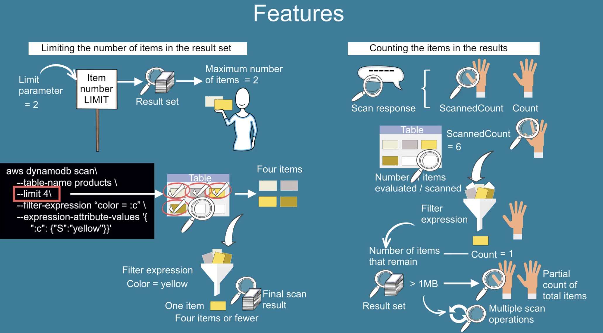

# DDB - Scans

<figure><figcaption></figcaption></figure>

<figure><figcaption></figcaption></figure>

<figure><figcaption></figcaption></figure>

<figure><figcaption></figcaption></figure>

## Parallel Scan :heart\_eyes\_cat: :watermelon: workers === segments

LastEvaluatedKey (LEK) -> ExclusiveStartKey (ESK ) -> scans until LEK is null. LEK = null, means no more data &#x20;

<figure><figcaption></figcaption></figure>

