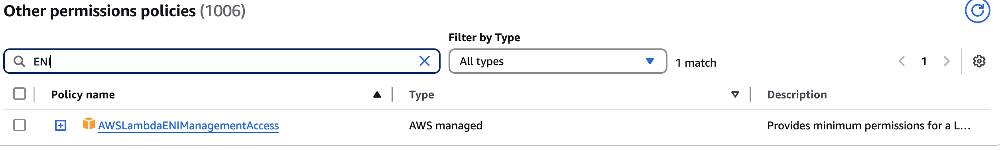
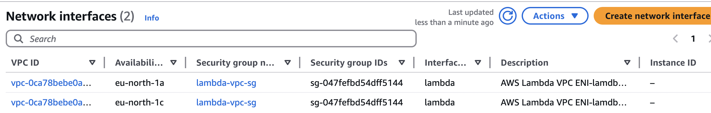
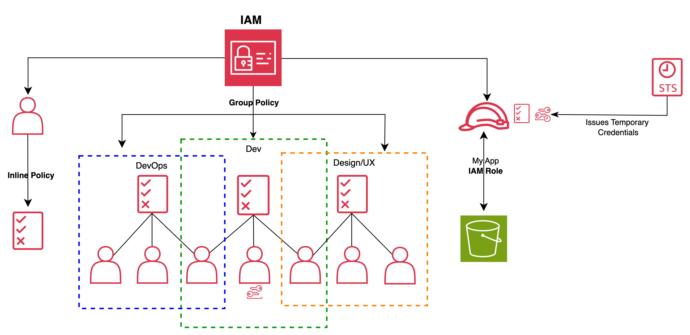

# Lambda

> Lambda function is a small, self-contained application. After you create your Lambda function, it is ready to run as soon as it is initiated. Each function includes your code as well as some associated configuration information, including the function name and resource requirements. Lambda functions are _**stateless**_, with no affinity to the underlying infrastructure. Lambda can rapidly launch as many copies of the function as needed to scale to the rate of incoming events.

→ Self-contained

→ Stateless

→ Runtime flexibility ( Java, Node…)

→ Cost: duration + calls ( invocations)&#x20;

-> AWS Lambda **free tier** for **400,000 GB-seconds** of compute time and **1 million requests per month** is **available every month for the first 12 months** of AWS account

1. **GB-seconds per execution** => 0.128 GB×3 seconds=0.384 GB-sec
2. 400,000GB-sec / 0.384 GB-sec ​ ≈ 1,041,666 requests/month

-> Billed according to pricing model after 12 month:&#x20;

1. Lambda pricing for **compute duration** is **$0.0000166667 per GB-second** (varies slightly by region; this is for the US East (N. Virginia) region).
2. 400,000 GB-seconds × 0.0000166667 USD/GB-second=**6.67 $**&#x20;
   1. If you’re still within the free tier for requests, you’d pay **$6.67 for 400,000 GB-seconds only**.
   2. If not, add $0.20 for the 1 million requests, for a total of: **6.67** + **0.20=6.87$**

#### Use Cases

* File Processing
* Stream Processing ( real-time tracking, telemetry, meetings, clickstreams, order processing, cleanups)
* Web apps ( SPA)
* IoT backends
* mobile backends (use Amplify to integrate iOs Android, react native frontends)

1.Define what Lambda is permitted to interact with

2\. Specify **triggers** or event sources that can initiate it + give them permissions to invoke Lambda with **Lambda Resource Policy**&#x20;

```json
{
    "Version": "2012-10-17",
    "Id": "default",
    "Statement": [
        {
            "Sid": "lambda-allow-s3-my-function",
            "Effect": "Allow",
            "Principal": {
              "Service": "s3.amazonaws.com"
            },
            "Action": "lambda:InvokeFunction",
            "Resource":  "arn:aws:lambda:us-east-2:123456789012:function:my-function",
            "Condition": {
              "StringEquals": {
                "AWS:SourceAccount": "123456789012"
              },
              "ArnLike": {
                "AWS:SourceArn": "arn:aws:s3:::amzn-s3-demo-bucket"
              }
            }
        }
     ]
}
```


&#x20;3\. Provide the code and any dependencies or libraries necessary to run your code. Keep code clean with Layers.&#x20;

* &#x20;Code and dependencies need to be packaged into a zip file and uploaded directly to Lambda if less than 50 MB, otherwise upload to **S3** and download to `/tmp.`
* **Pre-load dependencies** and make **smaller deployment packages**
* Simplified updates of shared libraries or code in one place (the layer) rather than in every function that uses them. Only need to update the layer not individual functions.
* ☃️ **Use of Layers can remove repeated dependancies** and help with **initialization** by preloading libraries or dependencies that are used across multiple functions, which can reduce startup time.

4\. Define the execution params: memory, timeout, and concurrency.&#x20;

* You configure a memory setting and AWS handles CPU, network, I/O
* You pay for the **amount of time** that your function code runs, multiplied by the **amount of memory** used.&#x20;

#### **Lambda Default Configuration Summary:**

* **Memory**: 128 MB.
* **Ephemeral Storage**: 512 MB.
* **Timeout**: 3 seconds.
* **Environment Variables**: None set by default.
* **VPC**: Not attached.
* **Concurrency**: No reserved or provisioned concurrency.
* **Tracing**: Disabled by default.
* **Function URL**: Not created by default. URL endpoint (HTTPs) for direct invocation without an API Gateway.
* **Layers:** up to 5 layers to share libraries, dependencies, or other function-specific assets.



This is the amount of **RAM** allocated to your Lambda function which runs your function and processes data.

* **Default**: 128 MB
* **Range**: 128 MB to 10,240 MB (10 GB), in 1 MB increments.
* **Scope:** runtime only
* **Key Points**:
  * Increasing memory also proportionally increases CPU power and network bandwidth.
  * If your function requires fast processing, increasing memory can speed it up.
  * Choose a value based on your function's processing requirements. For CPU-intensive tasks, a higher memory allocation may improve performance significantly.
    * Example 1: If your function processes large datasets in memory, like aggregating a JSON array or analyzing a file, this is where memory plays a critical role.
    *   Example 2: Suppose a Lambda function needs to download a 1 GB CSV file from S3, process for calculation workload and send outputs to destination bucket. 1. <mark style="color:orange;">Allocate enough</mark> <mark style="color:orange;"></mark><mark style="color:orange;">**ephemeral storage**</mark> <mark style="color:orange;"></mark><mark style="color:orange;">for the file size. Since</mark> The 1 GB CSV would be temporarily saved in `/tmp` (ephemeral storage).

        * Increase storage to at least **1.5 GB** for the file and overhead.

        Then, RAM depends on **how** lambda does compute, if you're loading the **entire 1 GB file into memory** (e.g., reading it as a single array), you will need at least **1 GB of memory** allocated. If you're processing the file in **chunks** (e.g., streaming smaller parts of the file), you may be able to use less memory—perhaps 512 MB to 1 GB. :wave: Lambda CPU power increases with memory, so more memory can speed up your processing.&#x20;

        * **Considerations for RAM:**
          * If your processing logic requires holding the entire file in memory (e.g., for data transformations), your **RAM must exceed the file size**. Set to **2 GB RAM** for faster processing.
          * If you use a streaming approach (e.g., reading and processing in small chunks), you can save on memory, but you still need sufficient **ephemeral storage**.



There are two types of storage relevant to AWS Lambda:

**a. Function Code Storage**

* **What it is**: The total size of your deployed Lambda function code (including dependencies, libraries, and binaries).
* **Where it’s stored**:
  * Lambda stores your code in an S3 bucket managed by AWS.
* **Default Limit**:
  * <mark style="color:orange;">250 MB (compressed package size).</mark>

**b. Ephemeral Storage (/tmp) in Configuration**

* **What it is**: Temporary disk space (up to 10 GB) provided for your Lambda function during execution.
* **Default**: 512 MB (can be increased to 10 GB).
* **Purpose**:
  * Used for temporary files, intermediate computations, or caching data during execution.
  * Files stored here are only accessible during the life of the function instance.
* **Use Cases**:
  * Storing a file downloaded from S3.
  * Writing intermediary data during processing.
  * Temporary caching for ML.





*   **Default**: 3 seconds.

    * If not set propertly:

    
* **Range**: 1 second to 15 minutes.
*   **Key Points**:

    * Longer timeouts are useful for heavy processing tasks like video transcoding or database migrations.
    * Keep timeout as low as possible to :arrow\_down\_small: costs and avoid hanging executions.
    * Hard limit of execution 15 minutes or function will be **forcefully terminated**
    * **Incomplete Work**: If your function hasn't finished its task within the 15-minute limit, **you'll lose any unsaved progress unless you implement checkpoints** (e.g., writing intermediate states to S3 or a database).
    * **Retries**: Depending on the event source (like SQS or EventBridge), the function may be retried.





What a Grants permissions for the function to access AWS services like S3, DynamoDB, or other Lambda functions.

* Attach custom policies to restrict permissions to the principle of least privilege.
* For **Source Mapping** KDS, MSK, SQS ( freate destination queues)



By default, Lambda provides your account with a total concurrency limit of 1,000 concurrent executions across all functions in an AWS Region. _Request quota increase_\*

Some of your functions might be more critical than others. As a result, you might want to configure concurrency settings to ensure that critical functions get the concurrency that they need.

Consider - a function with an average request duration of 50 ms and there’re 20,000 request/sec, This function experiences **throttling**.

`Concurrency = invocations_per_sec x avg_execution_time`

Concurrency = (20,000 requests/second) \* (0.05 second/request) = 1,000

**Key Points:**

* **To intentionally throttle a function,** set its reserved concurrency to 0. This stops your function from processing any events until you remove the limit.
* Use **reserved concurrency** to reserve a portion of your account's concurrency for a function. If you want to **guarantee** that a certain amount of concurrency is available for your function at any time.
* Use **provisioned concurrency to mitigate cold starts** :snowman2: the by using number of pre-initialized execution environments (they are prepared to respond immediately to function requests) that you want to allocate to your function. <mark style="color:blue;">When Lambda has to initialize a new environment in order to carry out an invocation, this is known as a cold start.</mark>
* In practice, you can set both provisioned concurrency and reserved concurrency on a function.



*   **Purpose**: Are key-value Pairs in **String.** Conceptually similar to `.env` file variables used in . Store configuration settings like:

    * Database connection strings.
    * API keys.
    * Feature flags -> adjust fn :hushed: behaviour not code
    * Env flags.

    **Encryption**: AWS encrypts these at rest, and you can add additional encryption with KMS (Key Management Service).





* Attach your Lambda function to a VPC to access private resources like RDS databases or EC2 instances.
*   **Components**:

    * Subnet IDs
    * Security Group IDs
    * Lambda's SG must have permission for ENI

    

    **Key Points:**
* Can introduce cold start latency if configured, especially with large VPC

<figure><figcaption></figcaption></figure>





## Permissions Policies

<table data-header-hidden><thead><tr><th width="174"></th><th width="153"></th><th width="146"></th><th></th></tr></thead><tbody><tr><td><strong>Service</strong></td><td><strong>Resource-Based Policy</strong></td><td><strong>Execution Role</strong></td><td><strong>Notes</strong></td></tr><tr><td><strong>Amazon SQS</strong></td><td>No</td><td>Yes</td><td>Execution role needs <code>sqs:ReceiveMessage</code>, <code>sqs:DeleteMessage</code>, etc.</td></tr><tr><td><strong>Kinesis Data Streams (KDS)</strong></td><td>No</td><td>Yes</td><td>Execution role needs <code>kinesis:GetRecords</code>, <code>kinesis:DescribeStream</code>.</td></tr><tr><td><strong>Amazon MSK</strong></td><td>No</td><td>Yes</td><td>Execution role needs Kafka cluster access permissions.</td></tr><tr><td><strong>Amazon DynamoDB Streams</strong></td><td>No</td><td>Yes</td><td>Execution role needs <code>dynamodb:GetRecords</code>, <code>dynamodb:DescribeStream</code>.</td></tr><tr><td><strong>Amazon S3</strong></td><td>Yes</td><td>Yes</td><td>Resource-based policy to allow S3 to invoke Lambda.</td></tr><tr><td><strong>API Gateway</strong></td><td>Yes</td><td>Yes</td><td>Resource-based policy for invocation; execution role for downstream calls.</td></tr><tr><td><strong>EventBridge</strong></td><td>Yes</td><td>Yes</td><td>Resource-based policy to allow EventBridge to invoke Lambda.</td></tr><tr><td><strong>AWS Step Functions</strong></td><td>Yes</td><td>Yes</td><td>Resource-based policy for Step Functions; execution role for downstream.</td></tr><tr><td><strong>Amazon Cognito Triggers</strong></td><td>Yes</td><td>Yes</td><td>Resource-based policy for Cognito to invoke Lambda.</td></tr><tr><td><strong>Amazon CloudWatch Logs</strong></td><td>No</td><td>Yes</td><td>Execution role needs <code>logs:PutLogEvents</code> for logging.</td></tr><tr><td><strong>Amazon SNS</strong></td><td>Yes</td><td>Yes</td><td>Resource-based policy to allow SNS to invoke Lambda.</td></tr><tr><td><strong>CloudFront (Lambda@Edge)</strong></td><td>No</td><td>No</td><td>No explicit execution role or resource policy needed for Lambda@Edge.</td></tr><tr><td><strong>IoT Rules</strong></td><td>Yes</td><td>Yes</td><td>Resource-based policy to allow IoT Rules to invoke Lambda.</td></tr><tr><td><strong>Direct Invocation (CLI/SDK)</strong></td><td>No</td><td>No</td><td>No specific policies needed; relies on AWS credentials.</td></tr></tbody></table>

#### Key Takeaways:

* **Resource-Based Policy:** Required when a service (e.g., S3, API Gateway) needs permission to invoke the Lambda function.
* **Execution Role:** Required when Lambda needs to access other AWS services (e.g., reading SQS messages or writing logs to CloudWatch).


## Execution environment

<figure><figcaption></figcaption></figure>

When you create your Lambda function, you specify configuration information, such as the amount of available memory and the maximum invocation time allowed for your function. Lambda uses this information to set up the execution environment.


### Parallelisation → to decrease time to complete

No overhead for long tasks.

> Cost savings on overall compute \$$$ → as a result reduce overall infrastructure costs

> ⏳  improve the average time it takes to transcode a video

Serverless Video Transcoding ( _video transcoding is something that has been a very serial type of process where you take a single video file and process it on a single node in order to transform it into a different format._ ) → transcode pieces of a large file

→ use Amazon s3 as kind of a staging area where they can drop in source files, and then use “ranged gets” within s3 to pull specific sub segments of each individual video file.

→ transcode a bunch of small timeslices of a single video in **parallel**

→ take individual trans coded slices, put them into an intermediate bucket, and then have another Lambda function run to merge all of those pieces together.

<figure><figcaption></figcaption></figure>

<details>

<summary>Useful CLI</summary>

`aws lambda update-function-configuration`\
`--function-name foo`\
`--description "Your new description here"`

`aws lambda update-function-configuration --function-name foo --timeout 10`

aws lambda create-function\
\--function-name MyLambdaFunction\
\--runtime nodejs20.x\
\--role arn:aws:iam::123456789012:role/MyLambdaRole\
\--handler index.handler\
\--timeout 10\
\--memory-size 128\
\--description "Lambda function with X-Ray tracing"\
\--zip-file fileb://function.zip

</details>

