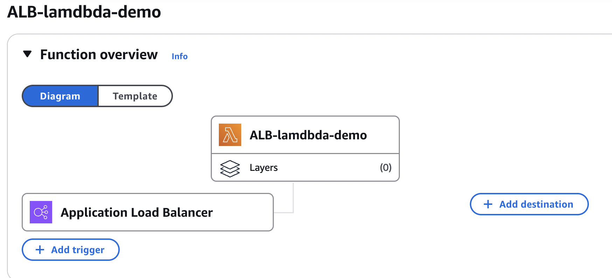

# Synchronous Invocation

## ALB + Lambdas as TG

<figure><figcaption></figcaption></figure>

### Lambda

```javascript
export const handler = async (event) => {
    console.log(`Event from ALB: ${JSON.stringify(event, null, 2)}`);
    
    const response = {
        statusCode: 200,
        statusDescription: "200 OK",
        isBase64Encoded: false,
        headers: {
            "Content-Type": "text/html"
        },
        body: "<h1 style='color:orange'>Hello from Lambda!</h1>"
    };
    
    return response;
};

```

&#x20;:warning: When logging ensure it is Strigified if an event is a complex object&#x20;

```javascript
console.log(`Event from ALB: ${JSON.stringify(event, null, 2)}`);
```

* **ALB sends a structured JSON event** to Lambda when it invokes the function.
* **`console.log(event)`** will end up with 502 Bad Request ->  `[object Object]`,
* **`JSON.stringify(event, null, 2)`** converts the event object into a human-readable string format, with indentation for better clarity, making it easier to inspect and debug the event in CloudWatch logs.
* This approach is especially useful because it displays the complete structure of the event that ALB sends to Lambda, which can include headers, body, and other details.

### ALB - trigger

Resource Policy:

```json
{
  "Version": "2012-10-17",
  "Id": "default",
  "Statement": [
    {
      "Sid": "AWS-ALB_Invoke-targetgroup-lambda-alb-tg-demo-48117b14c66064f8",
      "Effect": "Allow",
      "Principal": {
        "Service": "elasticloadbalancing.amazonaws.com"
      },
      "Action": "lambda:InvokeFunction",
      "Resource": "arn:aws:lambda:eu-north-1:1234566789:function:ALB-for-lambda",
      "Condition": {
        "ArnLike": {
          "AWS:SourceArn": "arn:aws:elasticloadbalancing:eu-north-1:1234566789:targetgroup/lambda-alb-tg-demo/48117b14c66064f8"
        }
      }
    }
  ]
}
```


