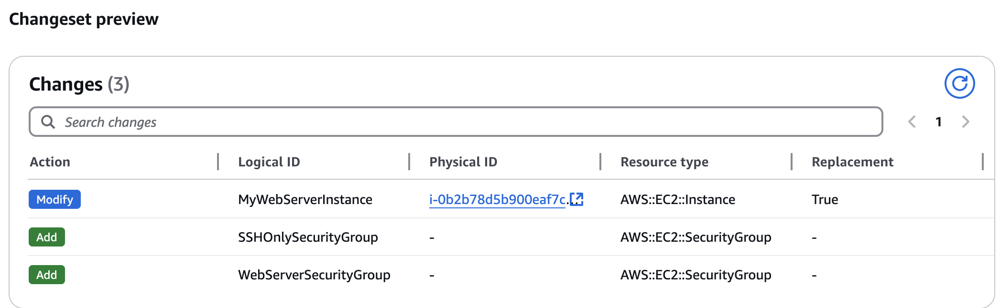

# SQS

## Granting permissions to publish event notification messages to a destination <a href="#grant-destinations-permissions-to-s3" id="grant-destinations-permissions-to-s3"></a>

#### Allow Specific S3 bucket to send message for <mark style="color:green;">All object create events</mark>

```json
{
  "Version": "2012-10-17",
  "Id": "__default_policy_ID",
  "Statement": [
    {
      "Sid": "__owner_statement",
      "Effect": "Allow",
      "Principal": {
        "AWS": "arn:aws:iam::accountnumber:root"
      },
      "Action": "SQS:*",
      "Resource": "arn:aws:sqs:eu-north-1:accountnumber:PubNotifS3Queue"
    },
    {
      "Sid": "AllowToPublishMsg",
      "Effect": "Allow",
      "Principal": {
        "Service": "s3.amazonaws.com"
      },
      "Action": "sqs:SendMessage",
      "Resource": "arn:aws:sqs:eu-north-1:accountnumber:PubNotifS3Queue",
      "Condition": {
        "StringEquals": {
          "aws:SourceAccount": "accountnumber"
        },
        "ArnLike": {
          "aws:SourceArn": "arn:aws:s3:::sqs-accesspolicy-demo"
        }
      }
    }
  ]
}
```

"`Principal": { "Service": "s3.amazonaws.com" }`

means that **any S3 service** (from any S3 bucket) is allowed to send messages to the SQS queue. This allows the **S3 service** to interact with the SQS queue, but it doesn't automatically mean that any **S3 bucket** will be able to send messages to your queue unless you have **bucket notifications** configured

<figure><figcaption></figcaption></figure>


&#x20;**Without condition**:&#x20;

The SQS Access policy without the condition is **allowing any S3 bucket** to potentially trigger a message to your SQS queue. However, the actual **event notification** will only come from the **S3 bucket** that you configure to trigger the event (i.e., the specific bucket for which you've set up notifications).

**With the Condition:**

* The condition introduces additional **security** and **granularity & potential loss of control who triggers actions**:
  * **`aws:SourceAccount`**: The `StringEquals` condition restricts the action to **only the specified account**. In this case, messages can only be sent from the S3 bucket in **accountnumber**, which prevents other accounts from sending messages to your SQS queue.
  * **`aws:SourceArn`**: The `ArnLike` condition ensures that only **S3 events from a specific bucket** (`sqs-accesspolicy-demo`) will trigger the action. Even if another bucket in the same account triggers an S3 event, the message will not be sent to the queue unless it's from `sqs-accesspolicy-demo`.

<mark style="color:red;">Misuse Scenario:</mark> use legitimate S3 bucket to send unwanted or malicious messages to your SQS queue, potentially affecting downstream services that rely on SQS.

:money\_mouth: <mark style="color:red;">Increased Costs:</mark> Each SQS message or event might incur costs. Without conditions, you might be unintentionally accepting messages from multiple source buckets.

