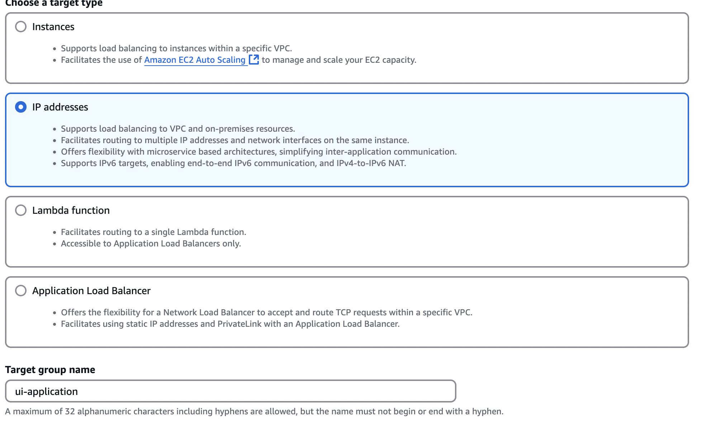
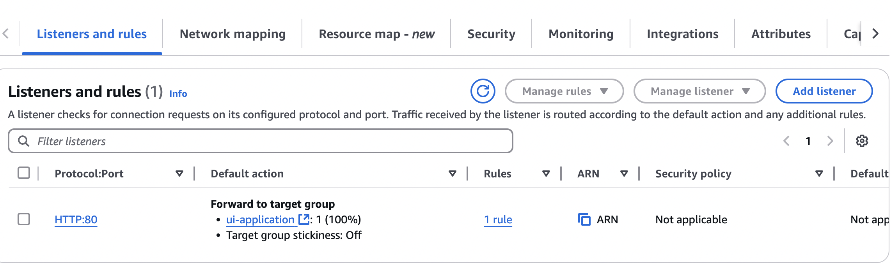

# Retail-store-cluster

### Create Cluster + Task Definition

`aws ecs create-cluster --cluster-name retail-store-ecs-cluster --region $AWS_REGION --settings name=containerInsights,value=enabled`

````sh

cat << EOF > retail-store-ecs-ui-taskdef.json
{
    "family": "retail-store-ecs-ui",
    "networkMode": "awsvpc",
    "requiresCompatibilities": [
        "FARGATE"
    ],
    "cpu": "1024",
    "memory": "2048",
    "runtimePlatform": {
        "cpuArchitecture": "X86_64",
        "operatingSystemFamily": "LINUX"
    },
    "containerDefinitions": [
        {
            "name": "application",
            "image": "public.ecr.aws/aws-containers/retail-store-sample-ui:0.7.0",
            "portMappings": [
                {
                    "name": "application",
                    "containerPort": 8080,
                    "hostPort": 8080,
                    "protocol": "tcp",
                    "appProtocol": "http"
                }
            ],
            "essential": true,
            "linuxParameters": {
                "initProcessEnabled": true
            },
            "healthCheck": {
                "command": [
                    "CMD-SHELL",
                    "curl -f http://localhost:8080/actuator/health || exit 1"
                ],
                "interval": 10,
                "timeout": 5,
                "retries": 3,
                "startPeriod": 60
            },
            "logConfiguration": {
                "logDriver": "awslogs",
                "options": {
                    "awslogs-group": "retail-store-ecs-tasks",
                    "awslogs-region": "$AWS_REGION",
                    "awslogs-stream-prefix": "ui-service"
                }
            }
        }
    ],
    "executionRoleArn": "arn:aws:iam::${ACCOUNT_ID}:role/retailStoreEcsTaskExecutionRole",
    "taskRoleArn": "arn:aws:iam::${ACCOUNT_ID}:role/retailStoreEcsTaskRole"
}
EOF

aws ecs register-task-definition --cli-input-json file://retail-store-ecs-ui-taskdef.json
```
````


### Create SG for ALB

```sh
aws ec2 create-security-group \
  --group-name alb-sg \
  --description "ALB Security Group" \
  --vpc-id $(aws ec2 describe-vpcs --query 'Vpcs[?IsDefault==`true`].VpcId' --output text)


# inbound allow 
aws ec2 authorize-security-group-ingress \
  --group-id $(aws ec2 describe-security-groups --group-names alb-sg --query 'SecurityGroups[0].GroupId' --output text) \
  --protocol tcp \
  --port 80 \
  --cidr 0.0.0.0/0

```

### SG for **the ECS Tasks (allows HTTP traffic on port 8080)**:

```sh
aws ec2 create-security-group \
  --group-name ecs-task-sg \
  --description "ECS Task Security Group" \
  --vpc-id $(aws ec2 describe-vpcs --query 'Vpcs[?IsDefault==`true`].VpcId' --output text)

# inbound 
aws ec2 authorize-security-group-ingress \
  --group-id $(aws ec2 describe-security-groups --group-names ecs-task-sg --query 'SecurityGroups[0].GroupId' --output text) \
  --protocol tcp \
  --port 8080 \
  --source-group $(aws ec2 describe-security-groups --group-names alb-sg --query 'SecurityGroups[0].GroupId' --output text)

```


### Create TG manually or CLI

Manually ->  **Target Type**: `ip` (for Fargate). **Fargate Tasks** run on dynamic infrastructure, meaning each task is allocated its own IP address within your VPC. **IP addresses** as the target type, you tell the Application Load Balancer to register and route traffic to the **IP addresses of the Fargate tasks**.

<figure><figcaption></figcaption></figure>

```sh
aws elbv2 create-target-group \
  --name ui-application \
  --protocol HTTP \
  --port 8080 \
  --vpc-id $(aws ec2 describe-vpcs --query 'Vpcs[?IsDefault==`true`].VpcId' --output text) \
  --health-check-protocol HTTP \
  --health-check-path "/actuator/health" \
  --health-check-interval-seconds 30 \
  --health-check-timeout-seconds 5 \
  --healthy-threshold-count 2 \
  --unhealthy-threshold-count 2

```

### Create ALB

```sh
aws elbv2 create-load-balancer \
  --name my-application-alb \
  --subnets subnet-058ddde594d10 subnet-0b3333eecc8b195 \
  --security-groups sg-0e832efacf02b17b1 \ # get id from console
  --scheme internet-facing \
  --type application \
  --ip-address-type ipv4
 
 
```

### Create Listener ( console or cli)

In Console:

<figure><figcaption></figcaption></figure>


```sh
# create the listener on port 80 for your Application Load Balancer 
# forward traffic to the specified TG ( used arns)
aws elbv2 create-listener \
  --load-balancer-arn arn:aws:elasticloadbalancing:eu-north-1:060683702247:loadbalancer/app/my-application-alb/70e8a185ff046673 \
  --protocol HTTP \
  --port 80 \
  --default-actions Type=forward,TargetGroupArn=arn:aws:elasticloadbalancing:eu-north-1:060683702247:targetgroup/ui-application/76705a33f7ce80e1


```

### Launch Service

```sh
aws ecs create-service \
 --cluster retail-store-ecs-cluster \
 --service-name ui \
 --task-definition retail-store-ecs-ui \
 --desired-count 2 \
 --launch-type FARGATE \
 --load-balancers targetGroupArn=arn:aws:elasticloadbalancing:eu-north-1:060683702247:targetgroup/ui-application/76705a33f7ce80e1,containerName=application,containerPort=8080 \
 --network-configuration "awsvpcConfiguration={subnets=[subnet-0be86765eecc8b195,subnet-058a6feb1be594d10],securityGroups=[sg-099d3a1db74f5a256],assignPublicIp=DISABLED}"

```


#### Check&#x20;

```sh
aws ecs describe-services \
 --cluster retail-store-ecs-cluster \
 --services ui \
 --query 'services[0].events' \
 --output table

# and verify status
aws ecs describe-services \
  --cluster retail-store-ecs-cluster \
  --services ui

```

:interrobang: Check two IAM roles are created and both have  permissions + trust

:white\_check\_mark: For ecsTaskExecutionRole manualy add permission to CloudWatchFullAccess


```sh
#cleanup
aws ecs delete-service \
  --cluster retail-store-ecs-cluster \
  --service ui \
  --force
# cluster
aws ecs delete-cluster --cluster name

```


