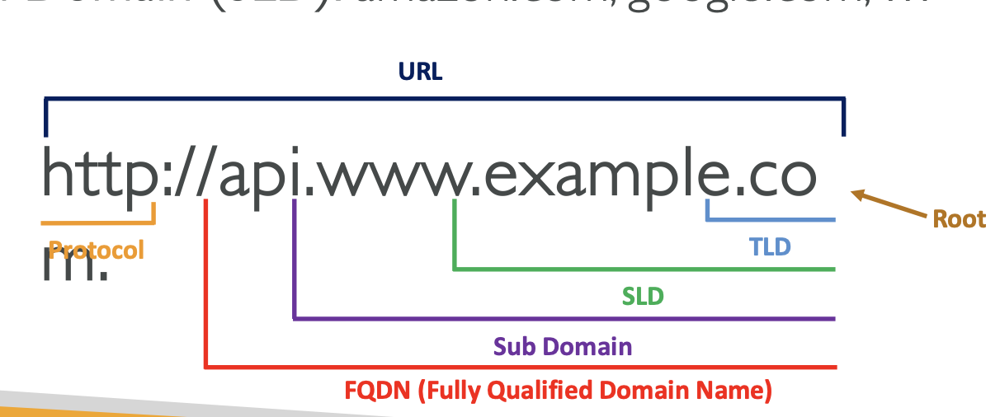

# Route 53


DNS - a globally distributed service that translates human readable names like google.com into the numeric IP addresses like 192.0.2.1. Mapping layer for readability, where TTL controls how long each mapping is valid for.

**Port 53**: Default port for DNS queries, used for both **UDP** (most queries) and **TCP** (large responses).

**DNS Components**:

* **Domain Names**: Structured as labels (e.g., `www.example.com`), with a **top-level domain (TLD)** like `.com`, `.org`, `.gov`, and country-specific TLDs like `.uk`.

**DNS Records**: Store information like:

* **A Record**: Maps domain to an IPv4 address.
* **AAAA Record**: Maps domain to an IPv6 address.
* **CNAME**: Alias for another domain, like we search www.abc.com points to abc.com so hostname to hostmane
* **MX**: Mail exchange records for email routing.
* **NS**: Nameserver record, pointing to DNS servers for the domain.
* **TXT**: Text-based information, often used for verification or security, like email validation (SPF sender policy framework, DKIM DomainKeys Identified Mai), domain verification, or other custom data.

**DNS Resolution Process**:

1. **DNS Query**: A user tries to access a domain (e.g., `website.com`).
2. **Recursive Resolver**: The request first goes to a local recursive resolver (usually provided by the ISP or a public service like Cloudflare). Local DNS (ISP Resolver )-> Root DNS   -> TLD DNS (resolves queries for _com, org etc_)-> SLD DNS (which is authoritative and contain the actual DNS records (such as `A` or `CNAME` )&#x20;
3. **Root DNS Servers**: If the resolver doesn’t know the IP, it asks a root DNS server, which directs it to the **TLD nameservers**.
4. **TLD Nameservers**: Directs the query to the **authoritative nameservers** for the specific domain.
5. **Authoritative DNS Server**: (refers to the server that contains the official DNS records for a domain) Returns the IP address for the domain.

**Caching**: DNS responses are cached at various levels (on client machines, recursive resolvers, etc.) to speed up resolution and reduce traffic. Cache expiration is controlled by **TTL** .

**DNS Security**: Includes features like **DNSSEC (DNS Security Extensions)** to prevent cache poisoning and ensure data integrity.

**Reverse DNS**: Used to resolve IP addresses back to domain names. It is important for email delivery and security (e.g., to avoid spam).


<figure><figcaption></figcaption></figure>

## Route 53&#x20;

fully managed **Authoritative DNS Server.**

## Features

* Provides **DNS resolution** and **DDoS protection** via **AWS Shield Standard** using a global edge network.
* Supports A /AAAA / CNAME/ NS (for for the Hosted Zone) record type.
* **Alias** record (always type A or AAAA record ) and is specific to **Route 53** and is used to map a **hostname** to certain AWS **resources** (e.g., Elastic Load Balancers, CloudFront, S3 bucket website, API GW, Global Accelerator etc.). Native :heart\_exclamation: check, free of charge. TTL is set by the Route 53.
* Very Low TTL will translate into cost :money\_mouth: => **Higher Query Volume**, frequent queries increase the overall number of DNS requests made to Route 53, which leads to higher costs. Clients (e.g., browsers, servers) will make more frequent DNS queries because they **must recheck the DNS record after the TTL expires**
* Supports three main functions: **domain registration**, **DNS routing**, and  :heart\_exclamation: **health checking**.
* It is an authoritative DNS service and does not provide web hosting, so for static websites use S3 and for dynamic EC2
* Uses <mark style="color:red;">anycast</mark> is a networking and routing technology that helps your end users’ DNS queries get answered from the optimal Route 53 location given network conditions.
*   Supports **Public and Private Hosted Zones**: A hosted zone is an Amazon Route 53 concept. A hosted zone is analogous to a traditional DNS zone file; it represents a collection of records that can be managed together, belonging to a single parent domain name.'

    * 0.50$ per month per HZ
    * **Public Hosted Zones**: Manage DNS records for publicly accessible domains.
    * **Private Hosted Zones**: Manage private DNS records within a **VPC** for resources not exposed to the public internet.

### Route 53 currently supports the following DNS record types:

* A → IPv4 address record
* AAAA -> IPv6 address record
* CNAME (canonical name record)→ like a nickname. If you call your friend “Mike,” but his real name is “Michael,” then `www.mysite.com` could be a nickname for `mysite.com`. So, `www.mysite.com` points to `mysite.com`
* CAA (certification authority authorisation) → Specifies which certificate authorities (CAs) are allowed to issue SSL certificates for your domain. CAA records are like setting rules for who can give out that badge, ensuring only trusted authorities can issue SSL certificates for your domain.
* MX (mail exchange record) → like a mail routing system. When someone sends you an email, the MX record tells them where to deliver it, like a post office directing mail to your house
* NAPTR (name authority pointer record)
* NS (name server record) → tells the world which servers to ask for information about your domain
* PTR (pointer record) → reverse DNS lookups, If you have an IP address and want to find out which domain name it belongs to, this record helps with that.
* SOA (start of authority record) → provides information about the domain’s DNS zone, such as the primary nameserver and the zone’s serial number.
* SPF (sender policy framework) → specify which mail servers are allowed to send emails on behalf of your domain
* SRV (service locator) → tells computers where to find the servers that provide specific services, like a chat server or a game server. It’s like a phone book for services, listing where to call to get the service you need
* TXT (text record) → often used for various purposes like verification and policy settings
* Alias records - free alias for mapping AWS resources, so example.com to DNS of ALB

### Health Checks :heart\_exclamation: Auto DNS failover

Identify traffic from aws : `curl -O https://ip-ranges.amazonaws.com/ip-ranges.json`

1.  If > 18% of health checkers report the endpoint is healthy, Route 53 considers it Healthy. Otherwise, it’s Unhealthy

    \+ Ability to choose which locations you want Route 53 to use
2. Health Checks pass only when the endpoint responds with the 2xx and 3xx status codes
3. Health Checks can be setup to pass / fail based on the text in the first 5120 bytes of the response
4. Configure you router/firewall to allow incoming requests from Route 53 Health Checkers

#### Calculated HC:&#x20;

* Combine the results of multiple Health Checks into a single Health Check

### DNS Routing Policies

<table><thead><tr><th width="143">Policy</th><th width="175">Description</th><th width="189">Use Case</th><th width="87"> $</th><th>Failover, Health</th></tr></thead><tbody><tr><td><strong>Simple</strong></td><td>When you have a single resource to serve traffic, if 2 A records a provided hostname is mapped randomly.</td><td>For small applications or static websites where a single server can handle all requests.</td><td>Low</td><td>No</td></tr><tr><td><strong>Weighted</strong></td><td>Routes to A records based based on weights, from 0 - 255 value</td><td>Distributing traffic across multiple servers, or A/B testing.</td><td>Med</td><td>No Failover, Yes - HC</td></tr><tr><td><strong>Failover</strong></td><td>Routes traffic to a primary (has mandatory health check)  and fails over to a secondary resource if the primary is unavailable</td><td>HA e-commerce platforms, or applications where uptime is crucial</td><td>High</td><td>Both yes </td></tr><tr><td><strong>Latency</strong></td><td>Routes A record to resource with the lowest latency, must specify Region when configuring</td><td>Global applications, to optimise performance by routing users to the lowest-latency endpoint.</td><td>High</td><td>Failover - no, HC - yes</td></tr><tr><td><strong>Geo-proximity</strong></td><td>Minimum 2 endpoints defined which can be  AWS region or Local Zone, routing is defined by bias,  ie if eu-west has higher bias than majority is routed there. Positive / negative values for bias. Uses Traffic Flow feature.</td><td>Delivering region-specific content. For example, a global e-commerce platform routing users to the closest server for faster response times. Controlling routing based on the physical distance of the user to the endpoint.</td><td>High, additional charges for latency-based routing</td><td>HC, yes. Additional configurations for full failover functionality.</td></tr><tr><td><strong>Geolocation</strong></td><td>Specifies <em>default</em> in case of no match, routing can be based on location (latency), country, </td><td>Useful for compliance, localisation, or optimising latency.</td><td>High</td><td>Both yes</td></tr><tr><td><strong>Multi-value</strong></td><td>Similar to simple routing but allows multiple (up to 8 )healthy records to be returned. If one fails, users are directed to a healthy option.</td><td>Load balancing across multiple instances, returning multiple healthy IP addresses for redundancy.</td><td>Med</td><td>Includes HC for each record. If a it is unhealthy, policy stops returning its IP in DNS responses, effectively acting as a basic failover mechanism.</td></tr></tbody></table>

