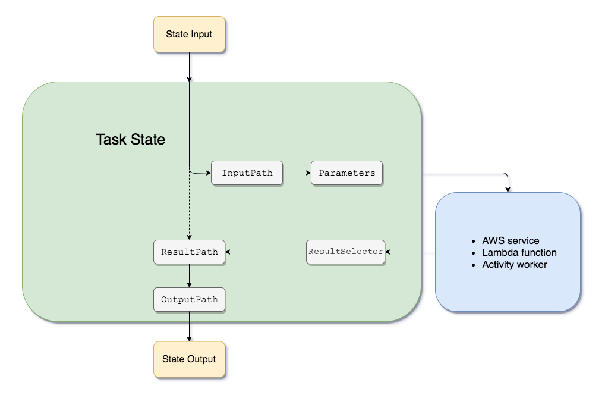
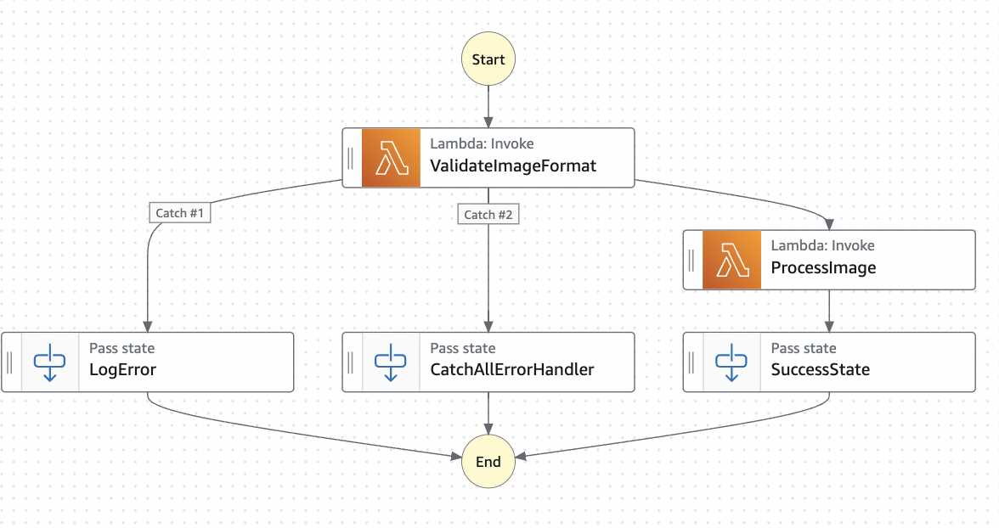

# Step Functions

> Serverless workflow orchestration & visualisation with **workflows called state machines** (1 per SM per w-flow)&#x20;
>
> * JSON format for definitions with ASL ( Amazon Simple Lang) - task sequencing, so order matters :red\_circle:
> * Offload error handling and retry logic from lambdas to keep them simple and not modify code

## ASL

n the Amazon States Language, these fields filter and control the flow of JSON from state to state:

\- **InputPath** (limit the input that is passed by filtering the JSON notation by using a path)

\- **Parameters** (- pass a collection of key-value pairs, where the values are either static values that you define in your state machine definition, or that are selected from the input using a path.)

_Step Functions applies the InputPath field first, and then the Parameters field. You can first filter your raw input to a selection you want using InputPath, and then apply Parameters to manipulate that input further, or add new values._

\- OutputPath

\- **ResultPath** ( The output of a state can be a copy of its input, the result it produces (for example, the output from a Task state’s Lambda function), or a combination of its input and result


<figure><figcaption></figcaption></figure>


## Errors: 2 types Retry or Catch

* Use Retry to retry failed state -> how many times we want to retry before failing over to Catch / Error state
* **ResultPath** - is used for **Merging Input and Output (**&#x69;nput plus the result of the final stat&#x65;**)**:
  * When a task (or state) completes successfully, its output is combined with its input. By default, the output completely replaces the input for the next state.
  * With `ResultPath`, you can **merge the output into a specific part of the input JSON**, instead of overwriting it.
  * Can be used  **in conjunction with error handling logic** to store error information
  * It does **not control the input for the next state**—that is controlled by `OutputPath` or default behavior.

<details>

<summary>Image Processing Workflow - ResultPath</summary>

**Scenario: Image Processing Workflow**

State machine with invoke Lambda function. The workflow involves:

1. Uploading the image.
2. The Lambda function checks the image format.
3. If the format is valid, it processes the image.
4. If any error occurs, error details are captured for logging or further action.




```json
{
  "Comment": "Process an image and handle errors gracefully.",
  "StartAt": "ValidateImageFormat",
  "States": {
    "ValidateImageFormat": {
      "Type": "Task",
      "Resource": "arn:aws:lambda:region:account-id:function:validate-image-format",
      "ResultPath": "$.validationResult",
      "Catch": [
        {
          "ErrorEquals": ["ImageFormatError"],
          "ResultPath": "$.errorDetails",
          "Next": "LogError"
        },
        {
          "ErrorEquals": ["States.ALL"],
          "ResultPath": "$.errorDetails",
          "Next": "CatchAllErrorHandler"
        }
      ],
      "Next": "ProcessImage"
    },
    "ProcessImage": {
      "Type": "Task",
      "Resource": "arn:aws:lambda:region:account-id:function:process-image",
      "ResultPath": "$.processResult",
      "Next": "SuccessState"
    },
    "LogError": {
      "Type": "Pass",
      "Result": "Error logged successfully!",
      "End": true
    },
    "CatchAllErrorHandler": {
      "Type": "Pass",
      "Result": "Unhandled error logged successfully!",
      "End": true
    },
    "SuccessState": {
      "Type": "Pass",
      "Result": "Image processed successfully!",
      "End": true
    }
  }
}
```

***

#### **When the Lambda Function Succeeds**

**Input to `ValidateImageFormat`:**

```json
{
  "imageKey": "example-image.jpg",
  "bucketName": "my-image-bucket"
}
```

**Output from Lambda:**

```json
{
  "isValid": true,
  "format": "JPEG"
}
```

**If `ValidateImageFormat` succeeds**:

* The **output** of `ValidateImageFormat` (e.g., `{"isValid": true, "format": "JPEG"}`) is merged with the original input and stored according to the `ResultPath`.
*   For example, with <mark style="color:purple;">`ResultPath: "$.validationResult"`</mark>, the input becomes:

    ```json
    jsonCopy code{
      "imageKey": "example-image.jpg",
      "bucketName": "my-image-bucket",
      "validationResult": {
        "isValid": true,
        "format": "JPEG"
      }
    }
    ```


**If `ValidateImageFormat` fails with `ImageFormatError`**, and the error is caught:

* The **error details** (not the state output) are stored at the path specified by `ResultPath` in the `Catch` configuration.
*   For example, with <mark style="color:red;">`ResultPath: "$.errorDetails"`</mark>, the resulting input to the next state becomes:

    ```json
    jsonCopy code{
      "imageKey": "example-image.jpg",
      "bucketName": "my-image-bucket",
      "errorDetails": {
        "Error": "ImageFormatError",
        "Cause": "Unsupported image format"
      }
    }
    ```

**Input to `ProcessImage` (with `ResultPath`):**

```json
jsonCopy code{
  "imageKey": "example-image.jpg",
  "bucketName": "my-image-bucket",
  "validationResult": {
    "isValid": true,
    "format": "JPEG"
  }
}
```

**Final Input to `SuccessState`:**

```json
{
  "imageKey": "example-image.jpg",
  "bucketName": "my-image-bucket",
  "validationResult": {
    "isValid": true,
    "format": "JPEG"
  },
  "processResult": {
    "status": "Processed",
    "details": "Image resized and saved successfully."
  }
}
```

***

#### **When the Lambda Function Fails with `ImageFormatError`**

**Error Thrown by Lambda:**

```json
jsonCopy code{
  "errorType": "ImageFormatError",
  "errorMessage": "Unsupported image format"
}
```

**Input to `LogError` (after `Catch`):**

```json
{
  "imageKey": "example-image.jpg",
  "bucketName": "my-image-bucket",
  "errorDetails": {
    "Error": "ImageFormatError",
    "Cause": "Unsupported image format"
  }
}
```

**Final Input to `LogError`:**

```json
{
  "Result": "Error logged successfully!"
}
```

***

#### **When an Unknown Error Occurs (`States.ALL`)**

**Error Thrown by Lambda:**

```json
{
  "errorType": "UnhandledException",
  "errorMessage": "Unexpected error occurred."
}
```

**Input to `CatchAllErrorHandler`:**

```json
{
  "imageKey": "example-image.jpg",
  "bucketName": "my-image-bucket",
  "errorDetails": {
    "Error": "UnhandledException",
    "Cause": "Unexpected error occurred."
  }
}
```

**Final Input to `CatchAllErrorHandler`:**

```json
{
  "Result": "Unhandled error logged successfully!"
}
```

* **`ResultPath`**:
  * Adds the output (or error details) from a state to a specific part of the input JSON.
  * Example: <mark style="color:purple;">`$.validationResult`</mark> stores the output of <mark style="color:purple;">`ValidateImageFormat`</mark>.
* **Error Handling**:
  * `Catch` routes errors based on type, and stores error details using `ResultPath`.
  * `ImageFormatError` goes to `LogError`, while all other errors (`States.ALL`) go to `CatchAllErrorHandler`.

</details>


#### Pre-defined error codes:

States.ALL -> match any error Name

States.Timeout ->  timed out, no heartbeat received from an activity

States.TaskFailed -> task execution failed itself, lambda function failed

* Might be defualt type of error for lambda if there's no explicit throw "customError"

States.Permissions -> insufficient permissions to execute


## **Task Tokens** :coin:

* Task tokens are **unique identifiers** issued to a Task state in Step Functions that waits for an external system to complete work.
* These tokens allow Step Functions to coordinate workflows with external systems in a push-based model.
* When an external system finishes its task, it sends the token back to Step Functions using the `SendTaskSuccess` or `SendTaskFailure` API.

#### **When to Use Task Tokens?**

1. **Integrating with External Systems**:
   * For example, a human approval process, a machine learning job, or an external system like a payment gateway or IoT device.
2. **Long-Running or Asynchronous Tasks**:
   * Tasks that don't immediately return a result (e.g., waiting for a batch processing job, manual user input, or database replication).
3. The `.`**`waitForTaskToken`** appended to **"Resource"** ensures that Step Functions **pauses the workflow** until the token is returned using the APIs `SendTaskSuccess` or `SendTaskFailure`.

```jsonp
{
  "StartAt": "WaitForTaskCompletion",
  "States": {
    "WaitForTaskCompletion": {
      "Type": "Task",
      "Resource": "arn:aws:states:::lambda:invoke.waitForTaskToken",
      "Parameters": {
        "FunctionName": "my-external-task-handler",
        "Payload": {
          "taskToken.$": "$$.Task.Token", //external system is responsible for 
          //completing the task and notifying Step Functions with the token.
          "inputData.$": "$"
        }
      },
      "TimeoutSeconds": 600, // Up to one year
      //Once the token is returned, 
      //Step Functions resumes the workflow from where it paused.
      "Catch": [
        {
          "ErrorEquals": ["States.TaskFailed"],
          "Next": "TaskFailed"
        }
      ],
       // resumes here at "Next": "TaskCompleted" 
      "Next": "TaskCompleted"
    },
    "TaskFailed": {
      "Type": "Fail",
      "Error": "TaskFailed",
      "Cause": "External task did not complete successfully"
    },
    "TaskCompleted": {
      "Type": "Pass",
      "Result": "Task successfully completed",
      "End": true
    }
  }
}

```

#### Task Token Generation:

1. **Step Functions Generates the Token**:
   * When a state with `waitForTaskToken` runs, Step Functions automatically creates a unique token for that task instance.
   * This token is included in the reserved JSONPath variable `$$.Task.Token`.
2. **The Token in Parameters**:
   * You specify where the token should be included in the payload passed to the external system (e.g., Lambda) using `taskToken.$`.
3. **Usage in Lambda**:
   * The Lambda receives this token and can forward it to an external system or wait until the task is completed.

#### Use Cases:

#### **Handling Long-Running Operations**

* **Scenario**: A process or task takes an unpredictable amount of time to complete (e.g., a third-party API that processes files or performs a calculation).
* **How It Works**:
  * Step Functions passes the task token to the system starting the long-running operation.
  * The system completes the task and calls Step Functions with the token to indicate success or failure.

#### **Manual Remediation**

* **Scenario**: When an automated workflow encounters an error, and a human operator must resolve the issue before proceeding.
* **How It Works**:
  * The task token is passed to a monitoring or alerting tool.
  * Once the issue is resolved, the operator uses the token to resume the workflow.

#### **Batch Job Execution**

* **Scenario**: A batch job needs to run in a compute environment like AWS Batch or on an external server.
* **How It Works**:
  * Step Functions provides the task token to the batch job runner.
  * The runner completes the job and calls `SendTaskSuccess` or `SendTaskFailure` with the token.

#### **Integration with External Systems**

* **Scenario**: You need to wait for a non-AWS system (e.g., an on-premises server or external API) to complete a process before continuing the workflow.
* **How It Works**:
  * The task token is sent to the external system as part of a message.
  * The external system processes the request and then uses the token to report the result back to Step Functions.

