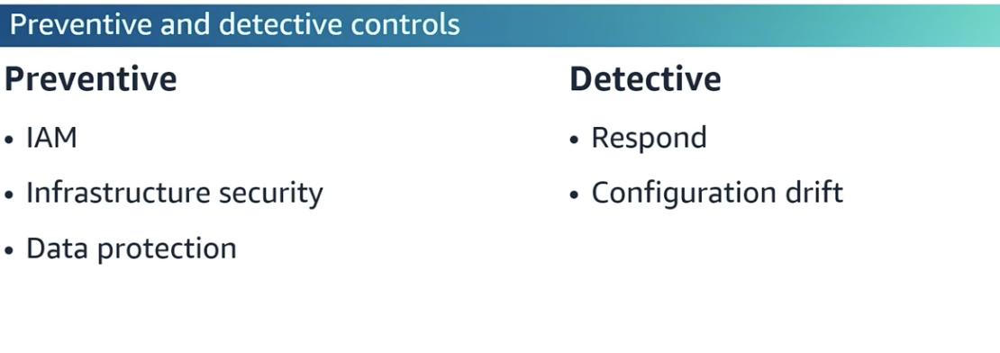

# Data Security

* Preventative and Detective security controls
  * Detective:
    * Monitor VPC flow logs traffic to see identify and remediate any security alerts&#x20;
    * GuardDuty for threat intelligent
    * Drift -> use AWS config with DynamoDB to detect table drift
    * For RDS -> use snapshots, security groups, subnets with ACLs, event subscriptions
* Layer security for **redundancy**

<figure><figcaption></figcaption></figure>

## Sensitive data security

* Macie -> PII or intellectual propert
* Sagemaker + Glue to add data labelling to classify data
*   S3  -> Amazon S3 Object Lambda to redact PII

    * S3 Object Lambda allows you to add your own code to S3 GET requests to modify and process data as it's being returned to an application. This feature is designed for use cases where data **needs to be transformed on-the-fly without the need to store a transformed copy** of the data. It's useful in scenarios like filtering rows, redacting confidential data, dynamically resizing images and other similar situations where data transformation or processing is required during data retrieval.

* For ECS best **practice to pass sensitive data as env variables using SSM or SEcrest manager in container Task definition**
* **In Lambda -> PArameters** use Secrets extensionto retreive and cache secrtes maanger secrets&#x20;
*

    \

