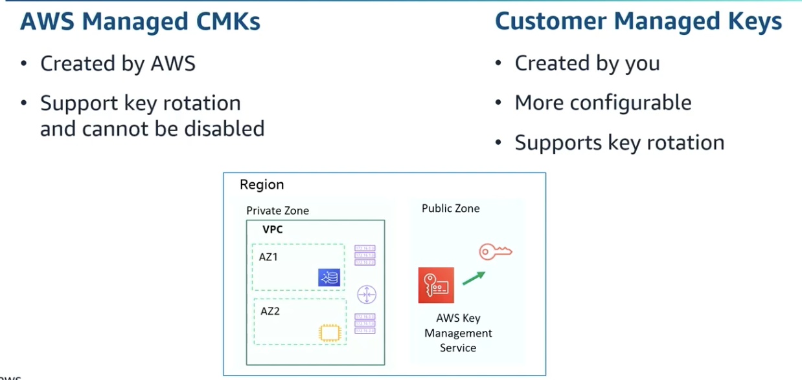
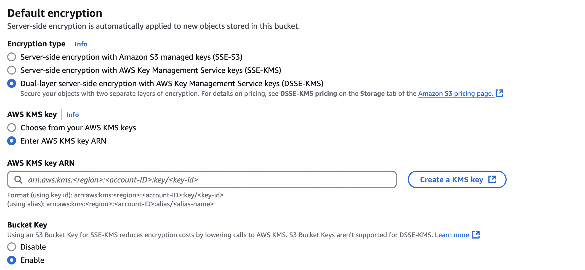
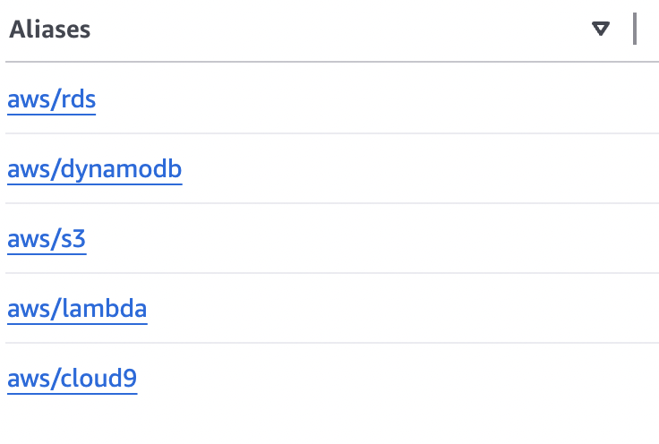
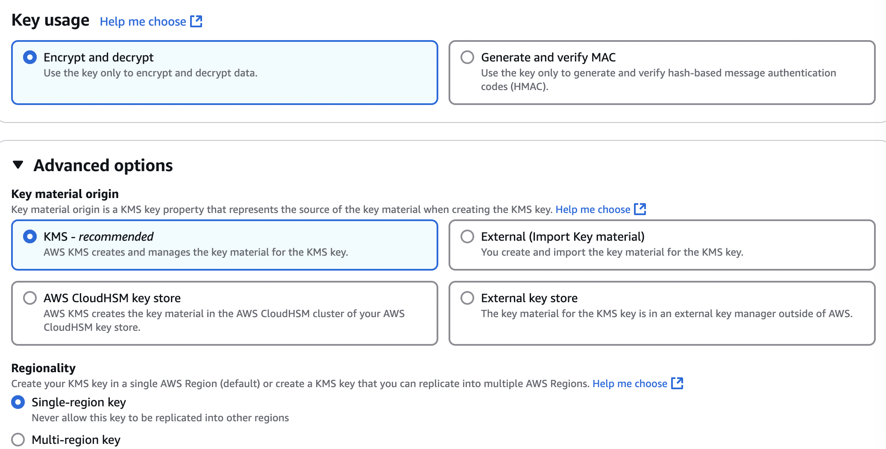
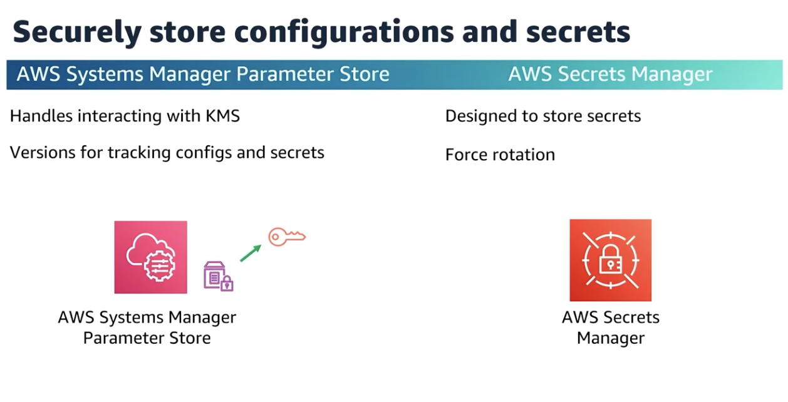

# Encryption

## KMS - key management service

<figure><figcaption></figcaption></figure>


* Limit for KMS Api call is 4 KB -> larger use Envelope Encryption
*   Envelope encryption uses DEK -> to protect the encryption key itself, so we encryot plaintext with data key and encrypt the data key with another cmk and so on. But one key must remain in plaintext ( known as master key)


    * **Data Encryption Key (DEK)**:
      * The **DEK** is used to encrypt the actual **data** (like files, database records, etc.). This DEK is a symmetric key, meaning it's used both for encryption and decryption of the data.
    * **Key Encryption Key (KEK)**:
      * The **DEK** itself needs to be protected, so it is encrypted with another key, typically a **Customer Master Key (CMK)**. This **CMK** is a separate key used only for encrypting the DEK. The CMK is usually stored and managed in a KMS (AWS Key Management Service) or any other key management system.
* HSM prevents unauthorised use of keys outside hsm by anyone -> you use own client to perform encryption but **dedicated hardware on aws**
* CMK for customer rotation is optional, 1 year

## S3 encryption :closed\_lock\_with\_key:


As the **base level** S3 has encryption at rest with SSE-KMS (server side aws managed) **it's object level not bucket level encryption.**

<figure><figcaption></figcaption></figure>

S3 has **2 methods - client side  & server-side encryption.**&#x20;

<figure><figcaption></figcaption></figure>

#### **`HEADER x-amz-server-side-encryption` enforces encryption** for objects when they are stored in S3.

```jsonp
// To enforce encryption wit h
{
  "Version": "2012-10-17",
  "Id": "PutObjectPolicy",
  "Statement": [
    {
      "Sid": "DenyUnencryptedUploads",
      "Effect": "Deny",
      "Principal": "*",
      "Action": "s3:PutObject",
      "Resource": "arn:aws:s3:::your-bucket-name/*",
      "Condition": {
        "StringNotEquals": {
          "s3:x-amz-server-side-encryption": "AES256"
        }
      }
    }
  ]
}

```

```jsonp
//Encrypts using AWS Key Management Service (KMS) keys.
{
  "Version": "2012-10-17",
  "Statement": [
    {
      "Sid": "DenyUnencryptedUploads",
      "Effect": "Deny",
      "Principal": "*",
      "Action": "s3:PutObject",
      "Resource": "arn:aws:s3:::your-bucket-name/*",
      //If the encryption headers are not included in the upload request, 
      //the Condition evaluates to false, and the request is denied.
      "Condition": {
        "StringNotEqualsIfExists": {
          "s3:x-amz-server-side-encryption": "aws:kms",
          //Specifies which KMS CMK to use for encryption.
          "s3:x-amz-server-side-encryption-aws-kms-key-id": 
          "arn:aws:kms:region:account-id:key/your-cmk-key-id"
        }
      }
    }
  ]
}

```

### Conditions

#### **Behavior Summary**

If you **want to force encryption** for uploads, you should use **`StringNotEquals`** instead of **`StringNotEqualsIfExists.`**


**`StringNotEquals`**

&#x20;<mark style="background-color:red;">strict enforcement -></mark> :key: key **must exist** and **match a value. Combine `StringNotEquals` with bucket default encryption** for maximum enforcement—this ensures unencrypted uploads are both denied by policy and protected by default encryption.

**`StringNotEqualsIfExists`**

Condition has lenient enforcement -> if key exists, it must match; otherwise, ignore it.  Allows for more flexibility when the encryption header is **optional**. Missing headers **do not trigger the condition**, so the upload can succeed.

* It  doesn’t block the upload **if no encryption header exists,** but if the header **is present**, it will enforce the condition (such as checking that the CMK ARN matches). If the ARN doesn’t match, the upload **will not succeed**.
* Useful when **bucket default encryption is disabled** and you want to ensure that **if encryption is provided**, it must be done with a specific method (like KMS or AES256).

If I have SSE-KMS enabled and in key i select arn:aws:kms:eu-north-1:desewe:key/0c25eww5-35c6-456b-b093-9bc80a3e8323

```jsonp
Condition": {
        "StringNotEqualsIfExists": {
          "s3:x-amz-server-side-encryption": "aws:kms",
          "s3:x-amz-server-side-encryption-aws-kms-key-id": 
          " arn:aws:kms:eu-north-1:desewe:key/0c25eww5-35c6-456b-b093-9bc80a3e8323"
```

1. **Uploads without encryption headers** will be encrypted using the default encryption (SSE-KMS with the specified CMK) and condition is ignored -> <mark style="background-color:green;">upload will still succeed</mark>
2. **Uploads with `AES256` or another encryption method** <mark style="background-color:red;">will be denied</mark> because they don’t match the condition (`aws:kms`).
3. **Uploads with a different CMK ARN** <mark style="background-color:red;">will be denied</mark> because the policy enforces the use of the specific CMK ARN


```jsonp
//Condition": {
        "StringNotEquals": {
          "s3:x-amz-server-side-encryption": "aws:kms",
          "s3:x-amz-server-side-encryption-aws-kms-key-id": 
          " arn:aws:kms:eu-north-1:desewe:key/0c25eww5-35c6-456b-b093-9bc80a3e8323"
```

* **Uploads without the `x-amz-server-side-encryption` header**: <mark style="background-color:red;">will be denied</mark> because the header is mandatory.
* **Uploads with `AES256` (SSE-S3 encryption)**: <mark style="background-color:red;">will be denied</mark> because the header doesn't match `aws:kms`.
* **Uploads with `aws:kms` encryption**, but a **different CMK ARN**: <mark style="background-color:red;">will be denied</mark> because the CMK ARN doesn't match the specified one.


#### Key Scenarios with **`StringNotEqualsIfExists`**:

1. **If Bucket Default Encryption is Enabled**:
   * Missing the `x-amz-server-side-encryption` header does not fail the upload.
   * The upload succeeds because the default bucket encryption automatically encrypts the object.
   * `StringNotEqualsIfExists` condition is **ignored** since the key doesn't exist, and the policy condition is not evaluated.
2. **If Bucket Default Encryption is Disabled**:
   * Missing the `x-amz-server-side-encryption` header means **no encryption** will be applied.
   * `StringNotEqualsIfExists` condition **does not deny** the upload because it only evaluates when the key exists.
   * As a result, the object will be uploaded **unencrypted**.

### Encryption in transit:

```jsonp
 // ensures the upload must occur over HTTPS (secure in transit)
 {
            "Sid": "DenyNonHttpsUploadsIntoStaticWebsiteBucket",
            "Effect": "Deny",
            "Principal": "*",
            "Action": "s3:PutObject",
            "Resource": "arn:aws:s3:::jt-s3-static-website-assets/*",
            "Condition": {
                "Bool": {
                    "aws:SecureTransport": "false"
                }
            }
        }
```


<mark style="background-color:red;">For full security, you need</mark> <mark style="background-color:red;"></mark><mark style="background-color:red;">**both policies**</mark><mark style="background-color:red;">:</mark>

1. **HTTPS Policy** ensures data is securely transmitted over the network (in transit).
   * The request itself will fail if it uses plain HTTP.
2. **Encryption Policy** ensures that the uploaded object is encrypted **at rest** in S3 using **`AES256` or KMS**
   * Policy checks if the upload request **is missing server-side encryption** (`s3:x-amz-server-side-encryption`) or has an incorrect value.
   * If encryption is missing, the upload fails.

<figure><figcaption></figcaption></figure>


**S3 Bucket Key** is used in conjunction with **SSE-KMS** to reduce the overhead of using KMS for encryption of every sing object we put in a bucket, in order to improve performance by reducing the number of **AWS KMS API calls** needed when encrypting objects.&#x20;

* When you store an object in an S3 bucket, which beed configures with SSE-KMS, S3 bucket key is created automatically. The **S3 Bucket Key** uses only **one KMS call** is made to encrypt the **Bucket Key** itself. So instead of calling KMS each time, S3 uses the **S3 Bucket Key** to encrypt the object. We make API call for every **PUT** request. The **S3 Bucket Key** itself is encrypted with the KMS key and stored in S3, reducing the need for KMS calls for every object.
* <mark style="background-color:yellow;">You do</mark> <mark style="background-color:yellow;"></mark><mark style="background-color:yellow;">**not**</mark> <mark style="background-color:yellow;"></mark><mark style="background-color:yellow;">need a</mark> <mark style="background-color:yellow;"></mark><mark style="background-color:yellow;">**bucket key**</mark> <mark style="background-color:yellow;"></mark><mark style="background-color:yellow;">if you're using</mark> <mark style="background-color:yellow;"></mark><mark style="background-color:yellow;">**SSE-S3**</mark> <mark style="background-color:yellow;"></mark><mark style="background-color:yellow;">(S3-managed keys). The</mark> <mark style="background-color:yellow;"></mark><mark style="background-color:yellow;">**bucket key**</mark> <mark style="background-color:yellow;"></mark><mark style="background-color:yellow;">feature is specifically designed to reduce the cost and overhead of using</mark> <mark style="background-color:yellow;"></mark><mark style="background-color:yellow;">**SSE-KMS!**</mark>
* **Without S3 Bucket Key**: Every time you upload an object, S3 encrypts the object and calls the KMS service to encrypt the object’s key.
* **S3 Bucket Key** is stored in S3 as metadata for that object.
* While the **S3 Bucket Key** is shared for objects within the same bucket, it is still encrypted with the **CMK**, so the risk is mitigated by the fact that your **CMK**'s permissions are tightly controlled.
* :exclamation:if we disable Bucket key with SSE-KMS encryption selected every upload will be an api call to KMS ( when we don't want a shared **Bucket Key** and want each object to be encrypted individually with **KMS**.
* <mark style="background-color:red;">S3 Bucket Keys</mark> <mark style="background-color:red;"></mark><mark style="background-color:red;">**aren't supported for dual-layer**</mark> <mark style="background-color:red;"></mark><mark style="background-color:red;">server-side encryption with AWS Key Management Service (AWS KMS) keys (DSSE-KMS).</mark>
*   KM<mark style="background-color:red;">**S keys are region-specific**</mark>, meaning you **cannot** use a CMK from one region (e.g., `us-east-1`) to encrypt resources in another region e.g., `eu-central-1`


### AWS managed keys - free - _aws/service_

<div align="left"><figure><figcaption></figcaption></figure></div>

### Customer Managed (CMK) - _$1/month per key + $0.03 / 10000 API calls to kms_

<figure><figcaption></figcaption></figure>

:money\_mouth::dollar::exclamation: **ORIGIN KMS keys costs for the existence**

1. **Key usage**: AWS charges $1 per month for each **Customer Managed Key** (CMK). This is the base charge for having the key available and being able to use it for encryption and decryption operations :scream\_cat:
2. **Request Costs**: In addition to the key charge, AWS also charges for the **requests** to use the KMS key. For example, each encryption and decryption request made using that key (e.g., when encrypting data or accessing encrypted data) has a cost associated with it. The cost for requests is typically **$0.03 per 10,000 requests**.

#### :grey\_question: **When I create an origin KMS key, is it symmetric?**

Yes, when you create a **Customer Managed KMS Key (CMK)** it is **symmetric** by default. A **symmetric key** means that the <mark style="background-color:green;">same key is used for both encryption and decryption operations</mark>. This is the most commonly used key type for most encryption tasks, such as encrypting data stored in S3 or EBS.

KMS also allows you to create **asymmetric keys** (public and private key pairs) <mark style="background-color:yellow;">for use in specific scenarios like digital signatures</mark>, but these need to be explicitly selected during the creation process.


#### :grey\_question: **What’s the default key policy if I don’t specify one?**

If you don’t specify a key policy when creating a **Customer Managed Key (CMK)**, AWS KMS will apply a **default key policy**.&#x20;

* **AWS Account Full Access**: By default, the key policy grants the **AWS account** that created the key full access to the CMK. This means the root user of the account can perform any KMS operation (like encrypt, decrypt, and manage the key).
* **No Access for Other Principals**: Other IAM users or roles in the account will have no access to the key unless you explicitly modify the key policy to grant them access.

Here’s a **sample of the default key policy**:

```json
// IAM policy for KEY 
{
  "Version": "2012-10-17",
  "Id": "default",
  "Statement": [
    {
      "Sid": "Allow administration of the key",
      "Effect": "Allow",
      "Principal": {
        "AWS": "arn:aws:iam::ACCOUNT_ID:root"
      },
      "Action": "kms:*",
      "Resource": "*"
    }
  ]
}
```


* In short: **Root user has full access** 🔑🎉, and **other users** won’t be able to use the key unless you specifically grant them permissions.

**Automatic Key Rotation & Security** 🔄:

* KMS supports automatic key rotation for **symmetric CMKs** 🚀 It’s **automated**, reducing the risks of key exposure over time. By default, AWS rotates keys every year (12 months). This helps meet security standards while simplifying your life. 😅
* 🔑 **Scheduled Key Deletion** 🕒&#x20;
  * after a certain waiting period (7 to 30 days). 📅&#x20;
  * ⏳ **AWS Deletion Rule**: KMS requires a **minimum of 7 days** and a **maximum of 30 days** before a key is permanently deleted after scheduling.
  * if you change your mind during the waiting period, you can **cancel** the deletion
  * **compliance and key lifecycle**: Scheduled key deletion is useful for organizations that have strict key management and data retention policies
  * :warning: <mark style="background-color:yellow;">Deleting a key makes all data encrypted under that key unrecoverable</mark>
  * :warning: <mark style="background-color:yellow;">Keys scheduled for deletion cannot be used with lambda etc</mark>

🏷️ **Aliases for KMS Keys** 🤖

Instead of using a long string like:\
`arn:aws:kms:region:account-id:key/key-id`,\
You can use an alias like:\
`alias/myAppEncryptionKey`

## APIs

1️⃣ **Encrypt**

**Input**:

* **Plaintext data** (≤ 4KB).
* **CMK ARN** or alias for the key to encrypt with.

**KMS Action**:

* KMS uses the specified **CMK** to encrypt the plaintext.
* It applies envelope encryption if needed.

**Output**:

*   **Ciphertext Blob** (encrypted version of your data is returned the in the API response.


    **Save the ciphertext**:

    *   Write it to a file:

        ```arduino
        fs.writeFileSync("encrypted-file.bin", ciphertext.CiphertextBlob);
        ```
    *   Or upload it to an S3 bucket:

        ```php
        await s3.putObject({
            Bucket: "my-bucket",
            Key: "encrypted-file.bin",
            Body: ciphertext.CiphertextBlob
        }).promise();
        ```

2️⃣ **Decrypt**&#x20;

**Input**:

* **Ciphertext Blob** (encrypted data).
* Optional: **Encryption Context** (if used during encryption).

**KMS Action**:

* KMS determines the CMK used to encrypt the data.
* It verifies permissions and decrypts the ciphertext.

**Output**:

* Plaintext Data&#x20;

```mathematica
codeCiphertext Blob + Encryption Context ➡️ Decrypt API ➡️ Plaintext Data  
```

#### 3️⃣ **Re-Encrypt**

**Input**:

* **Ciphertext Blob** (encrypted data).
* **New CMK ARN or alias** (the key you want to re-encrypt with).

**KMS Action**:

* KMS decrypts the ciphertext using the original CMK.
* Immediately encrypts it again using the new CMK.

**Output**:

* **New Ciphertext Blob** (encrypted with the new CMK).

```sql
Ciphertext Blob + New CMK ➡️ Re-Encrypt API ➡️ New Ciphertext Blob  
```

## DEK

* The **Data Encryption Key (DEK)** is a practical workaround for the 4KB encryption limit of KMS APIs since `Encrypt`, `Decrypt` can only handle data up to **4KB** directly.

#### 🛠 APIs:

1️⃣ **GenerateDataKey API**:

* You get **two things**:
  * **Plaintext DEK** (used for encrypting your data).
  * **Encrypted DEK** (encrypted using your CMK, stays safe for later use).
* The **CMK** (Customer Master Key) stays securely in KMS—it’s used to encrypt and decrypt the DEK, not the data itself.

```bash
#Call GenerateDataKey
   ⬇️
2. KMS returns:
   - Plaintext DEK (you use this to encrypt your file)
   - Encrypted DEK (you store this for future decryption)
   ⬇️
3. You encrypt your file locally with the plaintext DEK.
```

2️⃣ **GenerateDataKeyWithoutPlaintext API**:

* You only get the **Encrypted DEK**.
* No plaintext DEK is returned, so you can’t encrypt new data directly with it—only useful if you already have encrypted data needing decryption later.

**🔑 Summary:**

* Use `GenerateDataKey` if you need to encrypt or decrypt data locally.
* Use `GenerateDataKeyWithoutPlaintext` if you only need to store an encrypted DEK for later.


## SSM vs Secrets manager

<figure><figcaption></figcaption></figure>

### SSM

**Primary use-case:** Configuration management for **general application configurations**, **non-sensitive data**, and **cost-effective storage**.

* It supports both **plain text** and **secure string** (which uses AWS KMS encryption) parameters. Secure **hierarchical storage but not advanced**
* Does **not** support automatic rotation for parameters.
* Supports **versioning** of parameters, but it is **less advanced** compared to Secrets Manager.
* Rollback manually
* Uses IAM policies for access control but **granularity** of access control is simpler compared to Secrets Manager.
* **Free for standard parameters** :money\_mouth: **Charges apply** for **advanced parameters** (with features like KMS encryption, higher limits, and more).
* Integrates with AWS services like **EC2**, **Lambda**, RDs Secrets manager

### Secrets Manager

**Primary use-case:**  designed for managing **sensitive information**, such as credentials, API keys, and tokens.

* **Always encrypted** with AWS KMS, you can specify a custom KMS key to use for encryption.
* Automatic rotation
* Provides **automatic versioning** of secrets.
* Allows easy rollback to previous versions and tracks changes over time
* **Granular access control** for each individual se
* Automatically manages **access control policies** and integrates with IAM for more granular access control.
* Charges for each **secret** stored and the **API calls** for rotating and retrieving secret
* Integrates with AWS services like **RDS**, **Redshift**, **Lambda**
  * **Secrets Manager** is specifically designed for **RDS credentials**, offering **automatic rotation** and tighter integration with RDS.

Best for storing **secrets** like:

* Database credentials (username/password).
* API tokens or keys.
* Third-party service credentials.
* Any sensitive or highly confidential information that needs to be rotated and securely managed.


* **Secrets Manager** can generate **SSL/TLS certificates** through **AWS Certificate Manager (ACM)** integration.&#x20;
*


#### Useful likns

* [https://docs.aws.amazon.com/cli/latest/userguide/cli\_kms\_code\_examples.html](https://docs.aws.amazon.com/cli/latest/userguide/cli_kms_code_examples.html)
* [https://docs.aws.amazon.com/encryption-sdk/latest/developer-guide/introduction.html](https://docs.aws.amazon.com/encryption-sdk/latest/developer-guide/introduction.html)
