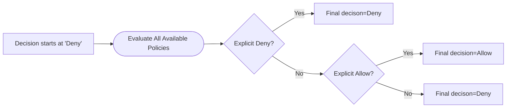

# IAM

* **User**_**:**_ can belong to multiple group or don't have to belong to a group(not best practice).
* **Groups**_**:**_ can only contain users not other groups.

## IAM Policies ( Group, Inline)

* Policies can be attached to IAM users, groups, or roles. Give broad permissions.
* Granular <mark style="color:red;">least-privilege</mark>. Never give more permissions than needed.
* Users inherit policies from groups they're in.
* AWS evaluates <mark style="color:red;">permissions based on the most restrictive policy</mark>. If the  IAM policy allows access but the bucket policy denies it, the user will be denied access.
* A "deny by default"  model for permission:

* Group policies allow for easy control of permissions for all users in that group simultaneously.
* Inline policies - attached directly to a single user.  Good practice for Highly Specific Access or Temp Access requirements.
* Define permissions for Users. Can define specific to service -> Actions -> resources.&#x20;

#### Achieving Fine Grained /Layered security &#x20;

Use IAM and bucket policies. IAM policy for DevOps group can grant access to the S3 bucket action (`"Action": "s3:GetObject",`) but Bucket policy (_also a JSON documents that specify permissions at the bucket level_) can enforce additional restrictions on specific objects / certain documents.

#### Useful Links

[https://docs.aws.amazon.com/IAM/latest/UserGuide/reference\_policies\_elements.html](https://docs.aws.amazon.com/IAM/latest/UserGuide/reference\_policies\_elements.html)

