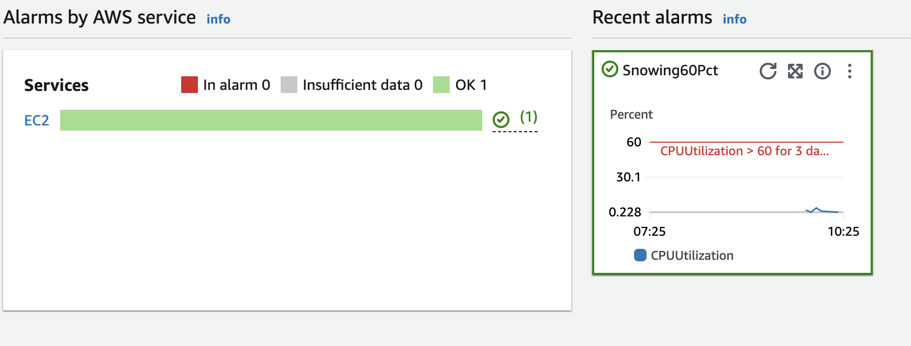
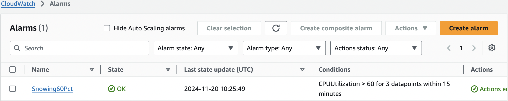
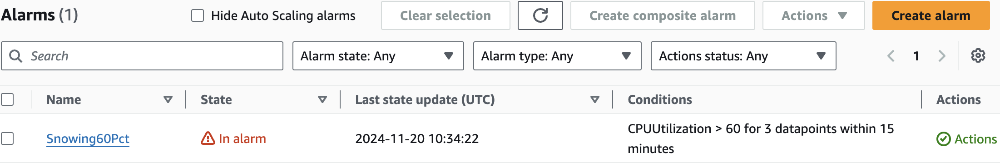
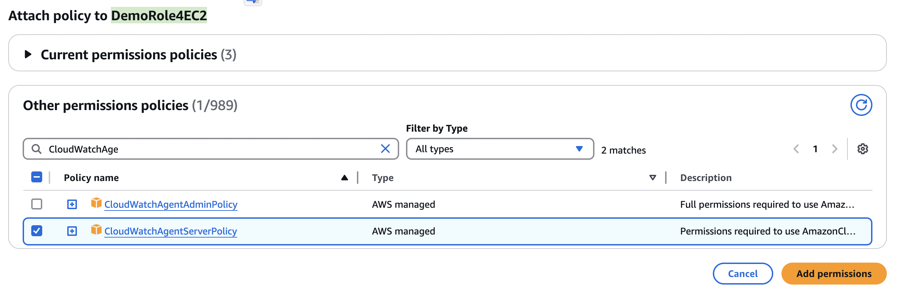

# CloudWatch

## &#x20;**Monitoring Metrics**

* **Default Metrics**: Automatically collects metrics from AWS services (e.g., EC2 CPUUtilization, RDS FreeStorageSpace).
* **Granularity**: Supports metrics at **1-minute** (standard) or **1-second** intervals (detailed monitoring).
* **Custom Metrics**: Allows users to publish their own application metrics via the **PutMetricData API**. [https://docs.aws.amazon.com/cli/latest/reference/cloudwatch/put-metric-data.html](https://docs.aws.amazon.com/cli/latest/reference/cloudwatch/put-metric-data.html)
  * Standard 1 minute of High resolution&#x20;
  * Time point from two weeks before in the past and 2hrs in the future

<details>

<summary>CLI: aws cloudwatch put-metric-data</summary>

```
aws cloudwatch put-metric-data --namespace "Usage Metrics" --metric-data file://metric.json
```

* Upload custom dummy json with metrics to CloudShell, all uploaded files are in `/home/cloudshell-user`

<!---->

* In cloudShell run **PutMetricData**&#x20;

`aws cloudwatch put-metric-data --namespace "Usage Metrics" --metric-data file:///home/cloudshell-user/customMetrics.json`

</details>


## **Logs**

* **Log Ingestion**: Collects logs from AWS services (e.g., Lambda, API Gateway, VPC Flow Logs) and custom applications.
* **Log Retention**: Logs can be stored indefinitely or with user-defined retention policies.
* **Insights**: Provides a query language to analyze logs and generate insights.

## **Alarms**

* **Threshold-based Alerts**: Trigger actions when metrics cross specified thresholds.
* **Actions**: Alarms can notify users via Amazon SNS, perform Auto Scaling, or stop/start/terminate instances.
  * Emulate the state for CPU etc [https://docs.aws.amazon.com/cli/latest/reference/cloudwatch/set-alarm-state.html](https://docs.aws.amazon.com/cli/latest/reference/cloudwatch/set-alarm-state.html)
* **Composite Alarms**: Combine multiple alarms into a single evaluation - **reduce alarm noise**&#x20;
  * Alert me if CPU is high and IOPS are low -> sign of bottleneck, but don't alret if both a high within a threshold (value and time)

<details>

<summary>CLI: aws cloudwatch set-alarm-state </summary>

**CASE - build it alarms in EC2 per instance**

1. Create a custom Alarm for instance-id, trigger EC2 Action if Alarm state





2. `aws cloudwatch set-alarm-state --alarm-name Snowing60Pct --state-value ALARM --state-reason "Testing it stops at 60% CPU"`&#x20;
3. Check CW Alarms



4. Check Instance is stopped

**CASE - custom alarm by Metric Filer ( must enable Logs first)**

1.  Attach the **`CloudWatchAgentServerPolicy`** managed policy to grant permissions to write logs to CloudWatch

    <figure><figcaption></figcaption></figure>
2. Enable Logs for EC2 instance -> Linux application aka CloudWatch Logs Agent by **Installing CloudWatch Logs Agent on EC2 Instance**

* If you **terminate the EC2 instance** and **delete its associated EBS volume**, the <mark style="color:red;">CloudWatch Logs agent that was installed on that instance will be removed as well.</mark>


</details>

<figure><figcaption></figcaption></figure>


## **CloudWatch Events / EventBridge**

* **Event Triggers**: Monitors AWS service changes (e.g., instance state changes) and triggers automated actions.
* **Integration**: Works with Lambda, Step Functions, and more for event-driven workflows.


#### Useful links

* [https://docs.aws.amazon.com/cli/latest/reference/cloudwatch/set-alarm-state.html](https://docs.aws.amazon.com/cli/latest/reference/cloudwatch/set-alarm-state.html)

