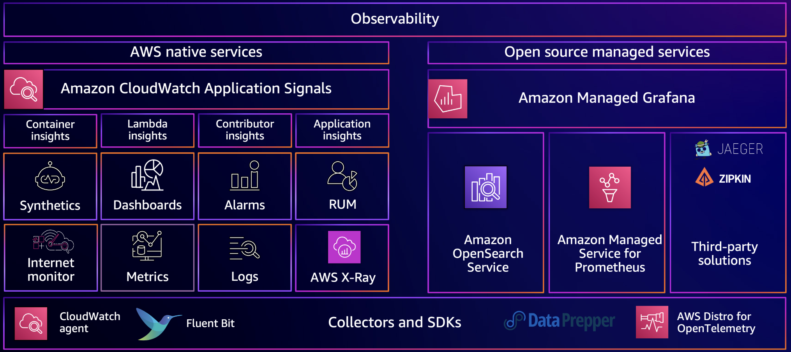
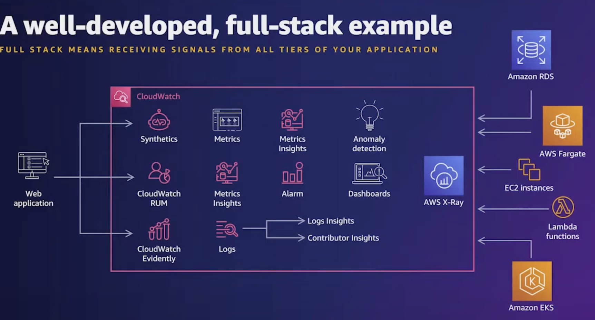
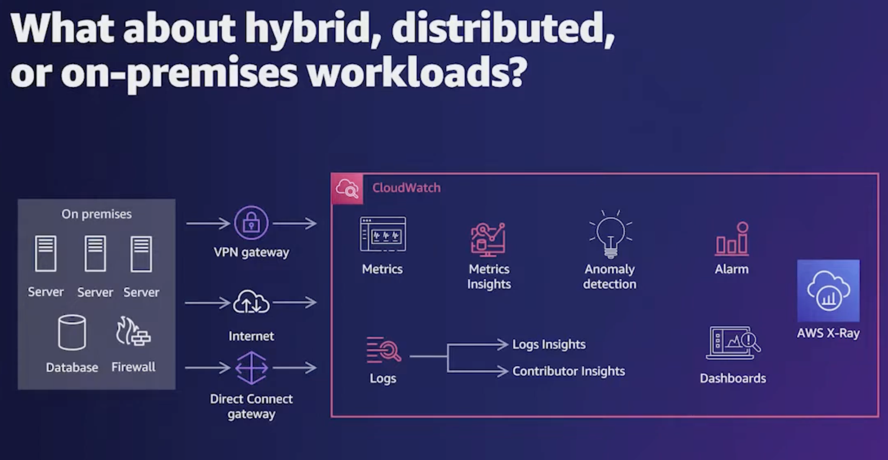
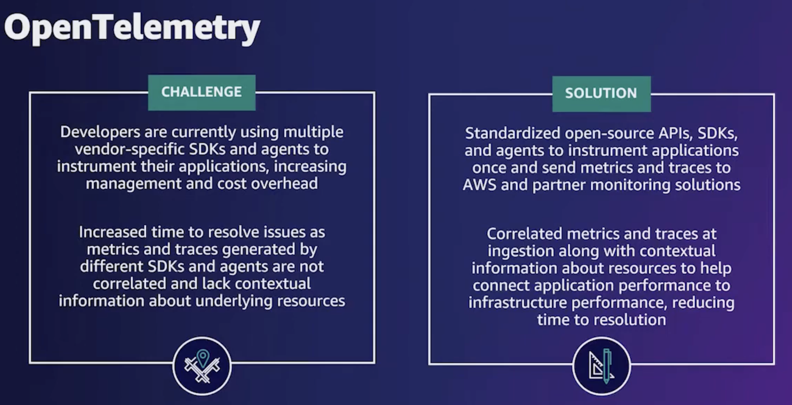
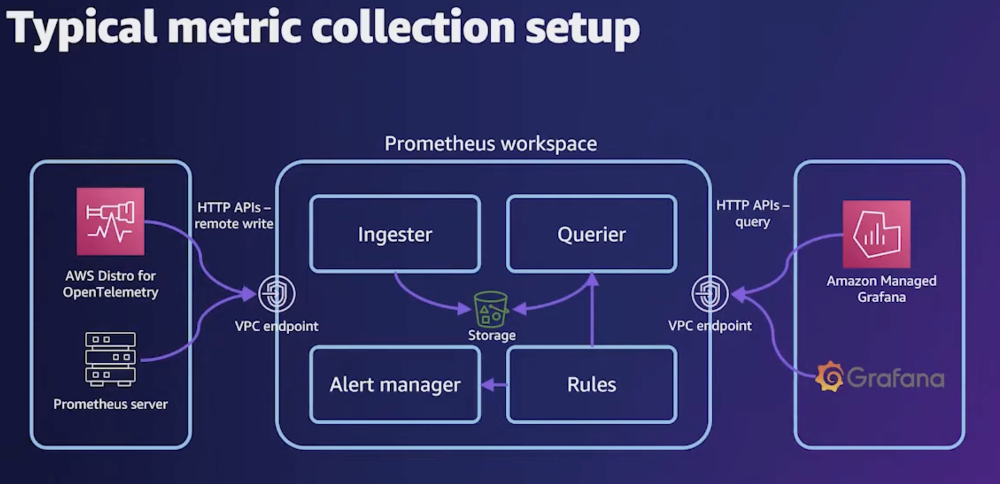

# Observability

> Understand what your application/system is doing based on the telemetry it emits, often by instrumenting it, to collect metric variables, logs, traces. For achieving SLA/SLO by looking at SLI as  indicators of what is happening.
>
> **Monitoring is what makes a system observable, along with logging, tracing.**
>
> **Goal -> reduce your mean time to resolution. Meet SLAs.**

## Tools for full-stack observability

<figure><figcaption></figcaption></figure>

## Cloud-native stacks

#### LEVEL: Front/Digital/Web

* CloudWatch Synthetics - synthetic browser testing to probe website (e.g. place order, log in, empty cart)
* CloudWatch RUM ( Real-time measure what Synthetic probe experiences as 'user' )

#### LEVEL:  Back/Application

* X-Ray Insights
* Lambda Insights
* Container Insights
* CloudWatch application insights

#### LEVEL: Infrastructure

* CloudWatch Logs, Metrics, Alarms, Dashboards

<figure><figcaption></figcaption></figure>

## Cloud-native patterns

1. Outside-in (_what is good for users_, focus on UX) vs Inside-out ( _what is good on the backends_ ) observability strategy.&#x20;
   1. <mark style="color:blue;">**Outside-in:**</mark>&#x20;
      1. Web page response / TTI -> rule of 3 (3-click rule is a persistent, unofficial heuristic that says that no page should take more than 3 clicks (or taps on a touchscreen OR to 3 seconds to load)
      2. Failed processes&#x20;
      3. JS Erros
   2. <mark style="color:purple;">**Inside-out:**</mark>
      1. Slow SQL queries
      2. Container health / reboots. Do _all_ workloads need to care about CPUUtilisation?
      3. Integration health&#x20;

## Hybrid / Open-source stacks

AWS services as an extension to the hybrid environments.

<figure><figcaption></figcaption></figure>

## Open-native patterns

#### Concerns around open source solutions -> managed services address them\*

* Anxiety around security & compliance
* Support & versioning of vulnerabilities
* Vendor lock in for observability solution, you need to rewrtie application to match vensor -> OpenTelemetry projects

#### Open Source Managed Services

* Distro for OpenTelemetry (ADOT)
  * 
*   Managed Prometheus&#x20;

    * query language to monitor containerised workloads
    * good alerting rules ( ingest, high cardinality metrics)
    * JMX exporters and other 100+
    * <mark style="color:purple;">hard to provision for high workloads \* for just observability solution not critial appplciation</mark>
    * 

* Managed Grafana
  * Rich Visualisation solution

####

