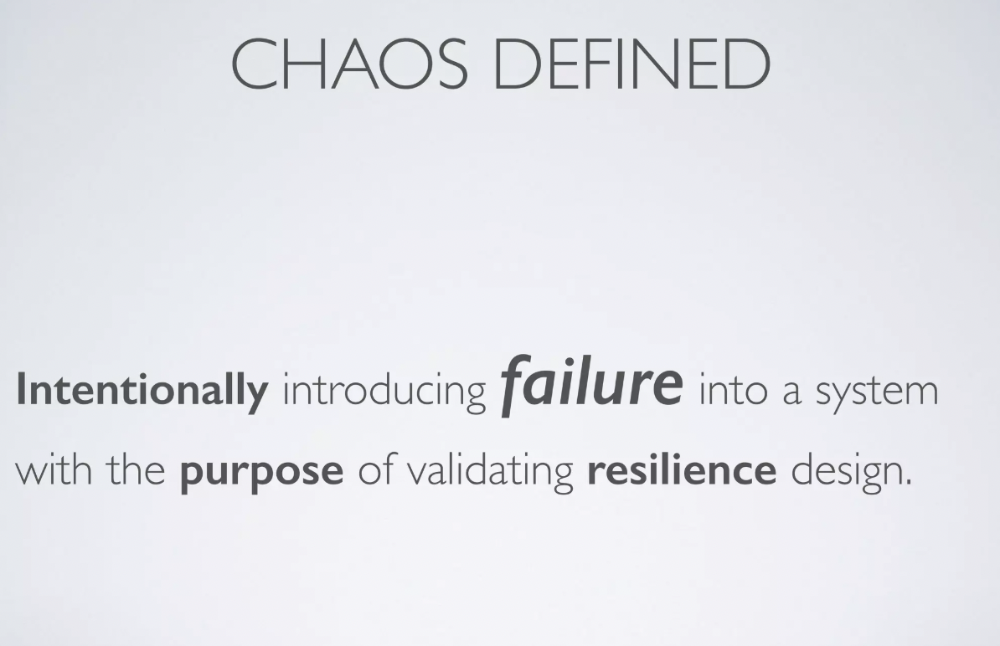
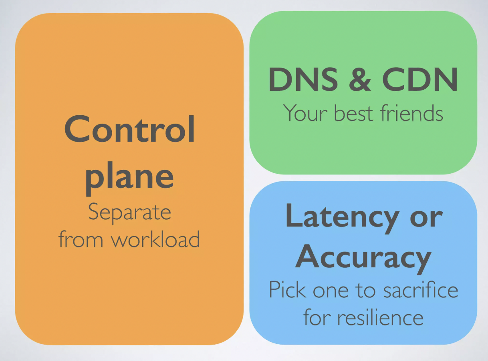

# Resilience Hub

> A central place to define, validate and track the resiliency of your applicaion.  Provides architectural guidance for improving application resiliency, implementing tests, alarms, SOPs( standard ops procedures) that you can deploy and run in CI/CD pipeline.

<figure><figcaption></figcaption></figure>

_Application Resilience - ability to maintain the availability and recover from failure, disruption within_ :clock2: _RTO (Recovery Time Objective, ie time an application can be down without causing significant damage)  and PPO (Recovery Point Objective)._ RPO helps determine how much data a company can tolerate losing during an unforeseen event.

_The things that can go wrong are called faults, and systems that anticipate faults and can cope with them are called fault-tolerant or resilient._

_Need for formal methods to reason (abstractly) about distributed system resilience and gain confidence of system design, formal methods help discover bugs early, their aim is to ensure that system satisfies formal specifications. Especially when you're trying to build a complicated system that is hard to reason about._

_Whats is the assumotion that component makes about other component?_&#x20;

_AWS P formal framework to go over design iterrations._

* Customers need to build a replication mechanism and **validate** that the procedure will work.
* &#x20;Validation is expensive as it involves month of planning.
* For very low RTOs, AWS allows for  **Aurora** ( for cross-region resilience).
* For longer. RTOs (1+hr) use **backup in different AZ or Region.**

## Resilience Hub Features

* Continuously validate & track application resilience with dashboard view.
* Provides resiliency score, which reflects how closely the application follows recommendations for meeting the application's resiliency policy, alarms, SOPs, and tests. Application resiliency score over time graph is presented in the dashboard so the user can monitor his resiliency score over the past 30 days. Max is 100.
* Audit trail for compliance.
* Define RTO & RPO policies and hub will provide procedures to meet them.
* Runs weakness assessments.
* Makes recommendations on SOPs and alarms.
  * Ex:&#x20;
    * `AWSResilienceHub-SyntheticCanaryInRegionAlarm`: A monitor for the entire application, configured to constantly verify that the application API/endpoints are available.
* Clarify & resolve incidents before they occur
* Prepare for outages, by conducting testing and verification.
* CI/CD integration.

<figure><figcaption></figcaption></figure>

## Testing Resilience

Hub is a fully managed service that provides FIS experiments

Fault injection is a practice in chaos engineering of stressing an application in testing or production environments by creating disruptive events, such as sudden increase in CPU or memory consumption, observing how the system responds, and implementing improvements → helps uncover bugs, 🐞 bottlenecks 🧣 and issues by :

*   Simulate a wide range of failures. **Synthetic CloudWatch Analysis using Canaries )**&#x43;anaries are scripts that run user journeys as a custom file or from aws pre-build template. **Best practice:** use private VPC endpoint to connect to your **pre-production / test resources**)

    <figure><figcaption></figcaption></figure>
* Validate that monitors and alarms identify the correct outage.
* Validate that the SOP recovered the application within its resilience targets.
* Integrate into CI/CD pipelines for continuous assessment and testing.

## Resilience objectives examples

* _n_ days tailing window 99,9% SLA
* downtime design with customer involvement&#x20;
* what's out formal process for defining rto and rpo? revenue regulation & reputation\*
* perform due diligence on the components&#x20;
* operational burden?
* <mark style="color:red;">cloud is inherently partition</mark> <mark style="color:red;"></mark><mark style="color:red;">**intolerant**</mark>
* **focus on isolation**

### Cellular Architecture

* Logically break into cells -> behind the science is AZ- > contain a problem, cell by cell at a time&#x20;
* Share nothing arch, including database

Static stability\* - system across multi AZs when you loose AZa 100% to match resources on AZb

Dependency on control plane? provide extra **capacity upfront ( trade off, solve for availability not cost)**

**Control plane : regional Data plane: Zonal**

_Distributed data planes more accurate for global services_

#### Application Recovery controller service -> run by :office\_worker:&#x20;

for most critical applications

## Failure Design Patterns

_<mark style="color:red;">\*operate under assumption that dependancies will fail\*</mark>_

<figure><figcaption></figcaption></figure>

_**Is it a control plane or data plane issue?** remove control plane dependancies_

Front:

* Establish performance degradation for customer -> estimate timeout
* Do not do many **retries**   (what's out number of retries), increase interval for retries ( backoff)
* **Jitter -** what/how we randomise the calls
* Limit queue size
* caching

Back:

* Rate limit
* rejection ( load shedding)
* caching
* circuit breaker ( components fail in isolation, condition close/open) used internally in aws, on the **data plane**

### Reassess to Disaster Recovery

* Chaos engineering ( start from steady state) -> simulate hardware, software, scaling events and of-the-cloud impairments (ie aws fails, how are we're still resilient)
* Mess up permissions to test connectivity, for example the SNS does not work for EC2 instance

### Observability&#x20;

* metric logs( don't overload), like amazoncom orders placed per second
* impact assessment metrics\*
* trails ( trace by id)
* 1.83 days for 95p downtime (Availability= MTBF+MTTR MTBF ​),

### Mean Time Between Failures (MTBF)

MTBF is calculated using the following formulas.

#### Total Operational Time

The total operational time can be expressed as:

$$
\text{Total Operational Time} = \text{Total Time Period} - \text{Total Downtime}
$$

#### MTBF Calculation

Once we have the total operational time, we can calculate MTBF using:

$$
\text{MTBF} = \frac{\text{Total Operational Time}}{\text{Number of Failures}}
$$

### Mean Time To Repair (MTTR)

MTTR is the average time taken to repair a failed system or component. This is typically calculated as:

$$
\text{MTTR} = \frac{\text{Total Repair Time}}{\text{Number of Failures}}
$$

### Availability

The availability of a system can be calculated using MTBF and MTTR:

$$
\text{Availability} = \frac{\text{MTBF}}{\text{MTBF} + \text{MTTR}}
$$

* **Grey failure** ( could be something in between )
* Latency threshold&#x20;

### Differential Observability

* Control plane might not indicate issue, but data plane has errors  -> **Composite alarms**
* align observability with fault isolation boundaries (AZ as a fault isolation boundary, so monitor the AZ)

2 components are sharing an alarm\* -> reduce the number of alarms -> don't start the formal mitigation until you analysed alarm

## Evaluate & test

* RCA  (root cause analysis ) is "not :point\_right: finger pointing process"
* Do Fault injection &#x20;

